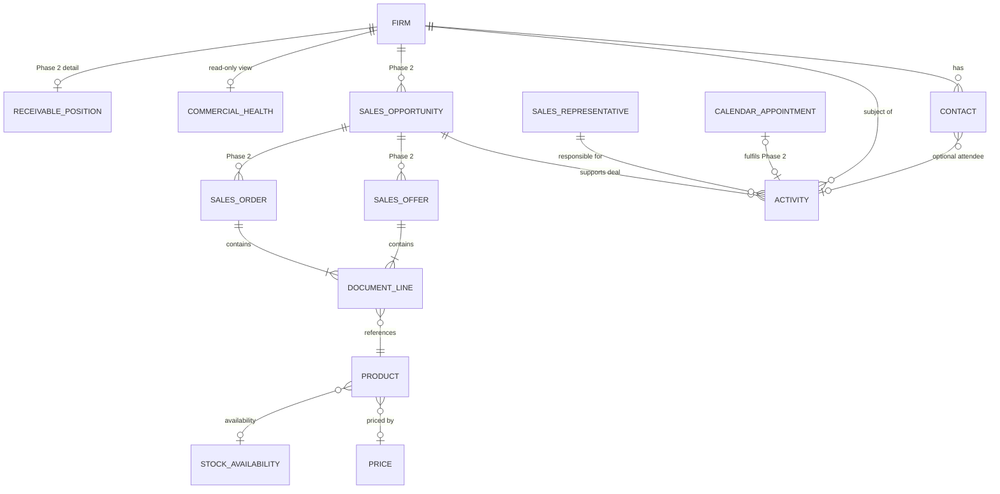
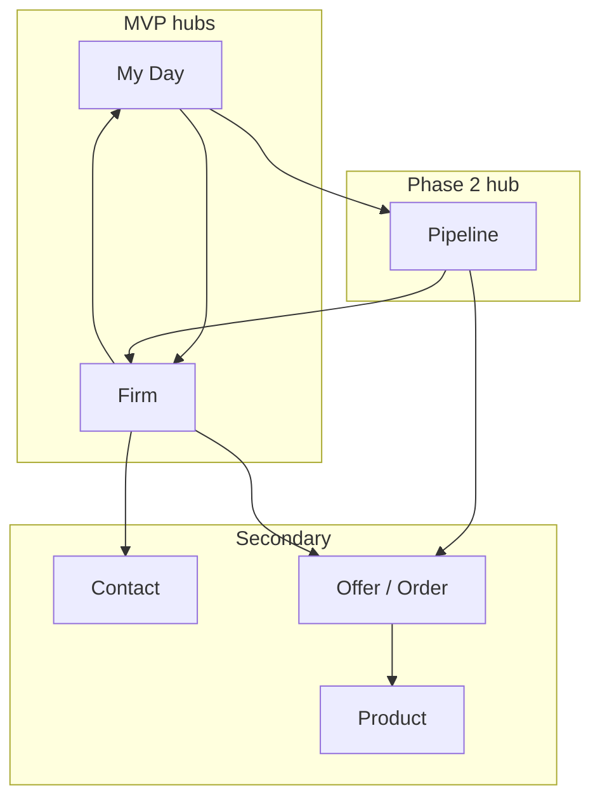

# Business domain model — ABRA Mobile CRM

**Status:** Draft  
**Version:** 0.2  
**Last updated:** 2026-06-04  

**CRM review:** [`domain-model-crm-review.md`](domain-model-crm-review.md) — challenges and rationale for v0.2 refinements.

## 1. Purpose

Describe the **business entities**, **relationships**, **data ownership**, and **permissions** needed for field sales CRM, where **ABRA Gen** holds every authoritative fact. Mobile CRM is a **sales channel** for viewing and changing Gen data — it does not own a parallel copy of customers, activities, or documents.

This model covers **MVP** and **planned Phase 2**. It intentionally excludes technology, integration, and user-interface implementation.

---

## 2. Domain principles

| Principle | Business meaning |
|-----------|------------------|
| **Single source of truth** | If a fact appears in Mobile CRM, it is stored and governed in ABRA Gen. Disputes are resolved in Gen, not in the app. |
| **Gen owns lifecycle** | Creation rules, numbering, approval, posting, and cancellation follow Gen business logic and organisational setup. |
| **Channel, not system of record** | Mobile CRM may present and capture data but never becomes the master for firms, contacts, activities, or sales documents. |
| **Person-bound work** | Field sales work is attributed to a **sales representative** identity recognised by the organisation and authorised in Gen. |
| **Customer-centric selling** | The **firm** (customer) is the relationship hub for contacts, visit history, commercial signals, and deals. |
| **Pipeline-aware selling** | **Opportunities** (Phase 2) connect daily work to quotes and orders; documents are outcomes, not the commercial centre. |
| **Unified day, separate truths** | **My Day** may combine activities and calendar appointments in one agenda; each record remains a distinct Gen object. |

---

## 3. Bounded context

**In scope of this product**

- Planning and recording **customer-facing work** (visits, calls, tasks) against **firms** and **contacts**.
- **Finding and reviewing** customer master data before and after visits.
- **Phase 2:** **Pipeline** (opportunities), **sales documents**, and extended **commercial health** (receivables detail) — all stored in Gen.
- **MVP (optional):** Read-only **commercial health signals** on firm where Gen provides credit/block indicators.

**Out of scope (remain in Gen or other systems)**

- General ledger, invoicing posting, manufacturing, warehouse operations (except stock **read** in Phase 2).
- Marketing campaign design, e-mail blasting, full BI/reporting suites.
- User administration, role configuration, enumeration maintenance (Gen administration).
- Offline replicas of business data as a competing truth.

---

## 4. Entity catalogue

### 4.1 Core entities (MVP)

| Entity | Business definition | MVP use |
|--------|---------------------|---------|
| **Firm** | Legal or commercial **customer / business partner** the organisation sells to. | Search, view detail, link activities and contacts. |
| **Contact** | **Natural person** (or role) associated with a firm for communication and visits. | View list and detail; optional link on activity. |
| **Activity** | A **planned or completed interaction** with a customer (visit, call, task) with subject, timing, status, and outcome. | Dashboard lists, view, create, complete, edit while open. |
| **Sales representative** | **Employee or agent** who performs field sales; owner or executor of activities. | Identity for “my work”; assignment on new activities. |

### 4.2 Supporting concepts (MVP — not navigation anchors)

| Concept | Business definition | MVP use |
|---------|---------------------|---------|
| **My Day** | **Temporal hub** — the rep’s agenda of today’s and overdue customer work (not a Gen entity). | Groups activities; later includes calendar appointments. |
| **Firm address** | Registered or operational **location** of a firm. | Shown on firm detail; used for visit planning (maps external). |
| **Firm commercial status** | Whether the firm is **active, blocked, or restricted** for sales. | Display and search filtering; may block new activities. |
| **Commercial health signal** | **Read-only risk context** from Gen (status, credit flag, overdue indicator). | Firm detail; informs visit without exposing full ledger. |
| **Pipeline snapshot** | **Optional read-only** summary of open opportunities on a firm. | Firm detail if Gen CRM module available (workshop). |
| **Activity type** | Category of interaction (e.g. visit, phone call, internal task). | Classification on create/edit. |
| **Activity status** | Lifecycle state (e.g. open, completed, cancelled). | Dashboard segmentation and edit rules. |
| **Activity outcome** | **Result narrative** after completion (notes, next steps summary). | Captured on complete; visible on detail. |

### 4.3 Phase 2 entities

| Entity | Business definition | Phase 2 use |
|--------|---------------------|-------------|
| **Document line** | **Line item** on an offer or order (product, quantity, price, delivery). | Read lines; add/edit lines on mobile draft. |
| **Product** | **Sellable item** from organisational catalogue (material/service). | Search/select on document lines. |
| **Price** | **Unit or total price** for a product in a given commercial context. | Display on lines; validate against Gen rules. |
| **Stock availability** | **Available quantity** (or availability signal) for a product. | Read during visit for promise-to-customer. |
| **Sales opportunity** | **Pipeline deal** with stage, value, and expected close — commercial spine. | Phase 2 hub; optional firm snapshot in MVP. |
| **Calendar appointment** | **Scheduling artifact** — when/where/who meets; not a substitute for visit outcome. | Phase 2 in **My Day** agenda; linked to activity. |
| **Sales offer** | **Quotation** tied to firm and preferably to an opportunity. | View/draft under firm or opportunity — not a top-level hub. |
| **Sales order** | **Binding order** tied to firm and preferably to an opportunity. | Same as offer. |
| **Receivable position** | **Detailed** outstanding balance, ageing, limit utilisation. | Phase 2 expansion of commercial health on firm. |

### 4.4 Explicitly excluded as owned entities

| Item | Reason |
|------|--------|
| Mobile “customer list cache” | Not a business entity; Gen remains truth (ADR 0001). |
| Local draft queue of visits | Out of MVP; if ever introduced, requires new business decision — not in this model. |
| Push notification record | Operational delivery artefact, not master data. |

---

## 5. Entity definitions

### 5.1 Firm

**Meaning:** The customer organisation or sole trader the company does business with.

**Key business attributes (illustrative):**

- Display name, identification numbers (e.g. IČO, DIČ), internal customer code
- Primary address and communication channels on record
- Commercial status (active / blocked / watch)
- **Commercial health signals** (read-only): credit exposure level, overdue indicator — scope per Gen permissions (MVP minimal)
- **Pipeline snapshot** (optional MVP): open opportunity count or headline deal — if Gen CRM is licensed
- Optional Phase 2: segment, payment terms, detailed receivable position

**Rules:**

- One firm record per customer identity in Gen; duplicates are prevented by Gen master-data governance.
- Inactive or blocked firms may be hidden from search or blocked from new activities (organisational rule in Gen).
- Commercial health is **informational for selling**; only finance changes limits and blocks in Gen.

### 5.2 Contact

**Meaning:** A person (or named role) through whom the firm is reached.

**Key business attributes:**

- Name, job title or role, phone, e-mail
- Belongs to exactly one firm for mobile CRM context (MVP)
- Optional notes

**Rules:**

- MVP: **read-only** through Mobile CRM; create/edit remains Gen (or Phase 2 extension).
- A contact does not exist as a standalone customer; always in context of a firm.

### 5.3 Activity

**Meaning:** Work the rep plans or performs with or about a customer.

**Key business attributes:**

- Subject and description / outcome notes
- Type (visit, call, task, …)
- Status (open, completed, cancelled)
- Scheduled start, end, due date
- Linked firm (required for customer-related types)
- Linked contact (optional)
- Linked sales opportunity (optional, Phase 2; MVP if Gen field exists)
- Linked calendar appointment (optional, when Gen has separate scheduling object)
- Responsible sales representative
- Completion timestamp and outcome (when completed)

**Rules:**

- Customer-related activities **must** reference a firm.
- **CRM activity** records **outcome** of selling work; it does not replace a **calendar appointment** when Gen stores both (see §5.8).
- Only **open** activities are fully editable; completed activities follow Gen rules for correction (often restricted).
- **Overdue** is derived: due date before today and status still open.
- **My Day** lists activities (MVP) and may add appointments (Phase 2) without merging Gen records.

### 5.4 Sales representative

**Meaning:** The human actor using Mobile CRM on behalf of the company.

**Key business attributes:**

- Identity known to organisation (employee, external agent)
- Name for display
- Gen authorisation profile determining what entities can be read or changed

**Rules:**

- Activities are filtered to “mine” by default on the dashboard unless Gen grants wider visibility.
- Representative does not own firm master data; may only change what permissions allow.

### 5.5 Sales opportunity (Phase 2 core; optional firm snapshot MVP)

**Meaning:** A **deal in progress** — stage, value, expected close — linking selling effort to quotes and orders.

**Key business attributes:**

- Name, stage, amount, probability or priority, expected close date
- Firm (required)
- Optional primary contact
- Related activities and documents in Gen

**Rules:**

- Opportunity is the **commercial spine** between activities and documents; not owned by Mobile CRM.
- Stage changes follow Gen CRM rules; mobile may update only where Gen permits.
- **Pipeline** navigation hub lists opportunities, not individual document headers.

### 5.6 Calendar appointment (Phase 2; scheduling)

**Meaning:** A **time reservation** for a meeting or visit — when and where, participants, location.

**Key business attributes:**

- Start, end, location, attendees
- Optional link to firm
- Optional link to fulfilling CRM activity

**Rules:**

- Appointment answers **when**; CRM activity answers **what happened** commercially.
- At most **one** customer-facing CRM activity should **fulfil** a given appointment (business pairing).
- If Gen uses a **single** object for both scheduling and outcome, treat as **customer interaction** in analysis — do not model duplicate entities (workshop D-09).

### 5.7 Phase 2 — Sales offer and sales order

**Meaning:** Commercial documents representing quotation and order lifecycle — **outcomes** of selling, usually tied to firm and opportunity.

**Key business attributes:**

- Document number, date, status (draft, confirmed, cancelled, …)
- Firm, optional contact, optional sales opportunity
- Currency, totals, delivery/payment terms (as defined in Gen)
- Collection of document lines

**Rules:**

- Document state transitions (confirm, cancel) follow Gen; Mobile CRM cannot bypass approval or posting rules.
- MVP: not exposed. Phase 2: **read** under firm/opportunity; **write** draft only if policy allows.
- **Not** primary navigation anchors — accessed from **Firm** or **Opportunity**.

### 5.8 Phase 2 — Product, price, stock

**Meaning:** Catalogue and commercial conditions for quoting and ordering.

**Rules:**

- Product and price masters are maintained in Gen (or linked modules).
- Stock availability is **informational** for the rep; warehouse truth remains Gen.

### 5.9 Commercial health signal and receivable position

**Commercial health signal (MVP minimal, Phase 2 enriched):**

- **Meaning:** Rep-oriented, read-only indicators derived from Gen — not a separate ledger.
- **Examples:** firm blocked for sales, credit over limit flag, any overdue receivable yes/no.
- **Rules:** Shown on **Firm** (and on **Opportunity** if Gen ties risk to deal). Finance owns meaning and thresholds in Gen.

**Receivable position (Phase 2 detail):**

- **Meaning:** Amounts, ageing buckets, credit limit utilisation — finance-grade summary.
- **Rules:** Read-only; expands commercial health; never a top-level navigation hub.

---

## 6. Relationships

### 6.1 Cardinality (business)

### 6.2 Relationship table

| From | To | Cardinality | Business description |
|------|-----|-------------|----------------------|
| Firm | Contact | 1 : N | A firm has zero or many contacts; each contact belongs to one firm. |
| Firm | Activity | 1 : N | Activities about a customer reference one firm. |
| Firm | Sales opportunity | 1 : N | Phase 2. Deals belong to one firm. |
| Sales opportunity | Activity | 1 : N | Activities can support a specific deal. |
| Activity | Sales opportunity | N : 0..1 | Optional link to one open deal. |
| Contact | Activity | N : 0..1 | An activity may reference one primary contact; contact optional. |
| Calendar appointment | Activity | 1 : 0..1 | Appointment may be fulfilled by one CRM activity. |
| Activity | Calendar appointment | N : 0..1 | Activity may originate from one appointment. |
| Sales representative | Activity | 1 : N | Rep is responsible for many activities; each activity has one responsible rep at a time. |
| Sales opportunity | Sales offer / order | 1 : N | Phase 2. Documents preferably tied to deal. |
| Firm | Sales offer / order | 1 : N | Phase 2. Always tied to firm; opportunity link when used. |
| Firm | Commercial health signal | 1 : 1 | Derived read-only view in Gen — not a separate master. |
| Sales offer / Sales order | Document line | 1 : N | Lines are part of exactly one document header. |
| Document line | Product | N : 1 | Each line refers to one catalogue product (or free-text service if Gen allows). |
| Product | Price | N : N | Price depends on price list, firm, date — resolved in Gen rules. |
| Product | Stock availability | 1 : 0..1 | Optional snapshot per warehouse context. |
| Firm | Receivable position | 1 : 0..1 | Phase 2 summary view, not a duplicate ledger. |

### 6.3 Structural dependencies

- **Activity** depends on **Firm** (for customer-facing types).
- **Document line** depends on **Sales offer** or **Sales order** header.
- **Contact** depends on **Firm** (cannot be created without firm context in Phase 2 create flow).

---

## 7. Data ownership

### 7.1 Ownership matrix

| Entity / concept | System of record | Created by | Maintained by | Mobile CRM role |
|------------------|------------------|------------|---------------|-----------------|
| Firm | ABRA Gen | Gen (master data, sales admin) | Gen | View; no master-data ownership |
| Contact | ABRA Gen | Gen (MVP); Gen + rep (Phase 2 if allowed) | Gen | MVP: view only |
| Activity | ABRA Gen | Rep via Mobile CRM (MVP) | Rep + Gen rules | Create, update, complete |
| Sales representative profile | ABRA Gen / HR | Gen / IT | Gen / IT | Consumes identity; no copy |
| Activity type / status lists | ABRA Gen | Gen admin | Gen admin | Consume enumerations |
| Sales offer / order | ABRA Gen | Gen; rep (Phase 2 draft) | Gen workflows | Phase 2: view; optional draft |
| Product / price | ABRA Gen | Product management | Gen | Phase 2: read (and select on lines) |
| Stock availability | ABRA Gen | Warehouse / Gen calc | Gen | Phase 2: read |
| Commercial health signal | ABRA Gen (derived) | Finance / credit rules | Gen | MVP: read minimal; Phase 2: enrich |
| Receivable position | ABRA Gen | Finance processes | Gen | Phase 2: read detail |
| Sales opportunity | ABRA Gen | Sales / CRM in Gen | Gen | Phase 2: read/write stage; MVP snapshot read |
| Calendar appointment | ABRA Gen | Rep / calendar in Gen | Gen | Phase 2: read; write if Gen allows |
| Audit trail of changes | ABRA Gen | Gen (automatic) | Gen | None — rely on Gen history |

### 7.2 What Mobile CRM never owns

- Authoritative firm or contact registry
- Posted accounting or inventory movements
- Price lists or product master definitions
- Permission definitions or organisational structure
- Duplicate “my customers” list with different IDs than Gen

### 7.3 Attribution and accountability

- Every **activity** records **who** is responsible and **when** it was completed; Gen audit supports managerial oversight.
- **Sales documents** in Phase 2 retain Gen document author and approval chain; mobile capture is an input channel only.

---

## 8. Read and write permissions

Permissions are **enforced in ABRA Gen** according to the sales representative’s profile. Mobile CRM reflects the same rules: if Gen denies an action, the business action is not allowed.

### 8.1 Roles (business)

| Role | Description |
|------|-------------|
| **Field sales representative** | Primary Mobile CRM user; manages own activities; views permitted firms. |
| **Sales manager** | Oversight of team activities and pipeline (Gen); may have broader read in Gen — mobile team features Phase 2+. |
| **Sales / master-data administrator** | Maintains firms, contacts, catalogues in Gen — not a Mobile CRM workflow in MVP. |
| **Finance / credit controller** | Owns receivable and blocking rules in Gen. |

### 8.2 Permission matrix — MVP

| Entity | Field sales rep — read | Field sales rep — write | Notes |
|--------|------------------------|-------------------------|-------|
| Firm | ✓ (within scope) | — | Search and detail |
| Contact | ✓ | — | List and detail |
| Activity | ✓ (own + firm context) | Create, edit open, complete | No delete in MVP unless Gen allows |
| Activity (others’ ownership) | Optional ✓ | — | Only if Gen grants team visibility |
| Firm commercial status | ✓ | — | May block writes in Gen |
| Commercial health signal | ✓ (policy) | — | MVP: flags; amounts optional |
| Pipeline snapshot on firm | ✓ (if Gen CRM) | — | Read-only |
| Sales representative (self) | ✓ | — | Identity display |

**Legend:** ✓ = allowed when Gen profile permits. — = not offered in Mobile CRM for MVP.

### 8.3 Permission matrix — Phase 2 additions

| Entity | Field sales rep — read | Field sales rep — write | Notes |
|--------|------------------------|-------------------------|-------|
| Contact | ✓ | Create, edit | If organisational policy enables |
| Sales offer | ✓ (open) | Draft, edit draft | Confirm/posting may be Gen-only |
| Sales order | ✓ (open) | Draft, edit draft | Same as offers |
| Document line | ✓ | Add, change, remove on draft | Not on posted documents |
| Product / price | ✓ | — | Select only |
| Stock availability | ✓ | — | Informational |
| Receivable position (detail) | ✓ | — | Phase 2; not editable |
| Sales opportunity | ✓ | Create, update stage (policy) | Pipeline hub |
| Calendar appointment | ✓ | Create/edit (policy) | Linked to activity |

### 8.4 Permission rules (business logic)

| Rule ID | Rule |
|---------|------|
| P-01 | No write to firm master data in MVP. |
| P-02 | Activity write requires firm reference for customer visit types. |
| P-03 | Completing an activity sets status to completed and records outcome; cannot silently leave open. |
| P-04 | Blocked firm: no new activities or documents if Gen business rule says so. |
| P-05 | Phase 2 document write only while document in **draft** (or equivalent Gen state). |
| P-06 | Manager cannot override Gen blocks from Mobile CRM; must change firm status in Gen. |
| P-07 | Commercial health is read-only; rep cannot edit receivables or credit limits in CRM. |
| P-08 | Completing a visit should link to existing calendar appointment when both exist in Gen (no duplicate business event). |

---

## 9. Primary navigation anchors

Navigation anchors are **business hubs** — how reps orient work. Hubs **group Gen data**; they are not separate systems of record.

### 9.1 Hub model (CRM-aligned)

| Hub | Type | MVP / Phase | Gen-backed entities (examples) |
|-----|------|-------------|--------------------------------|
| **My Day** | Temporal | MVP (activities); +appointments Phase 2 | Activity; Calendar appointment |
| **Firm** | Relationship | MVP | Firm, Contact, commercial health, pipeline snapshot |
| **Pipeline** | Commercial | Phase 2 | Sales opportunity |
| **Contact** | Secondary | MVP | Contact (from Firm) |
| **Product** | Secondary | Phase 2 | Product (from document line entry) |

**Demoted from primary:** Sales offer, Sales order — accessed via **Firm** or **Pipeline (opportunity)**.  
**Never hubs:** Sales representative, receivable position, stock, commercial health (shown **on** Firm).

### 9.2 Why not “Activity” as a hub name

Reps think **“my day”**, not “activity object.” **Activity** remains the core **entity** for selling work; **My Day** is the navigation hub that lists activities (and later appointments) sourced from Gen.

### 9.3 Typical navigation paths (business language)

| Intent | Hub path |
|--------|----------|
| Start the day | **My Day** → activity detail → complete |
| Prepare for visit | **Firm** → contacts, commercial health, recent activities |
| After visit | **My Day** or **Firm** (history) |
| Phase 2: manage deals | **Pipeline** → opportunity → activities / documents |
| Phase 2: quote on site | **Pipeline** or **Firm** → opportunity → **sales offer** → lines |
| Credit-aware visit | **Firm** → commercial health signal before **My Day** completion |

### 9.4 Default home (workshop D-10)

Organisation chooses default landing: **My Day** (time-driven reps) or **Firm** (account-driven reps). Both remain hubs; Gen remains truth.

### 9.5 Anchor diagram

---

## 10. Lifecycle summaries

### 10.1 Activity (MVP)

| State | Meaning | Allowed rep actions (if Gen permits) |
|-------|---------|--------------------------------------|
| Open | Planned or in progress | View, edit, complete, cancel (if Gen allows cancel) |
| Completed | Visit done | View; edit restricted by Gen |
| Cancelled | Will not happen | View only |

### 10.2 Sales document (Phase 2 — generic)

| State | Meaning | Mobile CRM |
|-------|---------|------------|
| Draft | Not yet binding | View, edit lines |
| Confirmed / posted | Binding in Gen | Read only |
| Cancelled | Voided | Read only |

---

## 11. Consistency with MVP scope

| MVP capability | Domain entities involved |
|----------------|--------------------------|
| M2 Firm search/detail | Firm, Firm address, Firm commercial status |
| M3 Contacts | Contact |
| M4 Activities on firm | Activity, Firm |
| M5 Log visit | Activity, Firm, Contact (optional), Sales representative |
| M6 Dashboard | **My Day** hub, Activity, Sales representative |
| M2 (extended) | Commercial health signal, Pipeline snapshot (optional) |
| M1 Auth | Sales representative (identity only) |

Phase 2 aligns with items marked **out of scope** in [mvp-scope.md](../requirements/mvp-scope.md): offers/orders, contact edit, calendar, reporting.

---

## 12. Open decisions (business workshop)

| # | Question | Impact |
|---|----------|--------|
| D-01 | ~~Activity vs calendar~~ → use **D-09** (superseded by CRM review) | — |
| D-02 | Can one activity reference multiple contacts? | Relationship cardinality |
| D-03 | Team visibility: can rep see colleagues’ activities on same firm? | Permission matrix |
| D-04 | Phase 2: which document types (offer vs order vs both)? | Entity catalogue |
| D-05 | Phase 2: can rep confirm/post documents or only draft? | Write permissions |
| D-06 | Credit block: hard stop vs warning on new activity? | Business rules P-04 |
| D-07 | Are opportunities in Gen? MVP **pipeline snapshot** on firm? | MVP scope |
| D-08 | Which commercial health signals (amount vs flag only)? | Permissions, firm UI |
| D-09 | One or two Gen objects for scheduling vs visit outcome? | Activity / calendar model |
| D-10 | Default home hub: **My Day** or **Firm**? | Product default |

---

## 13. Document history

| Version | Date | Change |
|---------|------|--------|
| 0.1 | 2026-06-04 | Initial domain model MVP + Phase 2 |
| 0.2 | 2026-06-04 | CRM review: hubs, opportunity spine, commercial health, activity/calendar split |
