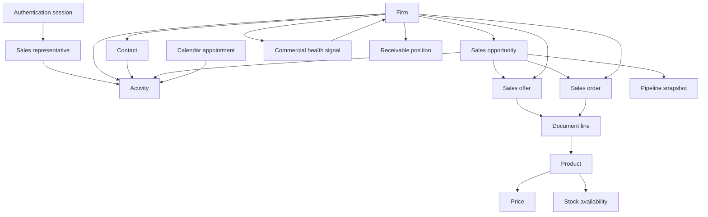

# ABRA Gen ↔ Mobile CRM business object mapping

**Status:** Draft — pending OpenAPI validation on target Gen instance  
**Version:** 0.1  
**Last updated:** 2026-06-04  

**Sources:** [business-domain-model.md](business-domain-model.md) v0.2, [screens/README.md](../screens/README.md) v0.2.

**Scope:** Maps each **Mobile CRM domain entity or concept** to the **expected ABRA Gen business object** (or derived view). Describes **business CRUD** intent for Mobile CRM — not HTTP methods or URLs.

**Rule:** ABRA Gen is the only source of truth. Unknown Gen object names are **TBD** until confirmed on customer OpenAPI / `api-docs/model`.

**Discovery spike (2026-06-04, localhost DEMO):** See [`../../architecture/reference/spike/crm-object-validation.md`](../../architecture/reference/spike/crm-object-validation.md). Confirmed: `firms`, `crmactivities`, `issuedoffers`, `issuedorders`, `storecards`. Candidates: `persons`, `busorders`, `currentuser`.

---

## 1. How to read this document

| Column | Meaning |
|--------|---------|
| **Expected Gen object** | Business object name as typically exposed in Gen Web API collections (PascalCase convention). |
| **Mobile CRM CRUD** | What the product needs: **C**reate, **R**ead, **U**pdate, **D**elete, **—** (not offered). Sub-operations in parentheses are business actions (e.g. Complete = U on status). |
| **Phase** | MVP or Phase 2. |
| **Dependencies** | Other entities or Gen setup required first. |
| **Open questions** | Items to verify in OpenAPI validation workshop / spike. |

**Aliases:** Czech/Slovak UI names in Gen may differ; validation must use OpenAPI `title` and field names on the deployment.

---

## 2. Summary matrix

| Mobile CRM entity / concept | Expected Gen object | MVP CRUD | Phase 2 CRUD | Gen object confidence |
|---------------------------|---------------------|----------|--------------|------------------------|
| Firm | `Firm` | R | R | High |
| Firm address | On `Firm` or `Address` / delivery place | R | R | Medium |
| Firm commercial status | `Firm` + status enumeration | R | R | Medium |
| Contact | **`persons`** + **`FirmPersons`** / `firmperson` on firm | R | R, C, U | **Medium** (spike 2026-06-04) |
| Activity | **TBD** (CRM activity / `Task` / calendar-linked BO) | R, C, U | R, C, U | Low |
| Activity type / status | Gen enumerations / code lists | R | R | Medium |
| Sales representative | **`currentuser`** → **`securityusers`**; optional **`employees`** via `Person_ID` | R | R | **Medium** (spike 2026-06-04) |
| Commercial health signal | Derived from `Firm` + finance objects | R | R | Low |
| Pipeline snapshot | **TBD** opportunity aggregate on `Firm` | R (optional) | R | Low |
| My Day | *(not a Gen object)* | — | — | N/A |
| Calendar appointment | **TBD** (`CalendarEvent`, `Appointment`, …) | — | R, C, U | Low |
| Sales opportunity | **TBD** (`Opportunity`, `CrmOpportunity`, …) | R (optional) | R, C, U | Low |
| Sales offer (Quote) | **TBD** (`ReceivedOrder`, `IssuedOrder`, offer doc type, …) | — | R, C, U | Low |
| Sales order (Order) | **TBD** (order document BO) | — | R, C, U | Low |
| Document line | Nested on document header BO | — | R, C, U, D | Medium |
| Product | **TBD** (`StoreCard`, `Product`, …) | — | R | Medium |
| Price | Price list / document calculation | — | R | Low |
| Stock availability | **TBD** (stock / warehouse view) | — | R | Low |
| Receivable position | **TBD** (receivable / balance view on `Firm`) | — | R | Low |
| Authentication session | Gen API identity / token context | C, R, U | C, R, U | Medium |

---

## 3. Entity mappings (detail)

### 3.1 Firm

| Attribute | Value |
|-----------|-------|
| **Mobile CRM role** | Primary **customer** hub; search and 360° view. |
| **Expected Gen object** | `Firm` (business partner / customer). |
| **Confidence** | High — standard Gen master data. |

**Mobile CRM CRUD**

| Operation | MVP | Phase 2 | Notes |
|-----------|-----|---------|-------|
| Read (list / search) | ✓ | ✓ | By name, IČO, code; filter inactive per policy. |
| Read (detail) | ✓ | ✓ | Header + address + status. |
| Create | — | — | Master data in Gen admin only (P-01). |
| Update | — | — | No firm edit in Mobile CRM. |
| Delete | — | — | Not in scope. |

**Dependencies**

- Valid authenticated **sales representative** with Gen read permission on firms.
- Gen **connection** and firm scope (organisation rules).

**Open questions (OpenAPI validation)**

| ID | Question |
|----|----------|
| OQ-FIRM-01 | Exact collection resource name: `Firm` vs `Firms` vs localised path. |
| OQ-FIRM-02 | Search: which fields are filterable (`Name`, `ICO`, `Code`, …)? |
| OQ-FIRM-03 | Field for **commercial / PM state** (blocked, active) — `PMState_ID` or equivalent. |
| OQ-FIRM-04 | Are inactive firms excluded via `where` or only on client? |
| OQ-FIRM-05 | Row-level security: per rep, team, or all customers? |

---

### 3.2 Firm address

| Attribute | Value |
|-----------|-------|
| **Mobile CRM role** | Location on firm detail; maps link. |
| **Expected Gen object** | Embedded on **`Firm`** and/or separate **`Address`** / **delivery place** object linked by `Firm_ID`. |
| **Confidence** | Medium. |

**Mobile CRM CRUD**

| Operation | MVP | Phase 2 |
|-----------|-----|---------|
| Read | ✓ (with firm) | ✓ |
| Create / Update / Delete | — | — |

**Dependencies**

- **Firm** read.

**Open questions**

| ID | Question |
|----|----------|
| OQ-ADDR-01 | Single main address on firm header vs child address collection? |
| OQ-ADDR-02 | Which address type is “visit” default (billing, delivery, office)? |

---

### 3.3 Firm commercial status

| Attribute | Value |
|-----------|-------|
| **Mobile CRM role** | Badge on firm; may block activity create (P-04). |
| **Expected Gen object** | Field(s) on **`Firm`** referencing **state / PMState** enumeration. |
| **Confidence** | Medium. |

**Mobile CRM CRUD**

| Operation | MVP | Phase 2 |
|-----------|-----|---------|
| Read | ✓ | ✓ |
| Create / Update / Delete | — | — |

**Dependencies**

- **Firm** read; enumeration metadata for display labels.

**Open questions**

| ID | Question |
|----|----------|
| OQ-STAT-01 | Enumeration resource for state codes and localized captions. |
| OQ-STAT-02 | Business rule in Gen when blocked: hard block on activity POST or warning only? |

---

### 3.4 Contact

| Attribute | Value |
|-----------|-------|
| **Mobile CRM role** | Person at firm; optional on activity. |
| **Expected Gen object** | **`persons`** (`person`); firm link via nested **`FirmPersons`** (`firmperson`). Phone/e-mail on **`address`** (`Address_ID`). |
| **Confidence** | **Medium** — validated on localhost DEMO; see [`../spikes/contact-model.md`](../spikes/contact-model.md). |

**Mobile CRM CRUD**

| Operation | MVP | Phase 2 |
|-----------|-----|---------|
| Read (list by firm) | ✓ | ✓ |
| Read (detail) | ✓ | ✓ |
| Create | — | ✓ (if policy) |
| Update | — | ✓ (if policy) |
| Delete | — | — (unless Gen allows soft-delete) |

**Dependencies**

- **Firm** (contact always in firm context).
- For list: firm identifier from Gen.

**Open questions**

| ID | Question |
|----|----------|
| OQ-CONT-01 | ~~Primary BO~~ → **`person`**; primary per firm: `InitialFirmPerson_ID` or `PosIndex` (spike). |
| OQ-CONT-02 | ~~Link field~~ → **`FirmPersons[]` on firm**; `persons` has no `Firm_ID` filter (spike). |
| OQ-CONT-03 | ~~Phone/e-mail~~ → **`address`**: `PhoneNumber1`, `PhoneNumber2`, `EMail` (spike). |
| OQ-CONT-04 | Can contact exist without firm (exclude from mobile if yes)? |
| OQ-CONT-05 | Phase 2 create: required fields and validation rules in Gen. |

---

### 3.5 Activity

| Attribute | Value |
|-----------|-------|
| **Mobile CRM role** | **My Day** lists; log visit; complete interaction. |
| **Expected Gen object** | **TBD** — candidates: CRM **Activity**, **Task**, **Event**, or calendar-linked CRM BO. |
| **Confidence** | Low — critical path for MVP. |

**Mobile CRM CRUD**

| Operation | MVP | Phase 2 | Notes |
|-----------|-----|---------|-------|
| Read (list: today, overdue, by firm) | ✓ | ✓ | Filter by responsible user + dates + status. |
| Read (detail) | ✓ | ✓ | |
| Create | ✓ | ✓ | Log visit / new activity. |
| Update | ✓ | ✓ | Edit open; **Complete** = status + outcome (U). |
| Delete | — | — | Only if Gen permits; not MVP default. |

**Dependencies**

- **Firm** (required for customer-facing types, P-02).
- **Sales representative** for ownership filter and default assignee.
- Optional: **Contact**, **Sales opportunity** (Phase 2), **Calendar appointment** (link).
- **Activity type** and **status** enumerations from Gen.

**Open questions**

| ID | Question |
|----|----------|
| OQ-ACT-01 | **Primary:** single BO for CRM visit or separate from calendar (see §3.6)? |
| OQ-ACT-02 | Fields: subject, body, start/end, due, status, type, `Firm_ID`, `Contact_ID`. |
| OQ-ACT-03 | Responsible person field name (`Responsible_ID`, `Owner_ID`, …). |
| OQ-ACT-04 | Query for “my today” and “overdue” — filterable fields and date semantics (timezone). |
| OQ-ACT-05 | Valid status transitions for Complete / Cancel. |
| OQ-ACT-06 | Validation on create/update (mandatory outcome on complete?). |
| OQ-ACT-07 | Link to **Sales opportunity** field existence (Phase 2). |
| OQ-ACT-08 | Team activities: same firm visible across reps? |

---

### 3.6 Activity type and Activity status

| Attribute | Value |
|-----------|-------|
| **Mobile CRM role** | Classify and filter activities. |
| **Expected Gen object** | Code lists / enumerations on **Activity** BO or shared **Enumeration** / `x-abra-field-enumeration` metadata. |
| **Confidence** | Medium. |

**Mobile CRM CRUD**

| Operation | MVP | Phase 2 |
|-----------|-----|---------|
| Read | ✓ | ✓ |
| Create / Update / Delete | — | — |

**Dependencies**

- **Activity** BO metadata or Gen admin-defined lists.

**Open questions**

| ID | Question |
|----|----------|
| OQ-ENUM-01 | How are activity types and statuses exposed in OpenAPI for this version? |
| OQ-ENUM-02 | Which types are “customer-facing” requiring `Firm_ID`? |

---

### 3.7 Calendar appointment

| Attribute | Value |
|-----------|-------|
| **Mobile CRM role** | Phase 2 **My Day** rows; scheduling vs outcome split (P-08). |
| **Expected Gen object** | **TBD** — `CalendarEvent`, `Appointment`, `Meeting`, or merged with Activity. |
| **Confidence** | Low. |

**Mobile CRM CRUD**

| Operation | MVP | Phase 2 |
|-----------|-----|---------|
| Read | — | ✓ |
| Create / Update | — | ✓ (policy) |
| Delete | — | — (TBD) |

**Dependencies**

- If separate from Activity: link **Activity** ↔ appointment (OQ-ACT-01).
- **Firm** optional on appointment.

**Open questions**

| ID | Question |
|----|----------|
| OQ-CAL-01 | Does Gen use one or two business objects for schedule vs CRM outcome? |
| OQ-CAL-02 | Link field names: appointment fulfilled by activity. |
| OQ-CAL-03 | Mobile write allowed or read-only sync from Outlook? |

---

### 3.8 Sales representative

| Attribute | Value |
|-----------|-------|
| **Mobile CRM role** | Identity, “my” filters, activity ownership. |
| **Expected Gen object** | **`currentuser`** (session) → **`securityusers`** (`securityuser`); optional **`employees`** via shared **`Person_ID`**. |
| **Confidence** | **Medium** — validated on localhost DEMO; see [`../spikes/sales-representative-model.md`](../spikes/sales-representative-model.md). |

**Mobile CRM CRUD**

| Operation | MVP | Phase 2 |
|-----------|-----|---------|
| Read (self profile) | ✓ | ✓ |
| Create / Update / Delete | — | — |

**Dependencies**

- Corporate **identity** integrated with Gen API authorization.
- Mapping from login identity to Gen **user id** used in activity filters.

**Open questions**

| ID | Question |
|----|----------|
| OQ-USER-01 | ~~Which BO~~ → **`securityusers.ID`** = `currentuser.id`; activities: **`ResponsibleUser_ID`** (+ legacy `SolverUser_ID` / `CreatedBy_ID` on DEMO). |
| OQ-USER-02 | Profile: **`currentuser`** + **`securityusers`**; HR via **`employees`** if `Person_ID` set. |
| OQ-USER-03 | Service account vs per-user Gen identity (auth ADR). |
| OQ-USER-04 | “My customers”: **`firms.ResponsibleUser_ID`** empty on DEMO — see spike OQ-SR-05. |

---

### 3.9 Commercial health signal

| Attribute | Value |
|-----------|-------|
| **Mobile CRM role** | Read-only section on firm detail (P-07). |
| **Expected Gen object** | **Derived** — not a standalone master. Sources: **`Firm`** + **TBD** finance objects (credit limit, receivable balance, overdue flag). |
| **Confidence** | Low. |

**Mobile CRM CRUD**

| Operation | MVP | Phase 2 |
|-----------|-----|---------|
| Read | ✓ (minimal) | ✓ (enriched) |
| Create / Update / Delete | — | — |

**Dependencies**

- **Firm** read.
- Finance/credit objects and permissions (TBD).

**Open questions**

| ID | Question |
|----|----------|
| OQ-CRED-01 | Which Gen objects/fields expose credit limit and utilization? |
| OQ-CRED-02 | Overdue indicator: aggregated on firm vs query receivable documents? |
| OQ-CRED-03 | Amounts visible to sales role or flags only (D-08)? |
| OQ-CRED-04 | Same data as desktop Gen firm finance tab? |

---

### 3.10 Pipeline snapshot

| Attribute | Value |
|-----------|-------|
| **Mobile CRM role** | Optional one-line summary on firm detail (MVP). |
| **Expected Gen object** | **Derived** from **Sales opportunity** collection filtered by `Firm_ID`, or computed field on **Firm**. |
| **Confidence** | Low. |

**Mobile CRM CRUD**

| Operation | MVP | Phase 2 |
|-----------|-----|---------|
| Read | ✓ (optional) | ✓ |
| Create / Update / Delete | — | — |

**Dependencies**

- **Sales opportunity** object exists in deployment (OQ-OPP-01).
- **Firm** read.

**Open questions**

| ID | Question |
|----|----------|
| OQ-SNAP-01 | Is CRM module licensed and present in OpenAPI? |
| OQ-SNAP-02 | Aggregate count vs single “primary” open opportunity field on Firm? |

---

### 3.11 Sales opportunity

| Attribute | Value |
|-----------|-------|
| **Mobile CRM role** | **Pipeline** hub (Phase 2); link activities and documents. |
| **Expected Gen object** | **TBD** — `Opportunity`, `SalesOpportunity`, `CrmDeal`, … |
| **Confidence** | Low. |

**Mobile CRM CRUD**

| Operation | MVP | Phase 2 |
|-----------|-----|---------|
| Read (list / detail) | ✓ (optional snapshot only) | ✓ |
| Create | — | ✓ (policy) |
| Update (stage, fields) | — | ✓ (policy) |
| Delete | — | — |

**Dependencies**

- **Firm** required.
- Optional: **Contact**, **Sales representative**.
- **Sales offer** / **Sales order** as children in Gen model.

**Open questions**

| ID | Question |
|----|----------|
| OQ-OPP-01 | Does this Gen deployment include a CRM opportunity object? |
| OQ-OPP-02 | Stage model: enumeration name and allowed transitions. |
| OQ-OPP-03 | Required fields for create from mobile. |
| OQ-OPP-04 | Relationship to issued/received orders in Gen. |

---

### 3.12 Sales offer (Quote)

| Attribute | Value |
|-----------|-------|
| **Mobile CRM role** | Phase 2 quote detail; firm/opportunity context. |
| **Expected Gen object** | **TBD** — offer/quotation document type (e.g. issued offer, `ReceivedOrder` variant, CRM quote BO). |
| **Confidence** | Low. |

**Mobile CRM CRUD**

| Operation | MVP | Phase 2 |
|-----------|-----|---------|
| Read | — | ✓ |
| Create / Update | — | ✓ (draft only, P-05) |
| Delete | — | D on draft lines/header (TBD) |

**Dependencies**

- **Firm**; preferably **Sales opportunity**.
- **Document line**, **Product**, **Price**.
- Document state machine in Gen.

**Open questions**

| ID | Question |
|----|----------|
| OQ-OFF-01 | Exact document BO for customer quotation in this installation. |
| OQ-OFF-02 | Draft vs confirmed states and mobile-allowed transitions. |
| OQ-OFF-03 | Link fields to Firm and Opportunity. |

---

### 3.13 Sales order (Order)

| Attribute | Value |
|-----------|-------|
| **Mobile CRM role** | Phase 2 order detail. |
| **Expected Gen object** | **TBD** — customer **order** document BO (issued order, sales order, …). |
| **Confidence** | Low. |

**Mobile CRM CRUD**

| Operation | MVP | Phase 2 |
|-----------|-----|---------|
| Read | — | ✓ |
| Create / Update | — | ✓ (draft only, P-05) |
| Delete | — | TBD (draft lines) |

**Dependencies**

- Same as **Sales offer**; may share document family in Gen.

**Open questions**

| ID | Question |
|----|----------|
| OQ-ORD-01 | Distinct BO from offer or shared header with type discriminator? |
| OQ-ORD-02 | Mobile allowed to confirm/post or draft only (D-05)? |

---

### 3.14 Document line

| Attribute | Value |
|-----------|-------|
| **Mobile CRM role** | Lines on quote/order in Phase 2. |
| **Expected Gen object** | Child collection on **sales document header** (rows / lines — name **TBD** per document BO). |
| **Confidence** | Medium (pattern known; names per BO). |

**Mobile CRM CRUD**

| Operation | MVP | Phase 2 |
|-----------|-----|---------|
| Read | — | ✓ |
| Create / Update / Delete | — | ✓ on draft header only |

**Dependencies**

- Parent **Sales offer** or **Sales order** in draft state.
- **Product**, **Price** resolution in Gen.

**Open questions**

| ID | Question |
|----|----------|
| OQ-LINE-01 | Nested lines via header create/update only (ABRA 26+ pattern)? |
| OQ-LINE-02 | Product reference field on line (`StoreCard_ID`, …). |

---

### 3.15 Product

| Attribute | Value |
|-----------|-------|
| **Mobile CRM role** | Line picker on quotes/orders. |
| **Expected Gen object** | **TBD** — commonly **`StoreCard`** (material/service catalogue) in Gen terminology. |
| **Confidence** | Medium. |

**Mobile CRM CRUD**

| Operation | MVP | Phase 2 |
|-----------|-----|---------|
| Read (search / detail) | — | ✓ |
| Create / Update / Delete | — | — |

**Dependencies**

- Catalogue permissions; may depend on firm price list.

**Open questions**

| ID | Question |
|----|----------|
| OQ-PROD-01 | `StoreCard` vs separate `Product` / service BO for sales. |
| OQ-PROD-02 | Search fields for mobile picker (code, name, barcode). |
| OQ-PROD-03 | Sellable filter (active, for sale flag). |

---

### 3.16 Price

| Attribute | Value |
|-----------|-------|
| **Mobile CRM role** | Display on document lines; Gen-calculated totals. |
| **Expected Gen object** | **Derived** — price list + document pricing engine on header/lines (**TBD** fields). |
| **Confidence** | Low. |

**Mobile CRM CRUD**

| Operation | MVP | Phase 2 |
|-----------|-----|---------|
| Read | — | ✓ |
| Create / Update / Delete | — | — (rep does not own price lists) |

**Dependencies**

- **Product**, **Firm**, document context, Gen price list rules.

**Open questions**

| ID | Question |
|----|----------|
| OQ-PRICE-01 | Are prices recalculated on line save via Gen validation only? |
| OQ-PRICE-02 | Firm-specific price list linkage field. |

---

### 3.17 Stock availability

| Attribute | Value |
|-----------|-------|
| **Mobile CRM role** | Informational at line or product read. |
| **Expected Gen object** | **TBD** — stock balance / availability on **`StoreCard`** or warehouse view. |
| **Confidence** | Low. |

**Mobile CRM CRUD**

| Operation | MVP | Phase 2 |
|-----------|-----|---------|
| Read | — | ✓ |
| Create / Update / Delete | — | — |

**Dependencies**

- **Product**; warehouse scope in Gen.

**Open questions**

| ID | Question |
|----|----------|
| OQ-STK-01 | Which object exposes available qty for sales document context? |
| OQ-STK-02 | Per-warehouse vs consolidated availability. |

---

### 3.18 Receivable position

| Attribute | Value |
|-----------|-------|
| **Mobile CRM role** | Phase 2 detail behind commercial health. |
| **Expected Gen object** | **TBD** — receivable balances / open invoices / **`Firm`** finance extension. |
| **Confidence** | Low. |

**Mobile CRM CRUD**

| Operation | MVP | Phase 2 |
|-----------|-----|---------|
| Read | — | ✓ |
| Create / Update / Delete | — | — |

**Dependencies**

- **Firm**; finance permissions.

**Open questions**

| ID | Question |
|----|----------|
| OQ-REC-01 | Separate receivable document list vs summary fields on Firm? |
| OQ-REC-02 | Ageing buckets available in API or UI-only in Gen desktop? |

---

### 3.19 My Day

| Attribute | Value |
|-----------|-------|
| **Mobile CRM role** | Operational hub (screen SCR-002). |
| **Expected Gen object** | **None** — composite view over **Activity** (MVP) and **Calendar appointment** (Phase 2). |
| **Confidence** | N/A |

**Mobile CRM CRUD**

| Operation | MVP | Phase 2 |
|-----------|-----|---------|
| All | — | — (CRUD applies to underlying entities) |

**Dependencies**

- **Activity**; Phase 2 **Calendar appointment**; **Sales representative** filter.

**Open questions**

| ID | Question |
|----|----------|
| OQ-DAY-01 | Single merged query possible in Gen or always two reads? |

---

### 3.20 Authentication session

| Attribute | Value |
|-----------|-------|
| **Mobile CRM role** | Login; authorized access to all Gen reads/writes. |
| **Expected Gen object** | Gen **API authorization context** (token / session) + optional **User** record — **TBD** mechanism per auth ADR. |
| **Confidence** | Medium. |

**Mobile CRM CRUD**

| Operation | MVP | Phase 2 |
|-----------|-----|---------|
| Create (login) | ✓ | ✓ |
| Read (validate) | ✓ | ✓ |
| Update (refresh) | ✓ | ✓ |
| Delete (logout) | ✓ | ✓ |

**Dependencies**

- Corporate IdP (if used); Gen permission profile for CRM objects.

**Open questions**

| ID | Question |
|----|----------|
| OQ-AUTH-01 | Bearer token issuance model documented for this Gen version. |
| OQ-AUTH-02 | Minimum permission set for MVP (Firm R, Activity CRU, …). |

---

## 4. Dependency graph (business)

---

## 5. OpenAPI validation backlog (prioritised)

Priority for first spike on customer Gen **26+** instance:

| Priority | IDs | Rationale |
|----------|-----|-----------|
| P0 | OQ-ACT-01 … OQ-ACT-06, OQ-FIRM-01 … OQ-FIRM-03, OQ-USER-01, OQ-AUTH-01 | MVP critical path |
| P0 | OQ-CONT-01, OQ-CONT-02 | Firm 360° |
| P1 | OQ-CRED-01 … OQ-CRED-04, OQ-STAT-02 | Commercial health MVP |
| P1 | OQ-ENUM-01, OQ-ENUM-02 | Activity UX |
| P2 | OQ-OPP-01 … OQ-OPP-04, OQ-CAL-01 … OQ-CAL-03 | Phase 2 hubs |
| P2 | OQ-OFF-01, OQ-ORD-01, OQ-LINE-01, OQ-PROD-01 | Documents |
| P3 | OQ-PRICE-01, OQ-STK-01, OQ-REC-01, OQ-DAY-01 | Enrichment |

**Validation artefact:** store audited model snapshots under `architecture/reference/openapi/` (see architecture README). Record answers in this file → bump version and change **TBD** to confirmed object names.

---

## 6. Maintenance

| Event | Action |
|-------|--------|
| Gen version change | Re-run validation backlog; update confidence column. |
| MVP scope change | Sync [mvp-scope.md](../requirements/mvp-scope.md) and CRUD tables. |
| Confirmed BO name | Replace **TBD** in §2–3; link to integration doc when created. |

---

## 7. Document history

| Version | Date | Change |
|---------|------|--------|
| 0.1 | 2026-06-04 | Initial mapping from domain model v0.2 |
