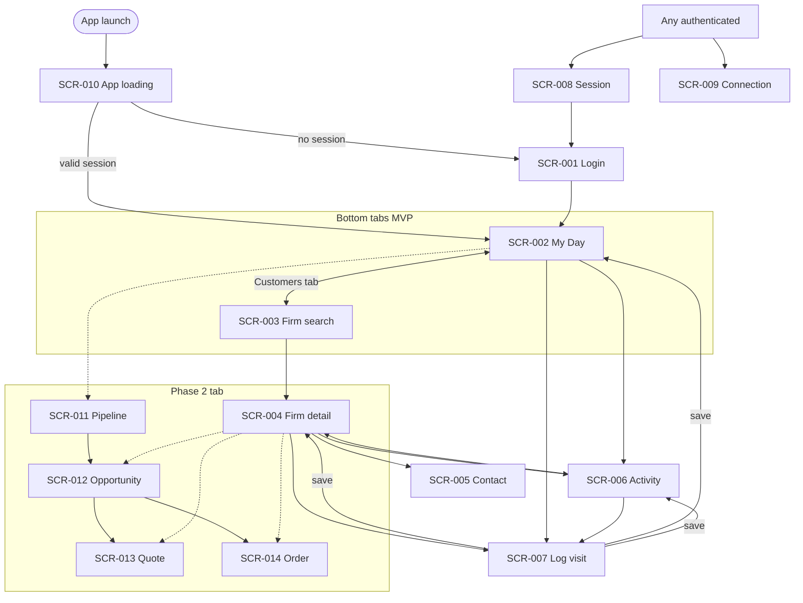

# MVP screen inventory — ABRA Mobile CRM

**Status:** Draft  
**Version:** 0.2 (aligned with [domain model v0.2](../domain/business-domain-model.md))  
**Last updated:** 2026-06-04

One markdown file per screen. Maps to MVP capabilities in [`../requirements/mvp-scope.md`](../requirements/mvp-scope.md) and journeys UJ-001–UJ-003.

## Business hubs → screens

| Hub | Type | MVP screen | Phase 2 screen |
|-----|------|------------|----------------|
| **My Day** | Operational (time) | SCR-002 | + calendar rows on SCR-002 |
| **Firm** | Customer (relationship) | SCR-003, SCR-004, SCR-005 | — |
| **Pipeline** | Commercial (deals) | Snapshot on SCR-004 only (optional) | SCR-011, SCR-012 |
| Quote / Order | Secondary (documents) | Placeholder sections on SCR-004 | SCR-013, SCR-014 |

## Screen index

| ID | Screen | File | Phase | Hub |
|----|--------|------|-------|-----|
| SCR-001 | Login | [SCR-001-login.md](SCR-001-login.md) | MVP | — |
| SCR-002 | **My Day** | [SCR-002-my-day.md](SCR-002-my-day.md) | MVP | Operational |
| SCR-003 | Firm search | [SCR-003-firm-search.md](SCR-003-firm-search.md) | MVP | Customer |
| SCR-004 | Firm detail | [SCR-004-firm-detail.md](SCR-004-firm-detail.md) | MVP | Customer |
| SCR-005 | Contact detail | [SCR-005-contact-detail.md](SCR-005-contact-detail.md) | MVP | Customer (secondary) |
| SCR-006 | Activity detail | [SCR-006-activity-detail.md](SCR-006-activity-detail.md) | MVP | Operational |
| SCR-007 | Log visit | [SCR-007-log-visit.md](SCR-007-log-visit.md) | MVP | Operational |
| SCR-008 | Session expired | [SCR-008-session-expired.md](SCR-008-session-expired.md) | MVP | System |
| SCR-009 | Connection / service error | [SCR-009-connection-error.md](SCR-009-connection-error.md) | MVP | System |
| SCR-010 | App loading | [SCR-010-app-loading.md](SCR-010-app-loading.md) | MVP | System |
| SCR-011 | Pipeline | [SCR-011-pipeline.md](SCR-011-pipeline.md) | **Phase 2 placeholder** | Commercial |
| SCR-012 | Opportunity detail | [SCR-012-opportunity-detail.md](SCR-012-opportunity-detail.md) | **Phase 2 placeholder** | Commercial |
| SCR-013 | Quote detail | [SCR-013-quote-detail.md](SCR-013-quote-detail.md) | **Phase 2 placeholder** | Document |
| SCR-014 | Order detail | [SCR-014-order-detail.md](SCR-014-order-detail.md) | **Phase 2 placeholder** | Document |

## Navigation map (MVP + Phase 2 stubs)

## Navigation consistency rules

| Rule | Application |
|------|-------------|
| **N-01** | Default post-login landing: **SCR-002 My Day** unless org chooses Firm-first (D-10) → **SCR-003**. |
| **N-02** | **Customers** tab always opens **SCR-003**; firm drill-down is **SCR-004**. |
| **N-03** | **My Day** tab always opens **SCR-002**; never firm search. |
| **N-04** | **Log visit** success returns to **origin** (SCR-002, SCR-004, or SCR-006). |
| **N-05** | **Firm** back from SCR-004: prefer SCR-003 if stack from search; else SCR-002. |
| **N-06** | Phase 2 **Pipeline** tab → SCR-011 only; quotes/orders are **not** top-level tabs. |
| **N-07** | SCR-008 / SCR-009 reachable from any authenticated screen; success retry restores prior context. |
| **N-08** | Commercial health is a **section on SCR-004**, never a standalone screen. |

## Global UI (not full screens)

| Element | Applies | Documented in |
|---------|---------|---------------|
| Connectivity banner | All authenticated screens | SCR-009, SCR-002 |
| Inline loading skeleton | Data screens | Per screen |
| Pull-to-refresh | Lists | SCR-002, SCR-003, SCR-004 |

## Gen business objects by screen

| Object | Screens |
|--------|---------|
| Firm | SCR-003, SCR-004 |
| Commercial health signal | SCR-004 |
| Contact | SCR-004, SCR-005 |
| Activity | SCR-002, SCR-006, SCR-007 |
| Sales opportunity | SCR-004 snapshot; SCR-011–012 Phase 2 |
| Sales offer (Quote) | SCR-004 placeholder; SCR-013 Phase 2 |
| Sales order (Order) | SCR-004 placeholder; SCR-014 Phase 2 |
| Identity | SCR-001, SCR-008, SCR-010 |

## Change control

Update this index when adding screens or changing hubs. Sync with [`../domain/business-domain-model.md`](../domain/business-domain-model.md) and [`../requirements/mvp-scope.md`](../requirements/mvp-scope.md).
