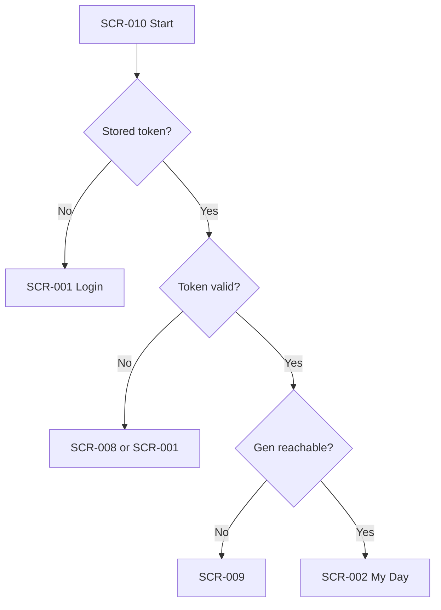

# SCR-010: App loading

| Attribute | Value |
|-----------|-------|
| **Screen ID** | SCR-010 |
| **MVP capabilities** | M1, M7 — Session bootstrap; loading UX |
| **Persona** | Field sales representative |
| **Online required** | Yes for Gen validation path |

## Purpose

Brief **cold-start gate** while the app checks stored credentials, refreshes tokens if applicable, and verifies that ABRA Gen is reachable before showing CRM data.

## User goals

- Open the app and land on the right screen without flashing wrong content
- Not see stale CRM data from a previous user on shared devices (sign out policy TBD)

## Information displayed

| Zone | Content |
|------|---------|
| Branding | Logo / app name |
| Progress | Indeterminate spinner or progress |
| Status text (optional) | “Signing in…”, “Connecting to ABRA…” |
| Error (if bootstrap fails) | Transition to SCR-009 or SCR-001 |

**Not displayed:** Firm or activity lists (no data until routing completes).

## Available actions

| Action | Behaviour |
|--------|-----------|
| *(none during load)* | User waits |
| Cancel (optional) | Abort → SCR-001 if hung (timeout 30 s TBD) |

## Navigation paths

| Direction | Target | Condition |
|-----------|--------|-----------|
| **Incoming** | App launch | Cold start |
| **Incoming** | App resume from background | Optional re-validate token |
| **Outgoing** | SCR-002 My Day | Valid token + Gen OK (default D-10) |
| **Outgoing** | SCR-003 Firm search | Valid token + org Firm-first (D-10) |
| **Outgoing** | SCR-001 Login | No / invalid token |
| **Outgoing** | SCR-008 Session expired | Refresh failed |
| **Outgoing** | SCR-009 Connection error | Gen unreachable at bootstrap |

## Bootstrap decision flow

## Related ABRA business objects

| Object | Role |
|--------|------|
| *(none)* | No CRM entities loaded on this screen |
| **Gen API session** | Validate or refresh |
| **Firm / Activity** | Not queried until SCR-002+ |

## Open design notes

- [ ] Maximum bootstrap time before offering Retry / Login
- [ ] Whether to prefetch dashboard on bootstrap (performance vs simplicity)
- [ ] Shared device: force login every launch (security)

## Acceptance hints

- No flash of SCR-002 with empty then error
- Token read from secure storage only
- Failed bootstrap never caches Gen business data
