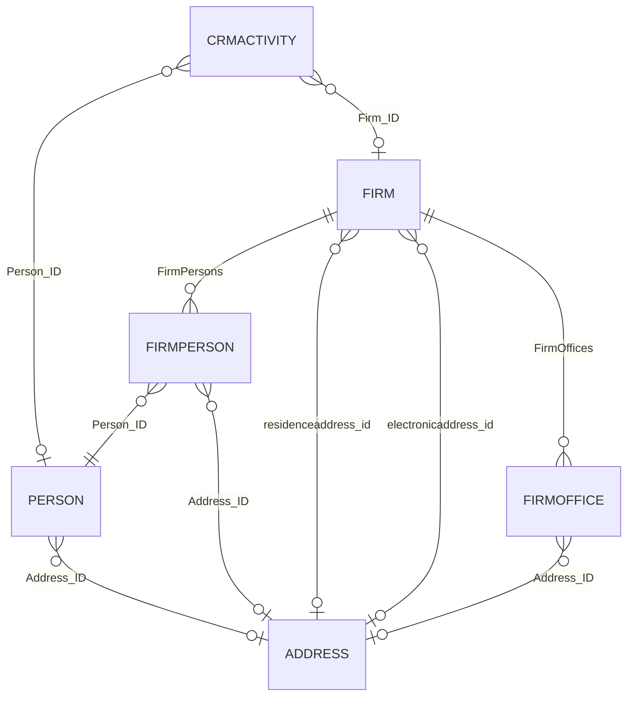

# Contact Model Validation Spike

**Mobile CRM entity:** Contact  
**Gen objects:** `persons` (osoba), `firms` (firma), junction `firmperson`, embedded `address`  
**Server:** `http://localhost/demo`  
**Spike date (UTC):** 2026-06-04  
**OpenAPI:** `architecture/reference/spike/openapi/persons.json`, `firms.json`  
**Live evidence:** [`contact-model-results.json`](contact-model-results.json)  
**Related:** [`crmactivities-lifecycle.md`](crmactivities-lifecycle.md), [`../domain/gen-business-object-mapping.md`](../domain/gen-business-object-mapping.md)

---

## 1. Executive summary

| Question | Answer (DEMO) |
|----------|----------------|
| Gen contact object | **`persons`** (`person`) — no separate `contacts` controller |
| Link to firm | **`FirmPersons[]`** on firm (`firmperson`: `Parent_ID` → firm, `Person_ID` → person) |
| List contacts for firm | **`GET firms/{id}`** (full or client-side extract `firmpersons`) — **not** `persons?where=Firm_ID` |
| Primary contact | **`InitialFirmPerson_ID`** when set; else **`PosIndex`** on `firmperson` (no `IsPrimary` flag) |
| Phone / email | On **`address`** BO — embedded or via **`GET addresses/{id}`** |
| Sales rep ownership | **`ResponsibleUser_ID`** / **`ResponsibleRole_ID`** on **firm** and **person** (Gen users, not contact) |

**MVP suitability:** **Suitable for read-only** contact list on firm detail and picker on log visit. **Phase 2** for create/update (master data in Gen). Confirm row-level security on target instance.

---

## 2. Object model

| Mobile CRM | Gen | Role |
|------------|-----|------|
| Contact | `person` / `persons` | Named individual |
| Firm–contact link | `firmperson` row in `FirmPersons[]` | Many-to-many with order and optional per-link address |
| Address | `address` / `addresses` | Phone, email, location |
| Firm | `firm` / `firms` | Customer; carries firm-level addresses and contact list |

**Not used for MVP contact list:** `ResponsibleCustomerPerson_ID` exists on some **other** BOs in OpenAPI (e.g. busorder checkpoints) but was **not** exposed on `firm` or `person` in live DEMO reads.

---

## 3. How contacts are linked to firms

### 3.1 Canonical link: `firmperson` (`FirmPersons[]`)

| Field (API) | Label (SK) | Notes |
|-------------|------------|-------|
| `Parent_ID` | Vlastník | Firm ID (owner); read-only on junction |
| `Person_ID` | Osoba | → `persons/{id}` |
| `PosIndex` | Poradie | Sort order (1-based on samples) |
| `FirmOffice_ID` | Prevádzkareň | Optional branch |
| `CommonWorkPosition_ID` | Pozícia vo firme | Job title reference |
| `Address_ID` | (embedded `address`) | **Per firm–person** address row (may differ from person default) |
| `Note` | Poznámka | |

**Live example (EUROCAR `3000000101`):**

| firmperson.id | person_id | displayname | posindex |
|---------------|-----------|-------------|----------|
| `2000000101` | `6000000101` | 00002 EUROCAR s.r.o. - Dlaha František | 1 |

### 3.2 Firm header pointers

| Field | Label (SK) | MVP use |
|-------|------------|---------|
| `InitialFirmPerson_ID` | Východisková osoba novej firmy | **Primary candidate** when ≠ `0000000000` |
| `InitialFirmPerson_*` | Name parts | Denormalized labels on firm |
| `PayRemPerson_ID` | Kontaktná osoba (upomienky) | Reminder contact; **read-only** on DEMO samples |

On DEMO, `InitialFirmPerson_ID` was **`0000000000`** (unset) for all sampled firms.

### 3.3 Activity link

`crmactivities.Person_ID` → optional contact on visit (see lifecycle spike). Not a substitute for firm contact list.

### 3.4 What does **not** link persons to firms (DEMO)

| Attempt | Result |
|---------|--------|
| `persons?where=Firm_ID eq '{firm}'` | **400** — column `FIRM_ID` does not exist on `Persons` |
| `persons?where=Parent_ID eq '{firm}'` | **400** — column `PARENT_ID` does not exist on `Persons` |
| `select` including `FirmPersons(...)` on `GET firms` | **400** — “Neznáma agregačná funkcia: FirmPersons” |

**Implication:** Load contacts by reading **`firms/{id}`** and parsing **`firmpersons`**, then optionally **`GET persons/{person_id}`** for detail.

---

## 4. Primary contact support

| Mechanism | Present on DEMO | Recommendation |
|-----------|-----------------|----------------|
| `IsPrimary` / `MainContact` on `firmperson` | **No** in OpenAPI or payloads | — |
| `InitialFirmPerson_ID` | Yes; often **unset** (`0000000000`) | Use when set |
| `firmperson.PosIndex` | Yes (`1` for first row) | **Default MVP:** lowest `PosIndex` when `InitialFirmPerson_ID` unset |
| `PayRemPerson_ID` | Yes; unset on samples | Do not use as UI “primary” unless product defines it |
| Firm `residenceaddress_id` | Company main address | Firm-level “call the company”, not a named contact |

**Open question:** Whether Gen desktop UI marks primary via `InitialFirmPerson_ID` only or also maintains `PosIndex`. Validate with customer on production data.

---

## 5. Phone and email fields

### 5.1 `address` schema (confirmed)

| Field | Label (SK) | Max | Notes |
|-------|------------|-----|-------|
| `EMail` | E-mail | 320 | |
| `PhoneNumber1` | Telefón 1. | 30 | Primary phone for MVP |
| `PhoneNumber2` | Telefón 2. | 30 | Secondary |
| `FaxNumber` | FAX | 30 | |
| `Street`, `City`, `PostCode`, `ZIP`, `Country`, … | Address | | |

**Read paths (live):**

| Source | Endpoint / path | Example (EUROCAR) |
|--------|-----------------|-------------------|
| Person | `GET persons/{id}` → `address_id` embedded | `6000000101`: phones/email **empty** on person address |
| Firm–person row | `GET firms/{id}` → `firmpersons[].address_id` | Often empty; name in `displayname` |
| Firm residence | `residenceaddress_id` | `phonenumber1`: +421 311 567 345, `email`: obchod@abc.com |
| Firm electronic | `electronicaddress_id` | `email`: obchod@abc.com |
| Firm office | `firmoffices[].address_id` | Same as residence on sample |
| Direct | `GET addresses/{id}?select=EMail,PhoneNumber1,...` | **200** for `AAAP000000` |

**API naming:** Full GET returns **lowercase** (`phonenumber1`, `email`); `select` uses **PascalCase** (`PhoneNumber1`, `EMail`).

### 5.2 Firm-level vs contact-level

| UI need | Suggested Gen source (priority) |
|---------|----------------------------------|
| Named contact phone/email | `person.address_id` → else `firmperson.address_id` |
| Company switchboard | `firm.residenceaddress_id` or `firm.electronicaddress_id` |
| Branch | `firmoffices[].address_id` matching `FirmOffice_ID` on `firmperson` |

### 5.3 Fields **not** on person API (DEMO)

| OpenAPI on person | Live `select` |
|-------------------|---------------|
| `ElectronicAddress_ID` | **400** — unknown on person class |
| Top-level `EMail` / `Phone*` on `person` | Not in `person` schema — only via `Address_ID` |

### 5.4 Other

| Field | Location | Notes |
|-------|----------|-------|
| `WWWAddress` | `firm` | Company web (e.g. `www.eurocar.sk`) — not person |

---

## 6. Ownership rules

### 6.1 CRM ownership (sales representative)

| Object | Field | Label (SK) | Meaning |
|--------|-------|------------|---------|
| `firm` | `ResponsibleUser_ID` | Zodpovedná osoba | Gen **security user** owning the customer |
| `firm` | `ResponsibleRole_ID` | Zodpovedná rola | Alternative role-based ownership |
| `person` | `ResponsibleUser_ID` | Zodpovedná osoba | Owner of person master record |
| `person` | `ResponsibleRole_ID` | Zodpovedná rola | |

On DEMO list samples, `ResponsibleUser_ID` was **null** on firms and persons — permissions/assignment not configured for API user.

### 6.2 Record flags

| Field | Object | Label | Notes |
|-------|--------|-------|-------|
| `IsOwned` | `person` | Vlastnená | Read-only; `true` for some employees |
| `IsEmployee` | `person` | Zodpovedná osoba / Zamestnanec | **true** = internal; filter out for customer contact pickers |
| `Hidden` | `person`, `firm` | Skrytý | Exclude inactive in lists |
| `CreatedBy_ID` / `CorrectedBy_ID` | both | Audit | |
| `PMState_ID` | `person` | Procesný stav | e.g. `PERSDEF000` |

### 6.3 GDPR / marketing

| Field | Object | Notes |
|-------|--------|-------|
| `CommercialsAgreement` | `person`, `firm` | Enum: Nevyjadril sa / Súhlas / Nesúhlas |
| `GDPRValiditySuspended` | `person`, `firm` | Processing restriction |

### 6.4 Mobile CRM permission alignment (from domain model)

- Contacts: **read** MVP; create/update in Gen admin / Phase 2 (P-01).
- Row-level scope (per rep vs all customers) applies to **firms** and indirectly to contacts loaded via firm — **OQ-CM-06**.

---

## 7. Field inventory

### 7.1 `person` — MVP projection

| Field | Label | MVP |
|-------|-------|:---:|
| `ID` | Vlastné ID | ✓ |
| `FirstName`, `LastName`, `FullName`, `DisplayName` | Meno, … | ✓ |
| `Title`, `Suffix`, `Grade` | Titul, pozícia | ✓ |
| `Address_ID` | → address | ✓ (expand or second GET) |
| `Hidden` | Skrytý | ✓ filter |
| `IsEmployee` | Zamestnanec | ✓ filter |
| `ResponsibleUser_ID` | Zodpovedná osoba | optional |
| `Note`, `Comment` | Poznámky | optional |

### 7.2 `firmperson` — from firm payload

| Field | MVP |
|-------|:---:|
| `ID`, `Person_ID`, `PosIndex`, `DisplayName` | ✓ |
| `CommonWorkPosition_ID`, `FirmOffice_ID`, `Note` | optional |
| `address_id` (embedded) | ✓ phone/email when populated |

### 7.3 `firm` — contact-related (read)

| Field | MVP |
|-------|:---:|
| `FirmPersons` | ✓ (via full GET) |
| `InitialFirmPerson_ID` | ✓ primary |
| `ResponsibleUser_ID` | ✓ rep filter |
| `residenceaddress_id`, `electronicaddress_id` | ✓ company phone/email |
| `firmoffices` | optional branches |

---

## 8. Live validation matrix

| Step | HTTP | Result |
|------|------|--------|
| `GET firms?select=ID,Name,InitialFirmPerson_ID,ResponsibleUser_ID,Hidden` | 200 | List OK |
| `GET firms/{id}` (full) | 200 | `firmpersons`, addresses embedded |
| `GET firms/{id}?select=FirmPersons(...)` | 400 | Nested collection not in `select` |
| `GET persons?select=...` | 200 | List OK |
| `GET persons/{id}` | 200 | `address_id` embedded |
| `GET addresses/{id}?select=EMail,PhoneNumber1,...` | 200 | Direct address read |
| `GET persons/{id}/xrelations` | 200 | Empty array on sample |
| `GET persons?where=Firm_ID eq '...'` | 400 | Invalid column |
| `GET firms/3000000101` | 200 | 1 firmperson; residence phone/email populated |
| `GET persons/6000000101` | 200 | Contact name; person address empty |

---

## 9. Business rules

| ID | Rule |
|----|------|
| BR-CM-01 | Mobile CRM **Contact** maps to Gen **`person`**, not `securityusers` / `employees`. |
| BR-CM-02 | Firm contact list comes from **`firm.firmpersons`**, not a flat `persons` query by firm. |
| BR-CM-03 | Exclude **`IsEmployee eq true`** from customer contact pickers unless product says otherwise. |
| BR-CM-04 | Exclude **`Hidden`** persons and firms from MVP lists. |
| BR-CM-05 | **Primary contact:** `InitialFirmPerson_ID` if valid; else `firmperson` with minimum **`PosIndex`**. |
| BR-CM-06 | Display phone/email from **address** linked to person or firmperson; fall back to firm **residence** / **electronic** address for “company line”. |
| BR-CM-07 | **`Person_ID`** on activities must reference a person linked to the activity’s **`Firm_ID`** (validate in UX). |
| BR-CM-08 | Do not use **`ResponsibleCustomerPerson_ID`** on `crmactivities` (invalid on DEMO class). Use **`Person_ID`**. |
| BR-CM-09 | **`ResponsibleUser_ID`** on firm = sales rep for “my customers”, not the customer contact. |
| BR-CM-10 | Contact **create/update** out of MVP scope — Gen master data only (P-01). |

---

## 10. Open questions

| ID | Question | Priority |
|----|----------|----------|
| OQ-CM-01 | Production pattern to load **`firmpersons`** with smaller payload (expand, view, or BQL)? | P0 |
| OQ-CM-02 | When is **`InitialFirmPerson_ID`** set vs relying on **`PosIndex`**? | P0 |
| OQ-CM-03 | Should mobile show **firmperson.address** or **person.address** when both differ? | P1 |
| OQ-CM-04 | Filter **`persons`** by firm via supported `where` on a view (if any)? | P1 |
| OQ-CM-05 | Is there a Gen field for **primary** on `firmperson` in customer configs not on DEMO? | P1 |
| OQ-CM-06 | Row-level security: which firms/persons does mobile API user see? | P0 |
| OQ-CM-07 | Phase 2 create contact: **POST person** + link via **PUT firm** `FirmPersons[]`? | P2 |
| OQ-CM-08 | Map **`PayRemPerson_ID`** in firm UI? | P2 |

---

## 11. MVP suitability assessment

| Capability | Suitability | Confidence | Blocker / note |
|------------|-------------|------------|----------------|
| Contact list on firm detail (SCR-004) | **High** | Medium | Full firm GET or OQ-CM-01 |
| Contact picker on log visit (SCR-007) | **High** | Medium | Same + `IsEmployee` filter |
| Tap-to-call / mailto | **High** | High | `address` phone/email |
| Contact detail screen | **High** | High | `GET persons/{id}` |
| Primary badge | **Medium** | Low | OQ-CM-02 |
| Create / edit contact | **Low** (P2) | High | P-01 master data policy |
| Search all contacts globally | **Low** | Medium | No firm filter on `persons` |

**Verdict:** **`persons` + `FirmPersons` junction** is the correct MVP contact model. Implement firm hub contact list from **`GET firms/{id}`** and detail from **`GET persons/{id}`** + address resolution rules in §5.2.

---

## 12. Suggested read sequence (MVP)

1. `GET firms/{firmId}?select=ID,Name,InitialFirmPerson_ID,ResponsibleUser_ID,Hidden`
2. `GET firms/{firmId}` — extract `firmpersons` (or solve OQ-CM-01).
3. For each `Person_ID`: `GET persons/{id}?select=ID,FirstName,LastName,FullName,DisplayName,Grade,Address_ID,Hidden,IsEmployee`
4. If needed: `GET addresses/{addressId}?select=EMail,PhoneNumber1,PhoneNumber2` when embed truncated.

**Suggested MVP contact card fields:** `DisplayName` or `FullName`, `Grade`, `PhoneNumber1`, `EMail`, primary flag (derived), `PosIndex`.

---

## 13. Document history

| Version | Date | Change |
|---------|------|--------|
| 0.1 | 2026-06-04 | Initial contact model spike vs localhost DEMO |
