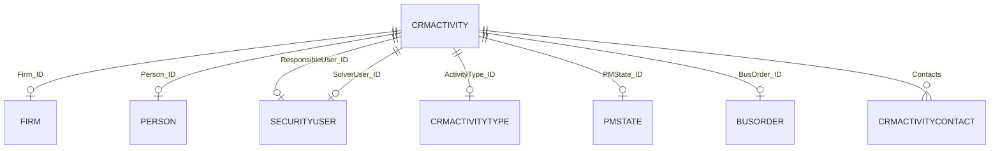

# CRM Activity Lifecycle Validation Spike

**Business object:** `crmactivities` (Gen: **Aktivita** / `crmactivity`)  
**Server:** `http://localhost/demo`  
**Spike date (UTC):** 2026-06-04  
**OpenAPI source:** `architecture/reference/spike/openapi/crmactivities.json`  
**Live evidence:** [`crmactivities-lifecycle-results.json`](crmactivities-lifecycle-results.json)  
**Related mapping:** [`../domain/gen-business-object-mapping.md`](../domain/gen-business-object-mapping.md)

---

## 1. Executive summary

| Lifecycle step | Result | Notes |
|----------------|--------|-------|
| Read (list / detail) | **Pass** / **Partial** | List OK; detail **400** if `select` includes unknown `ResponsibleCustomerPerson_ID` |
| Create | **Partial** | `POST ?validation=true` returns preview `id` even when validation fails; **201 / zero errors** needed to persist (see §5) |
| Update | **Pass** | `PUT` on existing `ID` returned 200 |
| Complete | **Pass** | `Status = 2` (Dokončené) via `PUT`; alternate: `pmchangestate` |

**MVP suitability:** **Suitable** for My Day, log visit, and complete flows, with a **minimal field set** and Gen-driven validation handling. Plan for DEMO-specific mandatory references (`ActQueue_ID`, `Period_ID`, etc.) and custom fields (`X_*`) ignored on mobile.

---

## 2. Gen business object

| Attribute | Value |
|-----------|-------|
| Controller / collection | `crmactivities` |
| Schema | `crmactivity` |
| Class ID (CLSID) | `AVV1JYV5AVNOZHQCK0D4CJFUCS` |
| Description (SK) | aktivita |
| BO class name | `crmactivity` |

**Not the same as:** `tasks` (Úlohy) — separate task module; Mobile CRM must use **`crmactivities` only**.

---

## 3. Field inventory (MVP-relevant)

Grouped for Mobile CRM. Full schema has 100+ properties (incl. customer-specific `X_*`); mobile should use a **narrow projection**.

### 3.1 Identity and display

| Field | Label (SK) | Type | Read | Write | Notes |
|-------|------------|------|:----:|:-----:|-------|
| `ID` | Vlastné ID | string | ✓ | RO | Assigned by Gen on create |
| `DisplayName` | Názov | string | ✓ | RO | Auto from number/subject |
| `Subject` | Predmet | string | ✓ | ✓ | Primary title in UI |
| `Description` | Popis | string | ✓ | ✓ | Plan / outcome notes |
| `Answer` | Odpoveď | string | ✓ | ✓ | Outcome on complete |
| `ObjVersion` | Verzia | integer | ✓ | RO | Concurrency |

### 3.2 Status and process

| Field | Label (SK) | Type | Read | Write | Notes |
|-------|------------|------|:----:|:-----:|-------|
| `Status` | Stav | integer (enum) | ✓ | ✓ | **Primary completion field for MVP** |
| `PMState_ID` | Procesný stav | → `pmstate` | ✓ | ✓ | Workflow; default `CADEF00000` on sample |
| `Priority` | Priorita | integer (enum) | ✓ | ✓ | 0–3 (Nízka … Extrémne vysoká) |

**`Status` enumeration (OpenAPI):**

| Value | Caption (SK) | Mobile CRM mapping |
|------:|--------------|-------------------|
| 0 | Neriešené | Open |
| 1 | V procese | In progress |
| 2 | Dokončené | **Completed** |
| 3 | Odovzdané | Handed over (post-complete) |

### 3.3 Scheduling (My Day)

| Field | Label (SK) | Type | Read | Write | Notes |
|-------|------------|------|:----:|:-----:|-------|
| `SheduledStart$DATE` | Čas začatia | date-time | ✓ | ✓ | Typo **Sheduled** in Gen API |
| `SheduledEnd$DATE` | Čas dokončenia | date-time | ✓ | ✓ | Planned end |
| `SheduledDuration$DATE` | Čas trvania | date-time | ✓ | ✓ | |
| `RealStart$DATE` | Skutočný čas začatia | date-time | ✓ | ✓ | Set on create in spike |
| `RealEnd$DATE` | Skutočný čas dokončenia | date-time | ✓ | ✓ | |
| `NextContact$DATE` | Dátum ďalšieho kontaktu | date-time | ✓ | ✓ | Optional follow-up |

### 3.4 Classification

| Field | Label (SK) | Type | Read | Write | Notes |
|-------|------------|------|:----:|:-----:|-------|
| `ActivityType_ID` | Typ aktivít | → `crmactivitytype` | ✓ | ✓ | e.g. `Tel` / Telefón |
| `ActivityArea_ID` | Oblasť aktivity | → `crmactivityarea` | ✓ | ✓ | Auto-filled from type in validation |
| `ActQueue_ID` | Rad aktivít | → `crmactivityqueue` | ✓ | ✓ | **Validation error if empty on DEMO** |
| `ActivityProcess_ID` | Proces aktivít | → `crmactivityprocess` | ✓ | ✓ | |
| `Period_ID` | Obdobie | → `period` | ✓ | ✓ | **Validation error if invalid on DEMO** |

### 3.5 Links — Firm, Contact, User

| Field | Label (SK) | Links to | Read | Write | MVP |
|-------|------------|----------|:----:|:-----:|:---:|
| `Firm_ID` | Firma | **Firm** (`firms`) | ✓ | ✓ | **Required** for customer visit |
| `FirmOffice_ID` | Prevádzkareň | `firmoffice` | ✓ | ✓ | Optional |
| `Person_ID` | Osoba | **Contact** (`persons`) | ✓ | ✓ | Primary contact link |
| `Contacts[]` | Kontakty | nested `crmactivitycontact` | ✓ | ✓ | Optional rows; includes `person_id` |
| `ResponsibleUser_ID` | Zodpovedná osoba | **User** (`securityusers`) | ✓ | ✓ | Filter “my” activities |
| `ResponsibleRole_ID` | Zodpovedná rola | `securityrole` | ✓ | ✓ | Alternative to user |
| `SolverUser_ID` | Riešiteľ | `securityusers` | ✓ | ✓ | |
| `SolverRole_ID` | Rola riešiteľa | `securityrole` | ✓ | ✓ | Validation noise on DEMO if empty |
| `CreatedBy_ID` | Vytvoril | `securityusers` | ✓ | ✓ | Set on create (API user) |
| `ResolvedBy_ID` | Skutočný riešiteľ | `securityusers` | ✓ | ✓ | |

**Not on this BO:** `ResponsibleCustomerPerson_ID` — live `select` returned **400** (“unknown item”). Use **`Person_ID`** or **`Contacts[]`** for contact.

**`currentuser` mapping:** `GET currentuser` returns `id` (lowercase) e.g. `2620000101` for login `API` — map to `ResponsibleUser_ID` / `CreatedBy_ID` (verify casing in request body: spike responses used lowercase keys in JSON).

### 3.6 Commercial / pipeline (Phase 2)

| Field | Links to |
|-------|----------|
| `BusOrder_ID` | **busorders** (zákazka) |
| `BusTransaction_ID` | `bustransaction` |
| `BusProject_ID` | `busproject` |
| `PipeLineStatus_ID` | `crmpipelinestatus` |
| `Progress_ID` | `crmprogresses` |
| `Product_ID` | `crmproducts` |

### 3.7 Nested collections (optional MVP+)

| Collection | Purpose |
|------------|---------|
| `Contacts[]` | Multiple contact rows per activity |
| `Participants[]` | Participants |
| `TimeRecords[]` | Time booking |
| `Attachments[]` / `Pictures[]` | Files — out of MVP |

### 3.8 Custom fields (`X_*`, `U_SV_*`)

Large set of installation/service protocol fields on DEMO schema. **Out of scope for Mobile CRM MVP** — do not send; validation may fail if type references missing modules (e.g. `X_Typ_kotla` on DEMO).

---

## 4. Required fields

### 4.1 OpenAPI schema

The `crmactivity` schema has **no `required` array** in OpenAPI — mandatory rules are **Gen business validation**, returned under `@meta.validation` when using `?validation=true`.

### 4.2 Observed on DEMO (validation spike)

Minimal POST body:

```json
{
  "Subject": "Mobile CRM spike visit",
  "Description": "Lifecycle validation — safe to delete",
  "Firm_ID": "AAA1000000",
  "ActivityType_ID": "2000000101"
}
```

**Validation response (200)** reported **5 errors** on DEMO:

| Field | Issue (summary) |
|-------|-----------------|
| `ActQueue_ID` | Activity queue not set |
| `Period_ID` | Period / queue identity error |
| `SolverRole_ID` | Solver role invalid |
| `Division_ID` | Cost centre invalid |
| `X_Typ_kotla` | Custom type — class not registered on DEMO |

Gen still returned populated defaults (`activityarea_id`, `period_id`, `pmstate_id`, schedule dates, nested `contacts[]`).

### 4.3 Recommended MVP create payload (working set)

| Field | Required for MVP | Source |
|-------|------------------|--------|
| `Subject` | Yes | User input |
| `Firm_ID` | Yes (customer visits) | Selected firm |
| `ActivityType_ID` | Yes (DEMO) | Default visit type from `crmactivitytypes` |
| `ResponsibleUser_ID` | Recommended | `currentuser.id` |
| `SheduledStart$DATE` | Recommended | Default now |
| `Description` | Optional | Visit notes |
| `Person_ID` | Optional | Contact at firm |

**After validation:** merge Gen-returned defaults for `ActQueue_ID`, `Period_ID`, `ActivityArea_ID`, `Division_ID`, `SolverRole_ID` from first `POST ?validation=true` response before final `POST` (pattern TBD per integration ADR).

### 4.4 Update / complete

| Operation | Minimum body |
|-----------|--------------|
| Update | `ID` + changed fields + retain `Firm_ID` on header PUT |
| Complete | `ID`, `Status: 2`, `Description` / `Answer`, `Firm_ID` |

Include `ObjVersion` if optimistic locking required (confirm in follow-up spike).

---

## 5. Lifecycle validation (live)

| Step | HTTP | Result | Evidence |
|------|------|--------|----------|
| Read list | `GET crmactivities?take=3&select=...` | **200** | Sample rows with `Status` 2 and 3 |
| Read detail | `GET crmactivities/{id}?select=...` | **200** / **400** | 400 when selecting invalid field `ResponsibleCustomerPerson_ID` |
| Create validate | `POST crmactivities?validation=true` | **200** | `@meta.validation.errors` (5 on DEMO) |
| Create | `POST crmactivities?validation=true` | **200** (not 201) | Response `id`: `H0G0000101`; follow-up **404** — treat as **validation-only until errors cleared** |
| Update | `PUT crmactivities/{id}?validation=true` | **200** | On existing id `2000000101` |
| Complete | `PUT` with `Status: 2` | **200** | Response showed `status: 2`; persisted state on demo row varied |

**Interpretation**

- Always call **`?validation=true`** before commit; inspect `@meta.validation.errors`.
- **201** = created; **200** on POST may mean validation/preview — confirm when `errors.count === 0`.
- Use **`PUT`** on header for update and complete (ABRA 26+ header pattern); no dependency on collection sub-paths for core fields.
- Response JSON uses **lowercase** property names (`id`, `firm_id`); request bodies may use **PascalCase** (`Firm_ID`) — confirm per integration ADR.
- On DEMO, create with validation errors returned preview id `H0G0000101` but **GET by that id → 404** (not persisted). Update/complete in the spike used an **existing list row** when create did not persist.

### 5.1 Alternate completion: process state

| Mechanism | Endpoint | Body |
|-----------|----------|------|
| PM state change | `PUT crmactivities/{id}/pmchangestate` | `{ "pmstate_id": "..." }` (+ optional role/user) |

Use when workflow is driven by **PMState** rather than `Status` enum. MVP can standardise on **`Status = 2`** if product agrees.

---

## 6. Business rules

| ID | Rule |
|----|------|
| BR-01 | Customer-facing activities must have **`Firm_ID`**. |
| BR-02 | **`Status`** drives open vs completed in Mobile CRM (0–1 open, 2 completed, 3 handed over). |
| BR-03 | **`PMState_ID`** is independent process workflow; do not confuse with `Status` in UI labels. |
| BR-04 | Contact link via **`Person_ID`** and/or **`Contacts[]`**; do not use `ResponsibleCustomerPerson_ID` on this Gen version. |
| BR-05 | **My Day** filters: `ResponsibleUser_ID` + date on `SheduledStart$DATE` / overdue on open `Status` + due logic (confirm exact `where` in OQ-LC-04). |
| BR-06 | Gen may auto-create **`Contacts[]`** row when `Firm_ID` set — expect nested row in response. |
| BR-07 | DEMO validates **queue, period, division, solver role** — environment-specific; resolve via validation round-trip or Gen defaults. |
| BR-08 | Ignore/custom-field suppress **`X_*`** fields for mobile to avoid DEMO validation failures. |
| BR-09 | Completing should set **`Answer`** and/or **`Description`** for audit trail (product rule). |
| BR-10 | Optional **`BusOrder_ID`** links visit to **zákazka** (opportunity) — Phase 2 pipeline. |

---

## 7. Links summary



| Mobile CRM entity | Gen field(s) |
|-------------------|--------------|
| Firm | `Firm_ID` |
| Contact | `Person_ID`, `Contacts[].person_id` |
| Sales representative | `ResponsibleUser_ID` (filter); `CreatedBy_ID` (audit) |
| Activity type | `ActivityType_ID` |
| Opportunity (P2) | `BusOrder_ID` |

---

## 8. Open questions

| ID | Question | Priority |
|----|----------|----------|
| OQ-LC-01 | Exact **create** contract: when does `POST` return **201** vs **200** with errors? | P0 |
| OQ-LC-02 | Minimal field set for **zero validation errors** on production Gen | P0 |
| OQ-LC-03 | Map `currentuser.id` → `ResponsibleUser_ID` (case, prefix) | P0 |
| OQ-LC-04 | **`where`** expressions for My Day (today, overdue, my user) | P0 |
| OQ-LC-05 | Is **`ObjVersion`** required on `PUT`? | P1 |
| OQ-LC-06 | Preferred complete path: **`Status`** only vs **`pmchangestate`** | P1 |
| OQ-LC-07 | List contacts: filter **`persons`** by firm vs expand firm | P1 |
| OQ-LC-08 | Which **`ActivityType_ID`** values = “customer visit” for mobile | P1 |
| OQ-LC-09 | Can mobile omit **`X_*`** on write without Gen requiring them | P1 |
| OQ-LC-10 | Behaviour of **`Status = 3` (Odovzdané)** on mobile — show as completed? | P2 |

---

## 9. MVP suitability assessment

| MVP feature | Suitability | Confidence | Dependency |
|-------------|-------------|------------|------------|
| SCR-002 My Day list | **High** | Medium | OQ-LC-04 query |
| SCR-006 Activity detail | **High** | High | Safe `select` list |
| SCR-007 Log visit (create) | **High** | Medium | OQ-LC-01, OQ-LC-02 validation defaults |
| SCR-007 Complete (update) | **High** | High | `Status = 2` + `Answer` |
| Link to contact | **High** | Medium | `Person_ID` |
| Link to firm | **High** | High | `Firm_ID` |
| Filter by rep | **High** | Medium | `ResponsibleUser_ID` + user mapping |
| Phase 2 `BusOrder_ID` | **High** | High | Field present |

**Risks for MVP**

1. **Environment-specific validation** (queues, periods, divisions) — mitigate with validate-then-commit pattern.
2. **Custom fields** on some Gen installs — use minimal projection; never send `X_*` from mobile.
3. **`tasks` vs `crmactivities`** — strict product/implementation guardrail.

**Verdict:** **`crmactivities` is the correct MVP activity object.** Proceed with integration spike to lock create payload and My Day queries on target customer Gen.

---

## 10. Suggested MVP `select` (read)

```
ID, Subject, Status, Firm_ID, Person_ID, ResponsibleUser_ID,
ActivityType_ID, SheduledStart$DATE, SheduledEnd$DATE, Description, Answer, DisplayName
```

Expand `Firm_ID(Name)`, `Person_ID` display fields when Gen supports expand on DEMO.

---

## 11. Document history

| Version | Date | Change |
|---------|------|--------|
| 0.1 | 2026-06-04 | Initial lifecycle spike vs localhost DEMO |
