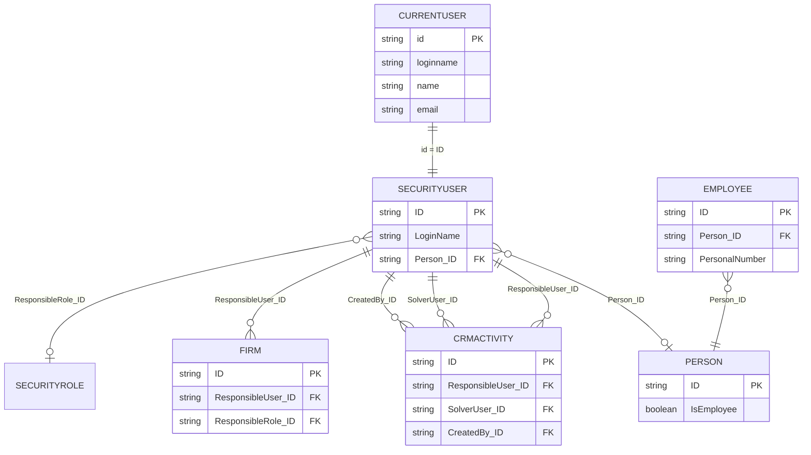

# Sales Representative Identity Validation Spike

**Mobile CRM entity:** Sales representative (authenticated field user)  
**Gen objects:** `currentuser`, `securityusers`, `employees`, `persons`, `crmactivities`, `firms`  
**Server:** `http://localhost/demo`  
**Spike date (UTC):** 2026-06-04  
**OpenAPI:** `currentuser.json`, `securityusers.json`, `employees.json`, `crmactivities.json`, `firms.json`  
**Live evidence:** [`sales-representative-results.json`](sales-representative-results.json)  
**Related:** [`crmactivities-lifecycle.md`](crmactivities-lifecycle.md), [`contact-model.md`](contact-model.md)

---

## 1. Executive summary

| Question | Answer (DEMO) |
|----------|----------------|
| How is the API user identified? | **`GET currentuser`** after Basic/Bearer auth → `id`, `loginname`, `name`, `email` |
| `currentuser` → `securityusers`? | **Yes** — `currentuser.id` equals **`securityusers.ID`** (confirmed for login `API` → `2620000101`) |
| `securityusers` → `employees`? | **Indirect** via **`Person_ID`** → `employees` where `Person_ID` matches; **employee `ID` ≠ security user `ID`** |
| Activity ownership field | **`ResponsibleUser_ID`** (intended); on DEMO samples **`SolverUser_ID`** / **`CreatedBy_ID`** populated, **`ResponsibleUser_ID` often null** |
| My Activities | Filter `crmactivities` with user id; DEMO data matches **`CreatedBy_ID`** / **`SolverUser_ID`** |
| My Customers | **`firms?where=ResponsibleUser_ID eq '{id}'`** syntactically valid but **returns empty** on DEMO (field unset); no alternate “my firms” filter found |

**MVP recommendation:** Resolve session identity with **`currentuser.id`** as **`securityusers.ID`**. Use that id for activity filters (see §5). Treat **`employees`** as optional HR enrichment via **`Person_ID`**, not as the login key. For “my customers”, use **`ResponsibleUser_ID`** when populated; escalate **OQ-SR-05** if DEMO/production leaves it empty.

---

## 2. Relationship diagram



**Identity chain (API user `API` on DEMO):**

```
currentuser.id: 2620000101
    → securityusers.ID: 2620000101  (LoginName: API)
        → Person_ID: 5000000101
            → persons: Kuchta Václav (IsEmployee: true)
            → employees.ID: 2300000101  (PersonalNumber: 004)  ← not 2620000101
```

---

## 3. Authenticated API user identification

### 3.1 Authentication

| Mechanism | Usage |
|-----------|--------|
| HTTP Basic | Spike config: user `api` / password (see local `config/config.yaml`) |
| Bearer token | `currentuser/createsession`, `changetoken` (not exercised in this spike) |

The active principal is whatever credentials are sent on each request.

### 3.2 `GET currentuser`

| Field (response) | Type | Example (DEMO) | Maps to |
|------------------|------|----------------|---------|
| `id` | string | `2620000101` | **`securityusers.ID`** |
| `loginname` | string | `API` | **`securityusers.LoginName`** |
| `name` | string | `API` | Display / `securityusers.Name` |
| `email` | string | `""` | Often empty on DEMO |

OpenAPI schema uses **lowercase** property names only (`id`, `loginname`, …) — not the PascalCase used on business objects.

**MVP:** Call once after login; cache `id` as **`repUserId`** for the session.

---

## 4. Field mapping tables

### 4.1 `currentuser` → `securityusers`

| currentuser | securityusers | Live check |
|-------------|---------------|------------|
| `id` | `ID` | **Equal** (`2620000101`) |
| `loginname` | `LoginName` | **Equal** (`API`) |
| `name` | `Name` / `DisplayName` | Partial (`API` / `API API`) |

| Read | Result |
|------|--------|
| `GET securityusers/{currentuser.id}?select=ID,LoginName,Name,Person_ID,IsActive` | **200** |
| `GET securityusers?where=LoginName eq '{loginname}'` | **200** (fallback if id read fails) |

**Invalid on `securityusers` select (DEMO):** `Hidden` → 400.

### 4.2 `securityusers` → `employees`

| Link | Field | Notes |
|------|-------|-------|
| Direct ID match | — | **`employees/{securityusers.ID}` → 404** for API user |
| Via person | `securityusers.Person_ID` → `employees.Person_ID` | **Confirmed** |

| securityusers (API) | persons | employees |
|---------------------|---------|-----------|
| `ID` `2620000101` | `5000000101` Kuchta Václav | `ID` `2300000101`, `PersonalNumber` `004` |

| Query | Result |
|-------|--------|
| `GET employees?where=Person_ID eq '5000000101'` | **200**, one row |
| `GET employees/{2620000101}` | **404** |

**OpenAPI:** `employee` has `Person_ID` → `person`; no `SecurityUser_ID` on `employee`. `securityuser` has `Person_ID` → `person` (label: Väzba na osobu).

**MVP:** Use **`securityusers`** for identity and CRM ownership ids. Load **`employees`** only for HR-specific UI (personal number, payroll fields), keyed by **`Person_ID`**.

### 4.3 `securityusers` → `persons`

| securityusers.Person_ID | persons | Use |
|-------------------------|---------|-----|
| `5000000101` | `IsEmployee: true` | Distinguish internal vs customer **`persons`** in contact pickers |

Sales reps may have **`Person_ID` null** on DEMO (e.g. `Obchodník - Martin Nejedlý` → `1300000101` has `Person_ID: null`).

### 4.4 `crmactivities` — ownership fields

| Field | Label (SK) | Role | DEMO sample |
|-------|------------|------|-------------|
| **`ResponsibleUser_ID`** | Zodpovedná osoba | **Intended owner** for “my” work | **null** on all 5 sampled activities |
| **`SolverUser_ID`** | Riešiteľ | Solver / executor | **`1300000101`** (Martin Nejedlý) |
| **`CreatedBy_ID`** | Vytvoril | Creator | **`1300000101`** (same as solver) |
| **`ResolvedBy_ID`** | Skutočný riešiteľ | Actual resolver | Not in spike sample |
| **`ResponsibleRole_ID`** | Zodpovedná rola | Role-based assignment | Not tested on activities |

**DEMO rep `1300000101` (Obchodník - Martin Nejedlý):**

| Filter | Rows returned |
|--------|---------------|
| `ResponsibleUser_ID eq '1300000101'` | 0 |
| `CreatedBy_ID eq '1300000101'` | 3+ |
| `SolverUser_ID eq '1300000101'` | 3+ |

---

## 5. Retrieving “My Activities”

### 5.1 Recommended identity key

Use **`repUserId = currentuser.id`** (equals **`securityusers.ID`**).

### 5.2 Filter patterns (validated syntax)

| Intent | `where` clause | DEMO result |
|--------|----------------|-------------|
| Assigned owner (canonical) | `ResponsibleUser_ID eq '{repUserId}'` | Valid; **empty** for API and for `1300000101` |
| Created by me | `CreatedBy_ID eq '{repUserId}'` | Valid; **hits** for `1300000101` |
| Solver is me | `SolverUser_ID eq '{repUserId}'` | Valid; **hits** for `1300000101` |

**Combine for MVP My Day (OR logic, confirm with customer):**

```
(ResponsibleUser_ID eq '{repUserId}' or SolverUser_ID eq '{repUserId}' or CreatedBy_ID eq '{repUserId}')
```

Add date predicates on **`SheduledStart$DATE`** (and open-status rules per [`crmactivities-lifecycle.md`](crmactivities-lifecycle.md)):

| Slice | Example predicate (illustrative) |
|-------|----------------------------------|
| Today | `SheduledStart$DATE ge {todayStart} and SheduledStart$DATE lt {tomorrowStart}` |
| Overdue open | `Status in (0,1) and SheduledStart$DATE lt {todayStart}` |

Exact date literals and `in` operator — confirm on target Gen (OQ-SR-04).

### 5.3 Suggested `select`

```
ID, Subject, Status, Firm_ID, Person_ID, ResponsibleUser_ID, SolverUser_ID,
CreatedBy_ID, SheduledStart$DATE, SheduledEnd$DATE
```

### 5.4 Create / update defaults

When logging a visit, set **`ResponsibleUser_ID`** (and optionally **`CreatedBy_ID`**) to **`repUserId`** so future “my” queries align with domain model even if legacy data used **`SolverUser_ID`** only.

---

## 6. Retrieving “My Customers”

### 6.1 Firm ownership fields

| Field | Label (SK) | Purpose |
|-------|------------|---------|
| **`ResponsibleUser_ID`** | Zodpovedná osoba | **Primary “my customer”** assignment |
| **`ResponsibleRole_ID`** | Zodpovedná rola | Role-based firm ownership |

### 6.2 Live filters

| Query | Result (DEMO) |
|-------|---------------|
| `firms?where=ResponsibleUser_ID eq '2620000101'` | **200**, `[]` |
| `firms?where=ResponsibleUser_ID eq '1300000101'` | **200**, `[]` |
| `firms?where=ResponsibleUser_ID ne null` | **200**, `[]` |
| `firms?take=5` (sample) | All **`ResponsibleUser_ID: null`** |

**Conclusion:** “My customers” via **`ResponsibleUser_ID`** is **supported by API** but **not populated** on DEMO firms. Mobile cannot rely on this filter until Gen master data or assignment rules fill the field.

### 6.3 Alternatives (not validated as “my customers” on DEMO)

| Approach | Status |
|----------|--------|
| Gen row-level security auto-filtering `firms` | **Not observed** — API user sees global firm list |
| Derive customers from activities | Possible: distinct `Firm_ID` from my activities — **workaround**, not master ownership |
| `ResponsibleRole_ID` | Not spike-tested with known role id |
| `employees` | No firm link |

---

## 7. Live validation matrix

| Step | HTTP | Result |
|------|------|--------|
| `GET currentuser` | 200 | `id`, `loginname` |
| `GET securityusers/{id}` | 200 | Same `ID`, `Person_ID` |
| `GET securityusers?where=LoginName eq 'API'` | 200 | 1 row |
| `GET employees?where=Person_ID eq '5000000101'` | 200 | `employees.ID` `2300000101` |
| `GET employees/{currentuser.id}` | 404 | IDs differ |
| `GET crmactivities?where=CreatedBy_ID eq '1300000101'` | 200 | Rows |
| `GET crmactivities?where=ResponsibleUser_ID eq '1300000101'` | 200 | Empty |
| `GET firms?where=ResponsibleUser_ID eq '{id}'` | 200 | Empty |

---

## 8. Business rules

| ID | Rule |
|----|------|
| BR-SR-01 | Session **`repUserId`** = **`currentuser.id`** = **`securityusers.ID`**. |
| BR-SR-02 | Do not use **`employees.ID`** as login or ownership key. |
| BR-SR-03 | Resolve **`employees`** via **`securityusers.Person_ID`**. |
| BR-SR-04 | **`ResponsibleUser_ID`** on activities is the **canonical** mobile ownership field going forward. |
| BR-SR-05 | Legacy/demo data may use **`SolverUser_ID`** / **`CreatedBy_ID`** — My Day query should include OR until data normalized (OQ-SR-03). |
| BR-SR-06 | **`ResponsibleUser_ID`** on **firms** is the canonical “my customer” filter when populated. |
| BR-SR-07 | **`persons`** linked to reps may have **`IsEmployee: true`** — do not treat as customer contacts. |
| BR-SR-08 | Many **`securityusers`** on DEMO have **`Person_ID: null`** — employee/person enrichment optional. |

---

## 9. MVP recommendation

| Area | Recommendation |
|------|----------------|
| **Login bootstrap** | `GET currentuser` → store `repUserId`, `loginname`, `displayName` (`name`) |
| **Profile enrichment** | `GET securityusers/{repUserId}?select=ID,LoginName,Name,DisplayName,Person_ID` |
| **HR / org (optional)** | If `Person_ID` set: `GET employees?where=Person_ID eq '{Person_ID}'` for badge/number |
| **My Day activities** | `GET crmactivities` with **OR** on `ResponsibleUser_ID`, `SolverUser_ID`, `CreatedBy_ID` + date/`Status` filters |
| **New activities** | Set **`ResponsibleUser_ID`** = `repUserId` on create |
| **Firm search (MVP)** | If `ResponsibleUser_ID` empty on deployment: show **all permitted firms** (per Gen security) OR derived firm list from activities — **workshop decision** (OQ-SR-05) |
| **Phase 2** | Enforce firm **`ResponsibleUser_ID`** in Gen for true “my customers” |

---

## 10. Open questions

| ID | Question | Priority |
|----|----------|----------|
| OQ-SR-01 | Production: is **`ResponsibleUser_ID`** on activities always set for field sales? | P0 |
| OQ-SR-02 | Should My Day use **`ResponsibleUser_ID` only** or **OR** with `SolverUser_ID` / `CreatedBy_ID`? | P0 |
| OQ-SR-03 | Normalization: backfill **`ResponsibleUser_ID`** from solver/creator on legacy data? | P1 |
| OQ-SR-04 | Exact **`where`** for today / overdue on `SheduledStart$DATE` and `Status` | P0 |
| OQ-SR-05 | “My customers” when **`firms.ResponsibleUser_ID`** unset — RLS, all firms, or activity-derived? | P0 |
| OQ-SR-06 | Use **`ResponsibleRole_ID`** for team/territory filtering? | P2 |
| OQ-SR-07 | Bearer **`createsession`** flow vs Basic for mobile production | P1 |
| OQ-SR-08 | Display name: `currentuser.name` vs `securityusers.DisplayName` vs `employees.EmployeeName` | P2 |

---

## 11. Document history

| Version | Date | Change |
|---------|------|--------|
| 0.1 | 2026-06-04 | Initial sales representative identity spike vs localhost DEMO |
