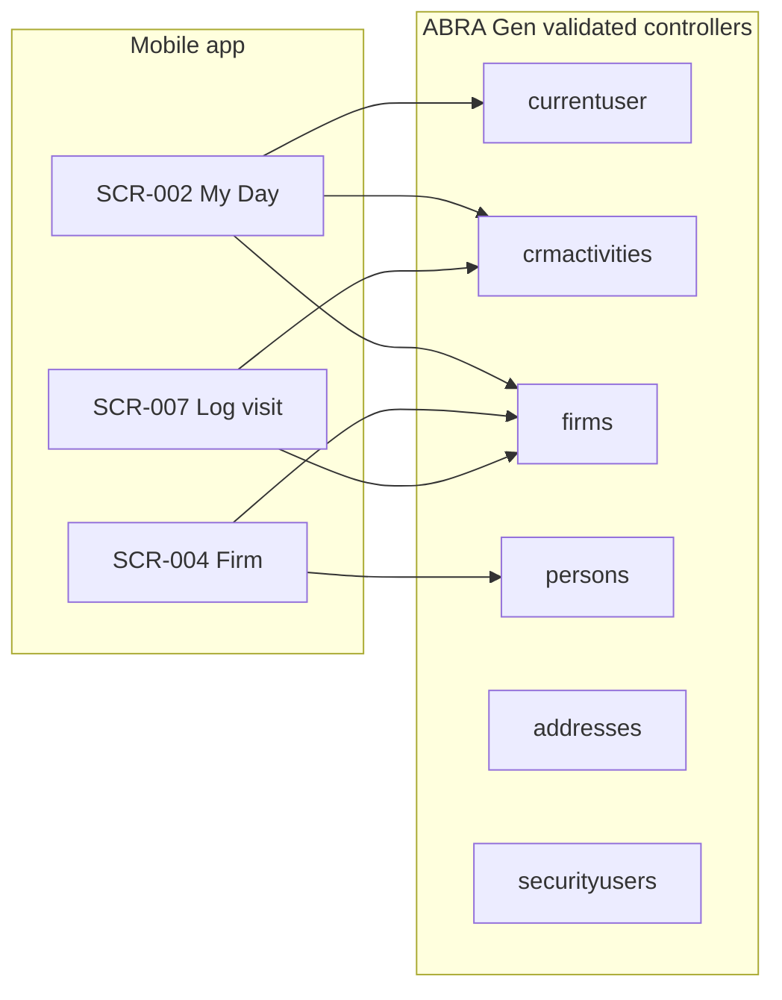
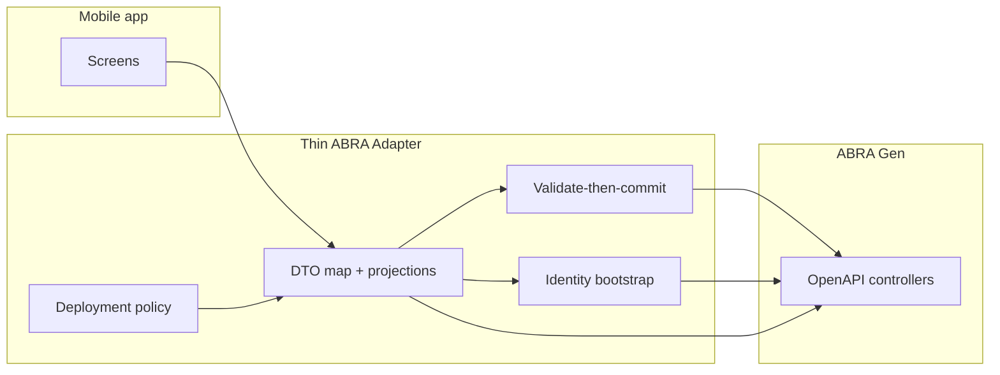

# Architecture Decision Study — Direct Gen OpenAPI vs Thin ABRA Adapter

**Status:** Draft for review  
**Date:** 2026-06-04  
**Scope:** Integration architecture for ABRA Mobile CRM mobile client  
**Evidence base:** Validated spikes only — no speculative Gen behaviour

| Spike | Document |
|-------|----------|
| CRM activities lifecycle | [`analysis/spikes/crmactivities-lifecycle.md`](../analysis/spikes/crmactivities-lifecycle.md) |
| Contact model | [`analysis/spikes/contact-model.md`](../analysis/spikes/contact-model.md) |
| Sales representative identity | [`analysis/spikes/sales-representative-model.md`](../analysis/spikes/sales-representative-model.md) |

**Out of scope for this study:** Commercial health fields, firm search `where` syntax, `crmactivities` filter by `Firm_ID`, OpenAPI `expand` on activities, bearer/session auth flows — not validated on DEMO in these spikes.

---

## 1. Context

The MVP is **online-only** (ADR 0002) with **ABRA Gen as sole source of truth** (ADR 0001). Three integration spikes proved that Gen exposure is **usable but uneven**:

- **Identity** is `currentuser.id` → `securityusers.ID`, not `employees.ID`.
- **Contacts** require `GET firms/{id}` and parsing **`firmpersons`**; `persons?where=Firm_ID` **fails**.
- **Activities** need **`?validation=true`** create/update, environment-specific mandatory fields, and **legacy ownership** (`SolverUser_ID` / `CreatedBy_ID`) often populated instead of `ResponsibleUser_ID`.
- **Response shape** mixes lowercase embeds vs PascalCase `select`; invalid `select` tokens return **400** per BO class.

The decision is whether the mobile app calls Gen **directly** or through a **thin adapter** (BFF or in-app integration module — same architectural role).

---

## 2. Options

### Option A — Direct ABRA OpenAPI consumption

The mobile app (or shared client SDK) invokes Gen REST collections using OpenAPI-derived knowledge embedded in UI/feature code.

```
┌─────────────┐     HTTPS      ┌──────────────────┐
│ Mobile app  │ ──────────────►│ ABRA Gen API     │
│ (screens)   │   per screen   │ firms, persons,  │
└─────────────┘                │ crmactivities, … │
                               └──────────────────┘
```

### Option B — Thin ABRA Adapter layer

A dedicated integration boundary (server BFF or client-side **GenAdapter** module) exposes **stable, screen-oriented operations**. It alone knows Gen paths, `select` lists, `where` templates, validate-then-commit, and DTO normalization.

```
┌─────────────┐              ┌─────────────────┐     HTTPS     ┌──────────────┐
│ Mobile UI   │ ──stable───► │ Thin adapter    │ ─────────────►│ ABRA Gen API │
│ screens     │   contracts  │ (map + policy)  │  OpenAPI      └──────────────┘
└─────────────┘              └─────────────────┘
```

**Thin** means: no second source of truth, no business logic beyond mapping, validation orchestration, and safe projections — Gen remains authoritative.

---

## 3. Validated Gen constraints (shared)

These drive cost for **both** options; the adapter **centralizes** handling.

| Area | Validated constraint | Spike ref |
|------|----------------------|-----------|
| Session user | `GET currentuser` → `id` = `securityusers.ID` | SR §3 |
| Employee link | `employees` via `Person_ID`, not user id | SR §4.2 |
| My activities filter | `ResponsibleUser_ID` / `CreatedBy_ID` / `SolverUser_ID` `where` **valid**; DEMO data uses latter two | SR §5, LC §5 |
| My customers filter | `firms?where=ResponsibleUser_ID eq '{id}'` **valid**, **empty** on DEMO | SR §6 |
| Contact list | `GET firms/{id}` full; **`firmpersons` not in `select`** | CM §3.4, §8 |
| Contact filter | `persons?where=Firm_ID` → **400** | CM §3.4 |
| Activity read | Safe narrow `select`; **`ResponsibleCustomerPerson_ID` → 400** | LC §5 |
| Activity write | `POST`/`PUT` + `?validation=true`; merge defaults; ignore `X_*` | LC §4–5 |
| Activity complete | `PUT` + `Status: 2` | LC §5 |
| Phone/email | `address` / embedded `address_id`; `GET addresses/{id}` | CM §5 |
| Firm header phone | `residenceaddress_id` / `electronicaddress_id` on full firm GET | CM §5.2 |
| Casing | lowercase in full GET vs PascalCase in `select` | LC §5, SR §3 |

---

## 4. API call count per screen (validated operations only)

Counts are **Gen HTTP requests per screen load or save**, assuming a **cold** screen (no in-memory cache). Ranges include **only** endpoints proven in spikes.

| Screen | Validated Gen operations | Direct (calls) | Notes |
|--------|--------------------------|----------------:|-------|
| **SCR-010** App loading / session check | `GET currentuser` | **1** | Same both options |
| **SCR-001** Login | Auth + `GET currentuser` | **1** (+ auth handshake) | Auth mechanism not spike-tested |
| **SCR-002** My Day | `GET currentuser` (if not cached); `GET crmactivities` ×2 (today + overdue `where`); optional `GET firms/{id}` per **distinct** `Firm_ID` on rows | **3–3+N** | Spikes validate activity `where` on user id, not date predicates (OQ-SR-04, OQ-LC-04). **N** = unique firms on list; list returns `Firm_ID` only — **firm name not in activity `select` spike**. |
| **SCR-003** Firm search | `GET firms?select=…&where=…` | **1** per search | **`where` on name/IČO not validated** — count assumes one list call per debounced query |
| **SCR-004** Firm detail | `GET firms/{id}` (full); contacts from `firmpersons` embed | **1** (+ **0–M** `GET persons/{id}` if M contacts need fields beyond embed) | Spike read sequence suggests **1 + M**; **M** often 0 if `displayname` + `address_id` embed suffices |
| **SCR-004** Recent activities section | `GET crmactivities?where=Firm_ID eq '…'` | **+0–1** | **Not validated** — omit from minimum; **+1** if proven later |
| **SCR-005** Contact detail | `GET persons/{id}`; optional `GET addresses/{id}` | **1–2** | |
| **SCR-006** Activity detail | `GET crmactivities/{id}`; `GET firms/{id}`; optional `GET persons/{id}` | **2–3** | |
| **SCR-007** Log visit (create) | `GET firms/{id}` (contacts); `GET crmactivitytypes` (spike script **200**); `POST` validate + `POST` commit | **3–4** | Types list used in lifecycle script, not separate results file |
| **SCR-007** Complete/edit | `GET crmactivities/{id}`; `PUT` validate + `PUT` | **2–3** | |

### 4.1 Pull-to-refresh

Re-running a screen repeats the same counts (e.g. SCR-002: **3–3+N** again).

### 4.2 Thin adapter — client-visible calls

If the adapter runs **in-process** on the device, the **UI still makes one call per screen operation** (e.g. `getMyDay()`, `getFirmDetail(id)`), while **Gen calls remain 3–3+N** internally unless the adapter caches/dedupes.

If the adapter is a **server BFF**, the UI call count drops to **1 per screen**, but total Gen traffic is unchanged without caching.

### 4.3 Where the adapter reduces Gen calls

| Pattern | Direct risk | Adapter mitigation |
|---------|-------------|-------------------|
| Firm names on activity list | **N+1** `GET firms/{id}` | Dedupe by `Firm_ID`, optional short TTL cache |
| Contact list + log visit picker | Repeat full `GET firms/{id}` | Cache firm payload for session |
| Validate-then-commit | 2 round-trips per save | Single `saveActivity()` hiding validate + commit |
| Identity bootstrap | Every screen may re-fetch user | Session-scoped `repUserId` + profile |

---

## 5. Evaluation matrix

| Criterion | Direct OpenAPI | Thin ABRA Adapter |
|-----------|----------------|-------------------|
| **Initial delivery speed** | Faster first screen if team knows Gen | Slower until adapter skeleton exists |
| **Complexity in UI layer** | **High** — spreads Gen rules across SCR-* | **Low** — screens consume view models |
| **Complexity in integration** | **Low** (no extra layer) | **Medium** — one module to own |
| **Maintainability (Gen drift)** | **Low** — N screens × select/where/validation | **High** — change once per BO |
| **Maintainability (OpenAPI updates)** | Regenerate client optional; still manual policy | Central projection tables per customer |
| **Testability** | Integration tests per screen | Contract tests on adapter; UI mocks stable API |
| **Customer customization** | **High impact** — each customer may break `select`, `X_*`, queues | **Contained** — config overlays in adapter |
| **Observability** | Raw Gen errors bubble to UI | Adapter can log normalized errors |
| **ADR 0002 (online)** | Same | Same |
| **ADR 0001 (truth)** | Same — adapter must not cache as truth | Same |

### 5.1 Complexity (qualitative)

**Direct:** Each screen must implement:

- `repUserId` from `currentuser` (SR).
- Activity list `where` OR across three user columns (SR).
- Avoid invalid fields on `crmactivities` / `securityusers` / `firms` (LC, SR, CM).
- Parse `firmpersons` from firm payload; never `persons?where=Firm_ID` (CM).
- Create flow: validate → merge `@meta.validation` defaults → commit (LC).
- PascalCase vs lowercase normalization (LC, CM).

Estimated **integration touchpoints:** 6 MVP screens × 2–4 Gen concerns ≈ **12–24** dispersed decision points.

**Thin adapter:** ~**5–8** adapter methods for MVP (`bootstrapSession`, `getMyDay`, `searchFirms`, `getFirmDetail`, `getContact`, `getActivity`, `saveActivity`, `listActivityTypes`) encapsulate the same concerns once.

### 5.2 Maintainability

| Change scenario | Direct | Adapter |
|-----------------|--------|---------|
| DEMO → customer: `ResponsibleUser_ID` populated on activities | Update SCR-002 query only | Update `getMyDay` filter policy |
| New mandatory field on activity create | Update SCR-007 + any create path | Update validate-merge in `saveActivity` |
| Gen removes `Hidden` from `securityusers` select | Find all selects | Fix one module |
| Contact: production allows smaller firm payload | Rework SCR-004, SCR-007 | Change `getFirmDetail` implementation |

### 5.3 Customer customization impact

Validated customization risks:

| Risk | Evidence | Direct impact | Adapter impact |
|------|----------|---------------|----------------|
| Custom `X_*` on `crmactivities` | LC validation error `X_Typ_kotla` | Every write path must omit `X_*` | Strip list in adapter write mapper |
| Mandatory `ActQueue_ID`, `Period_ID`, … | LC §4.2 | SCR-007 must merge validation response | `saveActivity` merge policy per env config |
| Ownership field mix | SR §4.4 | SCR-002 needs OR `where` | Config: `myActivityOwnershipFields[]` |
| `firmpersons` only via full firm | CM §3.4 | Large payloads on SCR-004/007 | Adapter can trim to mobile DTO; swap impl when OQ-CM-01 solved |
| `ResponsibleUser_ID` on firms unset | SR §6 | “My customers” filter useless | Adapter policy: fallback to all firms / activity-derived (product OQ-SR-05) |
| Invalid per-BO `select` tokens | LC, SR, CM | Runtime 400 per screen | Allowlisted projections in adapter |

**Conclusion:** Customer-specific Gen installs shift cost to **integration policy**. A thin adapter is the natural place for **per-deployment config** (YAML/JSON: ownership fields, default `ActivityType_ID`, ignored custom fields, validate-merge toggles).

---

## 6. Architecture diagrams

### 6.1 Direct consumption (conceptual)



### 6.2 Thin adapter (conceptual)



---

## 7. Recommendation — MVP

**Adopt a thin ABRA Adapter** (Option B), implemented at minimum as a **client-side integration module** with a stable internal API. A network BFF is **not required** for MVP if the module dedupes firm fetches and centralizes validate-then-commit.

### Rationale (evidence-only)

1. **Write path complexity** — Activity create is not a single `POST`; spikes require validate, error inspection, default merge, and `X_*` suppression (LC). One `saveActivity()` avoids duplicating this on SCR-007.
2. **Identity** — `repUserId` and optional `Person_ID` → `employees` chain is shared across SCR-002, SCR-007, and filters (SR). Bootstrap once.
3. **Contact assembly** — Firm detail and visit picker share **`firmpersons` parsing** and address resolution rules (CM). Single `getFirmDetail()` prevents three copies.
4. **My Day N+1** — Activity list carries `Firm_ID` without validated firm-name expand; adapter dedupes firm reads (LC + CM).
5. **Safe projections** — Invalid `select` fields caused **400** on DEMO (LC, SR, CM). Allowlists live in one place.
6. **Ownership OR filter** — Until OQ-SR-02 closes, adapter holds `ResponsibleUser_ID OR SolverUser_ID OR CreatedBy_ID` (SR §5.2).

### MVP adapter surface (suggested)

| Method | Screens | Wraps (validated) |
|--------|---------|-------------------|
| `bootstrapSession()` | SCR-001, SCR-010 | `GET currentuser`; optional `GET securityusers/{id}` |
| `getMyDay(repUserId, dateRange)` | SCR-002 | `GET crmactivities` (2× `where` + deduped `GET firms/{id}`) |
| `searchFirms(query)` | SCR-003 | `GET firms` (projection allowlist) |
| `getFirmDetail(firmId)` | SCR-004, SCR-007 | `GET firms/{id}` → mobile firm + contacts DTO |
| `getContact(personId)` | SCR-005 | `GET persons/{id}`; optional `GET addresses/{id}` |
| `getActivity(activityId)` | SCR-006, SCR-007 | `GET crmactivities/{id}` + related firm/person |
| `saveActivity(command)` | SCR-007 | `POST`/`PUT` + `?validation=true` + merge policy |
| `listActivityTypes()` | SCR-007 | `GET crmactivitytypes` (lifecycle script) |

### What not to build in MVP adapter

- Caching as source of truth (violates ADR 0001 / 0002).
- Commercial health derivation (not spike-validated).
- Contact create/update (CM: Phase 2 / Gen admin).
- Heavy orchestration beyond Gen (no workflow engine).

### If the team chooses Direct for MVP anyway

Minimum guardrails:

- Shared **`GenClient`** with allowlisted `select` per BO.
- Shared **`ActivityWriteService`** for validate-then-commit only.
- Documented **`repUserId`** helper from `currentuser`.
- Do **not** copy-paste `firmpersons` parsing into SCR-004 and SCR-007 separately.

---

## 8. Recommendation — Phase 2

**Keep and harden the thin adapter**; do not revert to scattered Direct calls as new BOs appear (`issuedoffers`, `busorders`, etc. from discovery spike).

| Phase 2 capability | Adapter evolution |
|--------------------|-------------------|
| Pipeline / opportunities | `getPipeline`, `getOpportunity` — new projections |
| Quotes / orders | Document header read/write with same validate-then-commit |
| Calendar merged into My Day | Extend `getMyDay` row discriminant |
| Contact create | `createContact` + firm `FirmPersons` update (after CM OQ-CM-07) |
| Per-customer config | Deployment package: ownership fields, ignored `X_*`, default types |
| Optional server BFF | Move adapter server-side **only** if mobile binary must not hold Gen credentials |

**Direct OpenAPI in Phase 2** would multiply validated patterns (validation merge, invalid selects, junction reads) across **SCR-011–014** — maintainability cost scales linearly with screens.

---

## 9. Open questions (from spikes — blockers for either option)

| ID | Question | Affects |
|----|----------|---------|
| OQ-SR-04 / OQ-LC-04 | Exact `where` for today / overdue on `SheduledStart$DATE` + `Status` | SCR-002 call count & correctness |
| OQ-SR-02 | Single ownership field vs OR on activities | Adapter policy |
| OQ-SR-05 | My customers when `firms.ResponsibleUser_ID` empty | SCR-003 scope |
| OQ-CM-01 | Smaller than full `GET firms/{id}` for `firmpersons` | SCR-004 payload size |
| OQ-LC-01 | When is create **201** vs validation-only **200** | `saveActivity` |
| OQ-CM-06 / OQ-SR-06 | Gen row-level security vs explicit `where` | Firm/activity lists |

---

## 10. Decision record

| Phase | Recommendation | Confidence |
|-------|----------------|------------|
| **MVP** | **Thin ABRA Adapter** (in-app module minimum) | High — driven by validated write and assembly complexity |
| **Phase 2** | **Retain adapter**; optional BFF + per-customer policy packs | High |

Proposed ADR: [`docs/decisions/0004-thin-abra-adapter.md`](../docs/decisions/0004-thin-abra-adapter.md).

---

## 11. Document history

| Version | Date | Change |
|---------|------|--------|
| 0.1 | 2026-06-04 | Initial study from three integration spikes |
