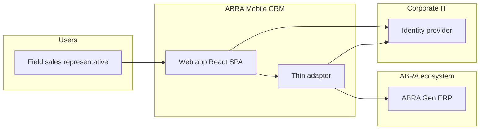

# System context

C4 Level 1 — ABRA Mobile CRM in its environment.

## Context diagram

## System responsibilities

| System | Responsibility |
|--------|----------------|
| **Web app** | CRM UX in **mobile browser**; calls `/api/v1` only ([ADR 0006](../docs/decisions/0006-frontend-technology.md)) |
| **Thin adapter** | Session, DTO mapping, Gen orchestration — not authoritative data ([solution-architecture-v1.md](solution-architecture-v1.md)) |
| **ABRA Gen** | Master data, documents, permissions, audit |
| **Identity provider** | Corporate IdP optional post-MVP; MVP uses BFF session after Gen login |

## Trust boundaries

- Internet or corporate VPN between mobile and Gen/BFF.
- All business writes cross into Gen trust zone.
- No third-party CRM cloud storing firm/contact master data.

## Out of scope (context)

- Warehouse, manufacturing, and non-CRM Gen modules (except read-only context if MVP needs).
- Replacement of Gen desktop UI for back-office users.
