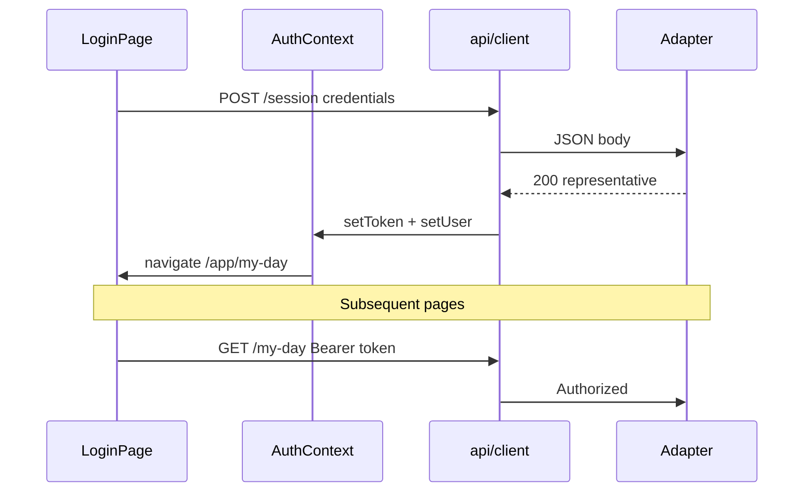
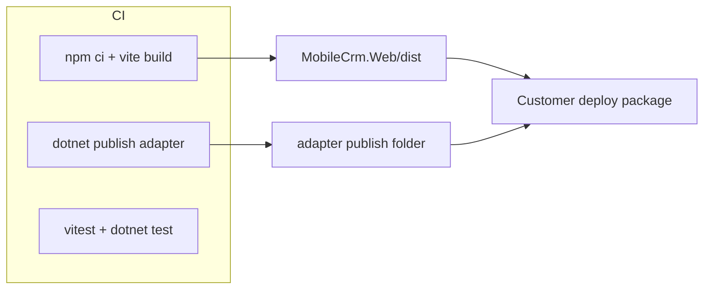

# Development Architecture v1 — ABRA Mobile CRM

**Status:** Draft  
**Version:** 1.0.0  
**Date:** 2026-06-04  
**Scope:** MVP implementation (SCR-001–SCR-010), browser React SPA + ASP.NET Core adapter

**Inputs:** [Solution Architecture v1.1](solution-architecture-v1.md) · [Mobile CRM API v1](mobile-crm-api-v1.md) · [Screen inventory v0.2](../analysis/screens/README.md) · [Domain model v0.2](../analysis/domain/business-domain-model.md)

**Out of scope:** Source code, CI pipeline YAML, OpenAPI generator scripts, Phase 2 screens (SCR-011–014).

---

## 1. Purpose

This document defines **how developers structure and build** the MVP: repository layout, frontend modules, routing, API access, session handling, state, errors, and deployment artefacts. It complements [Solution Architecture v1.1](solution-architecture-v1.md) (what we deploy) with **concrete engineering conventions** (how we organise code).

---

## 2. Principles (MVP)

| Principle | Development implication |
|-----------|-------------------------|
| **Contract-first** | Web client types and paths come from [mobile-crm-api-v1](mobile-crm-api-v1.md); Gen names only in adapter |
| **Screen-aligned modules** | Feature folders map to SCR-* and domain hubs (My Day, Firm, Activity, System) |
| **Online-only** | No offline queue, no IndexedDB entity tables, no Service Worker business cache |
| **Thin UI** | Validation UX + presentation; business rules on adapter/Gen |
| **Same-origin preferred** | Dev proxy and prod reverse proxy avoid CORS and simplify cookies |
| **Smallest maintainable** | One SPA, one adapter solution; avoid micro-frontends and global state libraries unless needed |

---

## 3. Repository structure

Single **monorepo** at repository root. .NET solution and Node web app coexist; shared contract via OpenAPI spec (published from API doc when tooling exists).

```text
ABRA-MobileCRM/
├── src/
│   ├── MobileCrm.Web/                 # React + Vite + TypeScript (SPA)
│   ├── MobileCrm.Adapter/             # ASP.NET Core 8 — hosts /api/v1
│   └── MobileCrm.Adapter.Gen/         # Gen HTTP client, mappers, policies
├── tests/
│   ├── MobileCrm.Adapter.Tests/       # Adapter + Gen sandbox integration
│   └── MobileCrm.Web.Tests/           # Vitest unit; Playwright E2E (mobile viewport)
├── config/
│   ├── adapter.appsettings.template.json
│   └── web.env.template                 # VITE_* for local dev
├── architecture/                        # Architecture docs (this file)
├── analysis/                            # Domain, screens, spikes
├── docs/decisions/                      # ADRs
├── scripts/                             # Spikes, OpenAPI publish (future)
├── MobileCrm.sln                        # .NET solution (adapter + tests)
├── package.json                         # Optional root workspace for web tooling
└── README.md
```

### 3.1 Project boundaries

| Project | References | Must not |
|---------|------------|----------|
| **MobileCrm.Web** | API types (generated or hand-maintained) | Reference Gen, adapter C# projects, or ERP DTOs |
| **MobileCrm.Adapter** | MobileCrm.Adapter.Gen, API contract shapes | Store authoritative business data in DB |
| **MobileCrm.Adapter.Gen** | Gen OpenAPI snapshot / hand-crafted client | Expose Gen types to web project |

### 3.2 Adapter solution layout (ASP.NET Core)

```text
src/MobileCrm.Adapter/
├── Program.cs
├── appsettings.json
├── Controllers/                         # 1:1 with API v1 routes
│   ├── SessionController.cs
│   ├── MyDayController.cs
│   ├── FirmsController.cs
│   ├── ContactsController.cs
│   ├── ActivitiesController.cs
│   └── ActivityTypesController.cs
├── Middleware/
│   ├── CorrelationIdMiddleware.cs
│   └── ExceptionEnvelopeMiddleware.cs   # Maps to API error envelope
├── Auth/
│   ├── ISessionStore.cs
│   └── GenAuthBridge.cs
├── Models/                              # CRM DTOs (mirror contract §6)
├── Mappers/                             # Gen → CRM (or in Adapter.Gen)
├── Health/
│   └── HealthEndpoints.cs
└── wwwroot/                             # Optional: SPA dist output

src/MobileCrm.Adapter.Gen/
├── GenClient/
├── Policies/                            # Ownership OR, allowlisted select, X_* strip
├── Activities/
│   └── ActivityWriteOrchestrator.cs     # validate-then-commit
└── Configuration/
    └── AdapterPolicyOptions.cs          # Per-customer JSON overlay
```

### 3.3 Contract artefact (future)

```text
architecture/reference/openapi/
└── mobile-crm-api-v1.openapi.json       # Generated from contract; feeds TS + optional C# clients
```

Until OpenAPI exists, maintain **parallel** TypeScript interfaces under `MobileCrm.Web/src/api/types/` aligned with contract §6.

---

## 4. Frontend folder structure

```text
src/MobileCrm.Web/
├── index.html
├── vite.config.ts
├── tsconfig.json
├── public/
│   ├── manifest.json                    # Optional PWA
│   └── icons/
├── src/
│   ├── main.tsx                         # Bootstrap, providers
│   ├── app/
│   │   ├── App.tsx
│   │   ├── routes.tsx                   # Route table (SCR mapping)
│   │   ├── providers.tsx                # QueryClient, Auth, Router
│   │   └── config.ts                    # env: API base URL
│   ├── api/
│   │   ├── client.ts                    # fetch wrapper, auth header, errors
│   │   ├── queryKeys.ts                 # TanStack Query key factory
│   │   ├── generated/                   # OpenAPI-generated (preferred)
│   │   └── types/                       # Hand-maintained until OpenAPI
│   ├── auth/
│   │   ├── AuthContext.tsx
│   │   ├── sessionStorage.ts
│   │   └── useAuth.ts
│   ├── features/                        # One folder per business hub / SCR group
│   │   ├── system/                      # SCR-008, SCR-009, SCR-010, shell
│   │   │   ├── AppLoadingPage.tsx       # SCR-010
│   │   │   ├── SessionExpiredPage.tsx   # SCR-008
│   │   │   ├── ConnectionErrorPage.tsx  # SCR-009
│   │   │   ├── ConnectivityBanner.tsx
│   │   │   └── AuthenticatedLayout.tsx  # Tabs, outlet
│   │   ├── login/                       # SCR-001
│   │   │   └── LoginPage.tsx
│   │   ├── my-day/                      # SCR-002 — domain: My Day hub
│   │   │   ├── MyDayPage.tsx
│   │   │   └── components/
│   │   ├── firms/                       # SCR-003, SCR-004 — Firm hub
│   │   │   ├── FirmSearchPage.tsx
│   │   │   ├── FirmDetailPage.tsx
│   │   │   └── components/
│   │   ├── contacts/                    # SCR-005
│   │   │   └── ContactDetailPage.tsx
│   │   └── activities/                  # SCR-006, SCR-007 — Activity entity
│   │       ├── ActivityDetailPage.tsx
│   │       ├── LogVisitPage.tsx
│   │       └── components/
│   ├── components/                      # Shared UI (buttons, lists, skeletons)
│   ├── hooks/
│   │   ├── useOnlineStatus.ts
│   │   └── usePullToRefresh.ts
│   ├── lib/
│   │   ├── errors.ts                    # ApiError, code → route mapping
│   │   └── navigation.ts                # returnTo, back stack helpers (N-04, N-05)
│   └── styles/
│       ├── tokens.css                   # Mobile-first spacing, touch targets
│       └── global.css
└── e2e/                                 # Playwright (optional colocate)
    └── mvp-journeys.spec.ts
```

### 4.1 Feature ↔ screen ↔ domain mapping

| Folder | SCR | Domain hub / entity |
|--------|-----|---------------------|
| `features/login` | SCR-001 | Sales representative (authenticate) |
| `features/system` | SCR-008, SCR-009, SCR-010 | System / session |
| `features/my-day` | SCR-002 | **My Day** (agenda composite) |
| `features/firms` | SCR-003, SCR-004 | **Firm**, commercial health section, contacts list |
| `features/contacts` | SCR-005 | **Contact** |
| `features/activities` | SCR-006, SCR-007 | **Activity**, activity type catalogue |

Phase 2 (`features/pipeline`, etc.) **must not** be scaffolded in MVP unless stub routes are explicitly marked non-shipping.

### 4.2 Naming conventions

| Item | Convention |
|------|------------|
| Page components | `*Page.tsx` — one primary SCR per file |
| Route paths | kebab-case English (`/my-day`, not `/SCR-002`) |
| Query hooks | `useFirmDetail(firmId)`, `useMyDay(date)` — live in feature folder or `api/queries/` |
| SCR references | Comments and docs only (`// SCR-007`); URLs stay user-friendly |

---

## 5. Routing strategy

**Library:** React Router v6+ (`createBrowserRouter` recommended for data APIs and error boundaries).

### 5.1 Route table (MVP)

| Path | Component | SCR | Auth |
|------|-----------|-----|------|
| `/` | redirect → `/app` or `/login` | — | — |
| `/login` | `LoginPage` | SCR-001 | Public |
| `/app/loading` | `AppLoadingPage` | SCR-010 | Public (bootstrap) |
| `/app/session-expired` | `SessionExpiredPage` | SCR-008 | Public |
| `/app/connection-error` | `ConnectionErrorPage` | SCR-009 | Public |
| `/app` | `AuthenticatedLayout` | — | Required |
| `/app/my-day` | `MyDayPage` | SCR-002 | Required |
| `/app/firms` | `FirmSearchPage` | SCR-003 | Required |
| `/app/firms/:firmId` | `FirmDetailPage` | SCR-004 | Required |
| `/app/contacts/:contactId` | `ContactDetailPage` | SCR-005 | Required |
| `/app/activities/:activityId` | `ActivityDetailPage` | SCR-006 | Required |
| `/app/firms/:firmId/log-visit` | `LogVisitPage` (create) | SCR-007 | Required |
| `/app/activities/:activityId/edit` | `LogVisitPage` (edit/complete) | SCR-007 | Required |

**Query parameters (not paths):**

| Param | Used on | Purpose |
|-------|---------|---------|
| `firmId` | `/app/contacts/:contactId` | Resolve `isPrimary` (API contract) |
| `returnTo` | Log visit, login redirect | Encoded return path after save (N-04) — e.g. `/app/my-day` |
| `mode` | Log visit | Optional hint `create` \| `complete` (server still authoritative) |

### 5.2 Bootstrap flow (SCR-010)

```mermaid
flowchart TD
  A[User opens / or /app] --> B[AppLoadingPage SCR-010]
  B --> C{Token present?}
  C -->|no| D[/login SCR-001]
  C -->|yes| E[GET /session]
  E -->|200| F[/app/my-day default N-01]
  E -->|401| G[/app/session-expired → login]
  E -->|502/503/network| H[/app/connection-error]
  D -->|POST /session 200| F
```

- Initial route on cold load: **`/app/loading`** (or `/` → loading).
- Default post-login landing: **`/app/my-day`** (N-01). Config flag `VITE_LANDING=firms` → `/app/firms` (D-10) if product enables later.

### 5.3 Authenticated shell (tabs)

`AuthenticatedLayout` implements bottom navigation:

| Tab | Route | Rule |
|-----|-------|------|
| **My Day** | `/app/my-day` | N-03 — never firm search |
| **Customers** | `/app/firms` | N-02 — always SCR-003 |

Nested routes render in `<Outlet />`. Tab switches **reset** to tab root (do not preserve firm detail stack across tabs).

### 5.4 Navigation rules (implementation)

| Rule | Implementation |
|------|----------------|
| **N-04** Log visit success | Read `returnTo` from `location.state` or query; `navigate(returnTo)`; default `/app/my-day` |
| **N-05** Back from firm detail | `navigate(-1)` if history from firms tab; else `/app/my-day` |
| **N-07** SCR-008 / SCR-009 retry | `connection-error` stores `location.state.from`; retry `navigate(from)` or `refetchQueries` |
| **N-08** Commercial health | Section component inside `FirmDetailPage` — no route |

Pass `state={{ returnTo: location.pathname }}` when opening log visit from My Day, firm detail, or activity detail.

### 5.5 Route guards

| Guard | Behaviour |
|-------|-----------|
| `RequireAuth` | Wraps `/app/*`; no token → redirect `/login?returnTo=…` |
| `RequireOnline` (soft) | Optional banner; hard block on **mutations** when offline |

---

## 6. API client strategy

### 6.1 Base URL

| Environment | Base URL |
|-------------|----------|
| **Production** | Same origin: `/api/v1` (reverse proxy) |
| **Development** | Vite proxy: `/api` → `https://localhost:5xxx` or env `VITE_API_BASE_URL` |

Client resolves: `const baseUrl = import.meta.env.VITE_API_BASE_URL ?? '/api/v1'`.

### 6.2 Layering

```text
UI / hooks
    → TanStack Query (queries & mutations)
        → api/client.ts (fetch, headers, parse envelope)
            → generated SDK or thin methods (getMyDay, postSession, …)
```

| Layer | Responsibility |
|-------|----------------|
| **Generated SDK** (target) | Path, method, request/response types from OpenAPI |
| **client.ts** | `Authorization: Bearer`, `Content-Type`, `X-Correlation-Id`, timeout, throw `ApiError` |
| **queryKeys.ts** | Hierarchical keys: `['myDay', date]`, `['firm', firmId]`, `['activity', id]` |
| **Feature hooks** | `useMyDayQuery`, `useCreateActivityMutation` — map to SCR actions |

### 6.3 HTTP methods (contract alignment)

| Operation | Method | Path |
|-----------|--------|------|
| Login | POST | `/session` |
| Session check | GET | `/session` |
| Logout | DELETE | `/session` |
| My Day | GET | `/my-day?date=&take=` |
| Firm search | GET | `/firms?q=&take=&skip=` |
| Firm detail | GET | `/firms/{firmId}?recentTake=` |
| Contact detail | GET | `/contacts/{contactId}?firmId=` |
| Activity detail | GET | `/activities/{activityId}` |
| Create activity | POST | `/activities` |
| Update / complete | PUT | `/activities/{activityId}` |
| Firm contacts (picker) | GET | `/firms/{firmId}/contacts` |
| Activity types | GET | `/activity-types` |

### 6.4 Client-side validation

| Where | What |
|-------|------|
| **Forms (SCR-007)** | Required fields per contract (subject, firmId, activityTypeId, scheduledStart; `answer` when complete) |
| **SCR-003** | Debounce `q` min length 2 before calling API |
| **Server** | Authoritative — display `error.details[]` on 422 |

Do not duplicate Gen validation rules in TypeScript.

### 6.5 Caching (TanStack Query defaults)

| Query | `staleTime` | Invalidation |
|-------|-------------|--------------|
| Session / representative | 5 min | On login/logout |
| My Day | 0–30 s | Pull-to-refresh, after activity save |
| Firm search | 0 | New search string |
| Firm detail | 1–2 min | Pull-to-refresh, after log visit from firm |
| Activity detail | 30 s | After edit/complete |
| Activity types | 30 min | Rarely changes |

`gcTime` (cache time) may exceed staleTime for back-navigation UX; **not** persisted to localStorage (ADR 0002).

### 6.6 Correlation

Generate `X-Correlation-Id` (UUID) per user action chain; attach on every request; surface `error.traceId` in SCR-009 support hint (dev/staging).

---

## 7. Authentication and session flow

### 7.1 MVP model

| Item | Choice |
|------|--------|
| Login | `POST /session` with `loginName`, `password` — **only** on SCR-001 |
| Token storage | `sessionStorage` key `mobilecrm.sessionToken` (MVP); migrate to **httpOnly cookie** when adapter sets `Set-Cookie` same-origin |
| Authenticated calls | Header `Authorization: Bearer {token}` |
| Logout | `DELETE /session` + clear storage + invalidate queries + `/login` |
| Password | Never stored in browser |

### 7.2 Sequence



### 7.3 AuthContext state

| State | Source |
|-------|--------|
| `token` | sessionStorage |
| `representative` | `POST /session` or `GET /session` response |
| `isAuthenticated` | `!!token` && optional session validation |
| `capabilities` | Session response (optional) — feature flags if needed |

On app resume (Safari tab restore): SCR-010 path runs `GET /session`; 401 → SCR-008.

### 7.4 Adapter responsibility (unchanged)

Adapter maps credentials to Gen, issues opaque session id or JWT, stores Gen auth context server-side. Web client **never** calls Gen.

---

## 8. State management approach

### 8.1 Split

| State type | Tool | Examples |
|------------|------|----------|
| **Server / API** | TanStack Query v5 | Firms list, My Day, activity save |
| **Auth session** | React Context (`AuthProvider`) | Token, representative display name |
| **UI ephemeral** | `useState` / `useReducer` in page | Form drafts, expanded sections |
| **Router** | React Router | URL params `firmId`, `activityId`, `returnTo` |
| **Preferences** | `localStorage` (non-business) | Last tab, theme — optional |

**Not used in MVP:** Redux, MobX, Zustand (unless form complexity forces lightweight Zustand for SCR-007 wizard — default **no**).

### 8.2 Domain alignment

| Domain concept | State representation |
|--------------|---------------------|
| Firm | Query cache `['firm', id]` — not a global store |
| Contact | Query cache; `firmId` query param for primary flag |
| Activity | Query + mutation; invalidate My Day and firm detail on success |
| My Day | Query `['myDay', date]` — not computed client-side from activities |
| Sales representative | Auth context |

### 8.3 Form state (SCR-007)

- **Create / edit:** Controlled form in `LogVisitPage`; submit via `useMutation`.
- **Optimistic updates:** **Off** for MVP (online-only; avoid rollback complexity).
- On success: invalidate related queries, `navigate(returnTo)`.

### 8.4 Connectivity

`useOnlineStatus`: `navigator.onLine` + failed fetch sets global banner (ConnectivityBanner). Mutations check online before submit → SCR-009 if offline.

---

## 9. Error handling

### 9.1 Error model

```text
ApiError
├── httpStatus: number
├── code: ApiErrorCode     // from error.code envelope
├── message: string
├── details?: { field, message }[]
└── traceId?: string
```

Parse JSON body when `Content-Type: application/json`; fallback to `NETWORK_ERROR` on throw/timeout.

### 9.2 Code → UX mapping

| `error.code` | HTTP | UX |
|--------------|------|-----|
| `UNAUTHORIZED` | 401 | Clear token → `/app/session-expired` (SCR-008) |
| `FORBIDDEN` | 403 | Inline message or toast; stay on page |
| `NOT_FOUND` | 404 | “Not found” on detail pages; back link |
| `VALIDATION_FAILED` | 422 | Map `details[]` to form fields (SCR-007) |
| `SERVICE_UNAVAILABLE` | 502/503 | `/app/connection-error` (SCR-009) |
| `NETWORK_ERROR` | — | SCR-009 (client-detected) |

Global `QueryClient` default:

```text
queries: onError → if 401 handle auth; if 502/503 navigate connection-error with state.from
mutations: onError → 422 inline; 401 auth; 503 connection-error
```

(Describe behaviour in prose — no code file.)

### 9.3 Error boundaries

| Boundary | Catches |
|----------|---------|
| Root `ErrorBoundary` | Render crashes → generic fallback + reload |
| Route-level | Optional per layout — log to console / Sentry |

### 9.4 Loading and empty states

| Pattern | SCR |
|---------|-----|
| Skeleton lists | SCR-002, SCR-003, SCR-004 |
| Pull-to-refresh | SCR-002, SCR-003, SCR-004 — `refetch()` |
| Empty My Day | SCR-002 copy — not an error |
| `commercialHealth` / `recentActivities` null | SCR-004 — hide section or “unavailable” (bestEffort) |

### 9.5 Logging errors (client)

Production: optional Sentry with `traceId`, route name, **no** credentials. Development: `console.error` only.

---

## 10. Build and deployment model

### 10.1 Build pipeline (conceptual)



| Artefact | Command (when implemented) | Output |
|----------|---------------------------|--------|
| Web | `npm run build` in `MobileCrm.Web` | `dist/` static files |
| Adapter | `dotnet publish -c Release` | DLL + runtime + optional `wwwroot` |

### 10.2 Development workflow

| Concern | Approach |
|---------|----------|
| Local web | `npm run dev` — Vite port 5173 |
| Local API | `dotnet run` adapter — port 5001/7001 |
| Proxy | `vite.config.ts` proxy `/api` → adapter — avoids CORS |
| HTTPS | Customer-like: dev certs optional; match prod TLS in TEST |

### 10.3 Production deployment (per customer)

**Recommended:** single hostname

```text
https://mobilecrm.customer.local/
  ├── /              → SPA index.html + assets (static)
  ├── /api/v1/*      → Kestrel adapter
  └── /health        → adapter ops
```

| Option | Description |
|--------|-------------|
| **A — Combined** | `dotnet publish` includes `wwwroot` from web `dist/`; IIS/Kestrel serves both |
| **B — Split** | nginx: `root` → dist; `location /api/v1` → adapter upstream |

**Update process:** replace adapter binaries/config + replace `dist/` files; no app store. Cache-bust via hashed asset filenames (Vite default).

### 10.4 Configuration

| File | Purpose |
|------|---------|
| `config/adapter.appsettings.template.json` | Gen URL, connection, policy path |
| `config/web.env.template` | `VITE_API_BASE_URL`, `VITE_LANDING` |
| Customer secrets | Outside git — vault or env vars on host |

### 10.5 Optional PWA (post-MVP shell)

| Piece | Scope |
|-------|-------|
| `vite-plugin-pwa` | Manifest + icons + **app-shell** precache only |
| Service worker | **No** caching of `/api/v1` responses |
| Install prompt | Convenience only |

### 10.6 Environment matrix

| Env | Web host | API | Gen |
|-----|----------|-----|-----|
| DEV | Vite dev server | Proxy → local adapter | DEMO localhost |
| TEST | Customer staging URL | Staging adapter | Test Gen |
| PROD | Customer prod URL | Prod adapter | Prod Gen |

---

## 11. Testing strategy (MVP, no code)

| Layer | Tool | Focus |
|-------|------|-------|
| Web unit | Vitest + Testing Library | Form validation, error mapping, hooks |
| Web E2E | Playwright (mobile viewport 390×844) | Login → My Day → firm → log visit |
| Adapter integration | xUnit + WebApplicationFactory | Contract status codes, envelope shape |
| Adapter + Gen | Sandbox tests (gated) | Validate-then-commit, session |

---

## 12. Out of scope (development v1)

| Item | Reference |
|------|-----------|
| SCR-011–014 routes | Phase 2 |
| Offline sync module | ADR 0002 |
| IndexedDB / Service Worker API cache | Product constraint |
| Shared npm package monorepo beyond single web app | YAGNI |
| Microservices split of adapter | Thin monolith |

---

## 13. Related documents

| Document | Relationship |
|----------|--------------|
| [solution-architecture-v1.md](solution-architecture-v1.md) | Runtime and technology choices |
| [mobile-crm-api-v1.md](mobile-crm-api-v1.md) | Endpoint and DTO truth |
| [online-architecture.md](online-architecture.md) | Caching and connectivity rules |
| [Screen specs](../analysis/screens/) | Per-SCR acceptance detail |

---

## 14. Document history

| Version | Date | Change |
|---------|------|--------|
| 1.0.0 | 2026-06-04 | Initial development architecture for MVP web + adapter |
