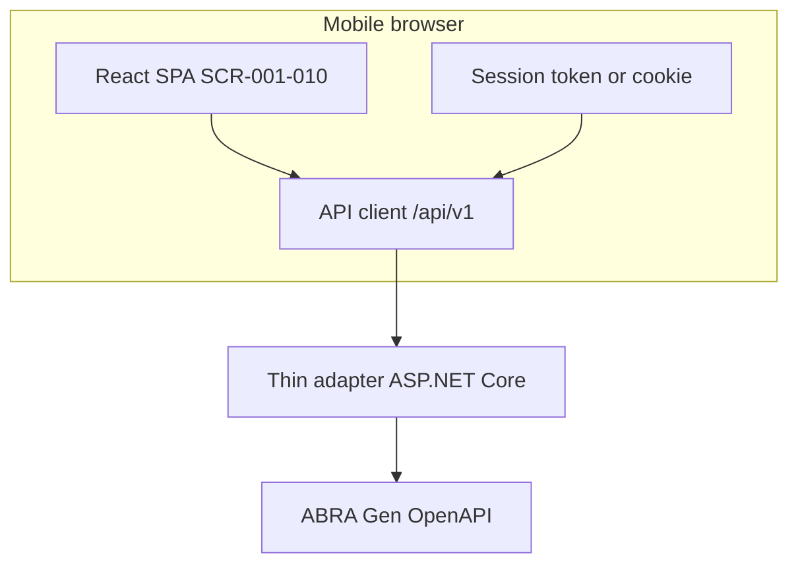

# MVP solution overview

High-level technical shape for the first release. **No application code yet** — guides folder layout under `src/` when implementation starts.

**Authoritative stack and operations:** [`../solution-architecture-v1.md`](../solution-architecture-v1.md) (ADR [0005](../../docs/decisions/0005-solution-architecture-v1.md)).

## Logical components



## Screen map (MVP)

Detailed specs: [`../../analysis/screens/README.md`](../../analysis/screens/README.md) (SCR-001–SCR-014).

| ID | Screen | Hub | Phase |
|----|--------|-----|-------|
| SCR-001 | Login | — | MVP |
| SCR-002 | **My Day** | Operational | MVP |
| SCR-003–005 | Firm search / detail / contact | Customer | MVP |
| SCR-006–007 | Activity detail / Log visit | Operational | MVP |
| SCR-008–010 | Session / error / loading | System | MVP |
| SCR-011–012 | Pipeline / Opportunity | Commercial | Phase 2 placeholder |
| SCR-013–014 | Quote / Order detail | Document | Phase 2 placeholder |

## Planned source layout (future)

```text
src/
  mobile/           # App UI and navigation (stack TBD)
  integration/      # Gen OpenAPI client, DTOs, query builders
  domain/           # UI-agnostic models mapped from Gen (not master DB)
tests/
  integration/      # Gen API contract tests (sandbox)
  e2e/              # Journey tests
```

## Stack decisions

See [Solution Architecture v1](../solution-architecture-v1.md) and [ADR 0005](../../docs/decisions/0005-solution-architecture-v1.md):

- [x] Client: **React SPA (Vite)** in mobile browser; optional PWA install
- [x] Integration: **ASP.NET Core thin adapter** (`/api/v1`) — unchanged
- [x] Auth: **BFF session** (Gen bridge on server)
- [x] Native mobile apps: **out of scope**

## Delivery phases

| Phase | Deliverable |
|-------|-------------|
| **0 (current)** | Analysis + architecture docs |
| **1** | Gen mapping spike + OpenAPI audit script |
| **2** | Mobile shell + auth + firm search read path |
| **3** | Activities read/write + dashboard |
| **4** | Hardening, UAT, store release |
