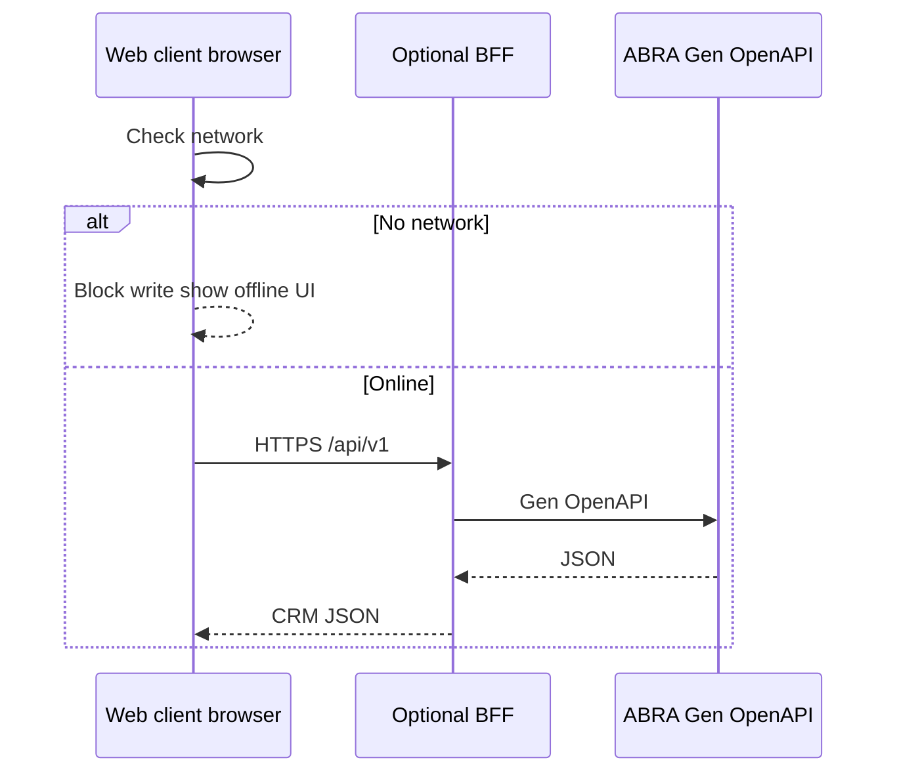

# Online architecture

Runtime model for **online-only** Mobile CRM (ADR 0002).

## Request path

## Caching policy

| Data | Cache | Notes |
|------|-------|-------|
| Firm search results | Short TTL in memory | Invalidate on pull-to-refresh |
| Firm detail | Session memory | Not persisted as master |
| Auth tokens | Session storage or httpOnly cookie | Not Gen password after login |
| User preferences | Local non-business store | Theme, last list sort |

**Forbidden for MVP:** SQLite/Room/Core Data tables mirroring Gen firms, contacts, or activities as authoritative replicas.

## Resilience

| Scenario | Behaviour |
|----------|-----------|
| Timeout | Retry read once with backoff; show error |
| 401 / 403 | Re-auth or permission message |
| 5xx from Gen | Non-destructive message; do not cache write as success |
| Partial connectivity | Treat as offline for writes |

## Observability (when implemented)

See [solution-architecture-v1.md](solution-architecture-v1.md) §10–11:

- Correlate `traceId` / `X-Correlation-Id` mobile → adapter → Gen
- Structured Serilog on adapter; crash reporting on mobile
- No PII in logs without policy

## Deployment (high level)

See [solution-architecture-v1.md](solution-architecture-v1.md) §9:

| Component | Hosting |
|-----------|---------|
| ABRA Gen | Customer existing Gen instance |
| Thin adapter | Co-located with Gen on customer network |
| Web UI | Static deploy with or behind adapter; mobile browser + VPN |
