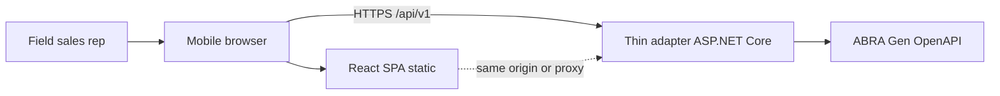
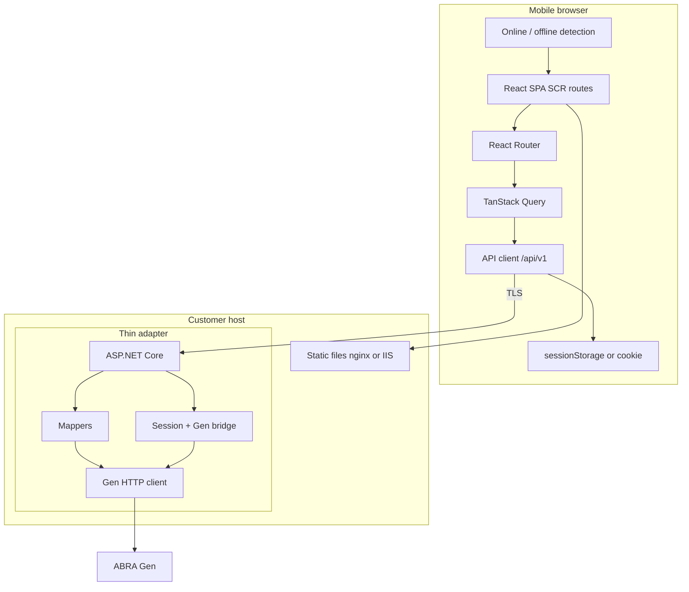
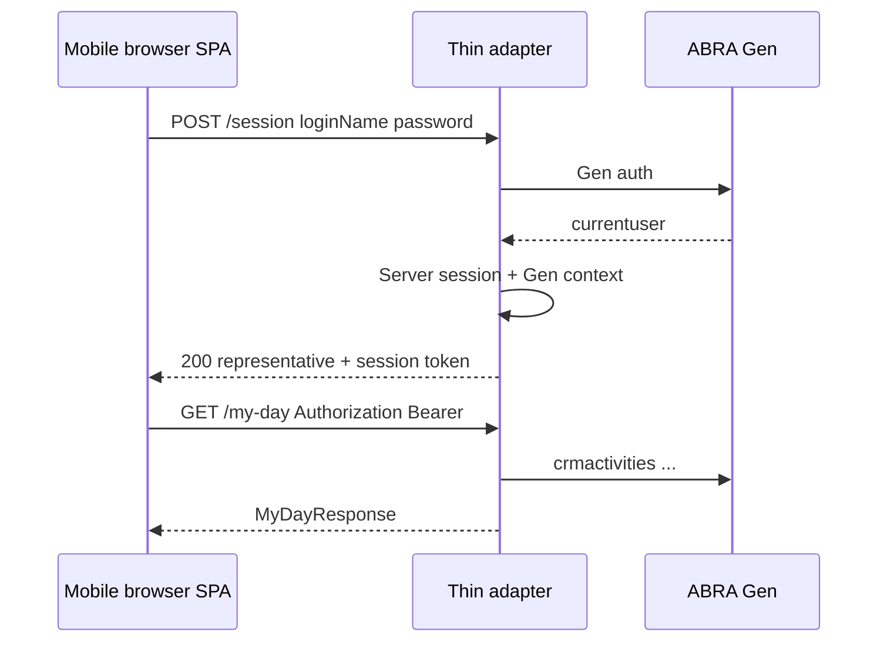
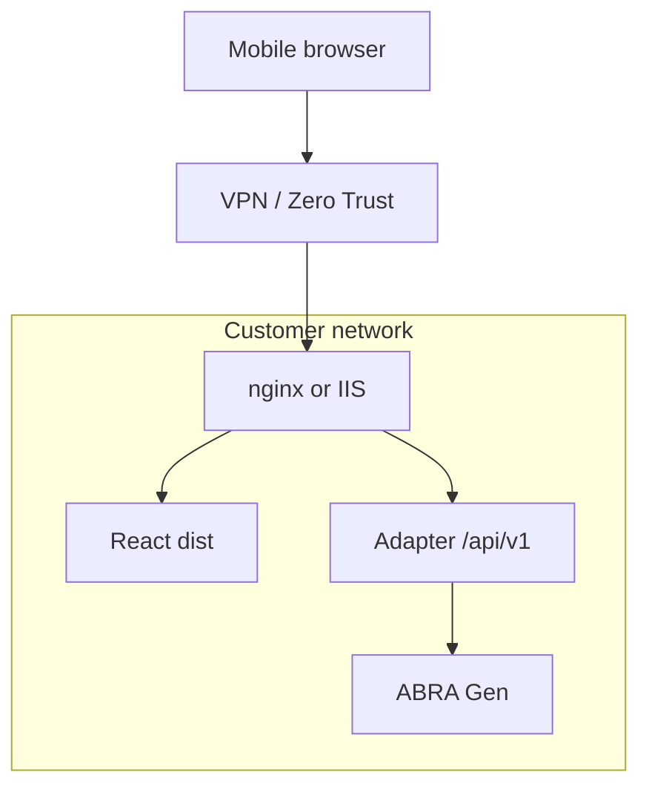

# Solution Architecture v1 — ABRA Mobile CRM

**Status:** Draft  
**Version:** 1.1.0  
**Date:** 2026-06-04  
**Scope:** MVP (SCR-001–SCR-010), online-only browser web app, smallest maintainable system

**Decision records:** [ADR 0005 v1.1](../docs/decisions/0005-solution-architecture-v1.md) · [ADR 0006 v2 — Browser frontend](../docs/decisions/0006-frontend-technology.md)

**Product constraint:** ABRA Mobile CRM is accessed through a **mobile browser**. Native applications are **out of scope**.

---

## 1. Purpose

This document defines the **end-to-end technical architecture** for MVP: components, technology choices, authentication, deployment, logging, and monitoring. It implements accepted principles and ADRs using validated integration evidence and the normative Mobile CRM API contract.

**Out of scope:** Application source code, infrastructure-as-code, CI/CD pipelines, and OpenAPI code generation scripts. **Native mobile apps**, **offline sync**, and **app store / MDM** distribution.

---

## 2. Inputs and traceability

| Input | Role in this architecture |
|-------|---------------------------|
| [Business domain model v0.2](../analysis/domain/business-domain-model.md) | Entities, ownership, MVP vs Phase 2 boundaries |
| [Screen inventory v0.2](../analysis/screens/README.md) | SCR-001–010 journeys (mobile browser UX) |
| [Integration spikes](../analysis/spikes/README.md) | Validated Gen behaviour (activities, contacts, rep identity) |
| [Mobile CRM API v1](mobile-crm-api-v1.md) | **Normative** HTTP surface for the web client |
| [Adapter mapping v1](mobile-crm-api-v1-adapter-mapping.md) | Gen implementation (**unchanged**) |
| [ADR 0001](../docs/decisions/0001-abra-gen-source-of-truth.md) | Gen sole source of truth |
| [ADR 0002](../docs/decisions/0002-online-only-architecture.md) | No offline business replica |
| [ADR 0004](../docs/decisions/0004-thin-abra-adapter.md) | Thin adapter boundary |
| [ADR 0006 v2](../docs/decisions/0006-frontend-technology.md) | Browser-only frontend |

---

## 3. Architecture decision summary

| Topic | MVP decision | Rationale (short) |
|-------|--------------|-------------------|
| **Frontend** | **React 18+ TypeScript SPA (Vite)** | Browser-only product; mobile-first UI; static deploy |
| **PWA** | **Optional enhancement** (manifest, install, app-shell cache only) | Not offline sync; not a native app |
| **Adapter** | **ASP.NET Core 8** Web API `/api/v1` | **Unchanged** — Gen mapping, validate-then-commit, session |
| **Authentication** | BFF session after `POST /session`; browser `Bearer` or httpOnly cookie | Gen credentials stay on server |
| **Deployment** | Per-customer: Gen + adapter + **static web** on customer network | Minimal update complexity (replace `dist/`) |
| **Logging** | Serilog JSON on adapter; restrained browser logging | Correlation via `traceId` |
| **Monitoring** | Adapter `/health` + HTTP metrics; optional APM | Sufficient for MVP |

### 3.1 Thin adapter (unchanged rationale)

Server-hosted thin adapter per [ADR 0004](../docs/decisions/0004-thin-abra-adapter.md) and [mobile-crm-api-v1.md](mobile-crm-api-v1.md):

1. REST `/api/v1` is the only client integration surface.
2. Gen credentials and validate-then-commit stay off the browser.
3. Deployment policy and allowlisted `select` lists change without redeploying UI logic.

Adapter remains **thin**: no business database, no authoritative cache ([adapter mapping](mobile-crm-api-v1-adapter-mapping.md)).

### 3.2 Withdrawn from v1.0.0 (MAUI-era)

The following are **removed** from this architecture:

| Withdrawn item | Reason |
|----------------|--------|
| .NET MAUI client | Native mobile out of scope |
| App Store / Play / MDM distribution | Browser access only |
| OS secure storage (Keychain) for client | Web session model |
| Offline/SQLite as stack driver | Offline not a design driver |
| Single-language C# across UI + adapter | Web UI is TypeScript; split at API contract |

See [ADR 0006 § Invalidated arguments](../docs/decisions/0006-frontend-technology.md#invalidated-arguments-from-adr-0006-v100-net-maui).

---

## 4. System context (C4 Level 1)

| System | Responsibility |
|--------|----------------|
| **Web client** | SCR-001–010 in mobile browser; calls only `/api/v1` |
| **Thin adapter** | Auth, session, DTO mapping, Gen orchestration (**unchanged**) |
| **ABRA Gen** | Master data, permissions, audit |
| **Static host** | Serves React `dist/` (may be same site as adapter) |

---

## 5. Container view (C4 Level 2)

### 5.1 Repository layout

Detailed monorepo, adapter, and web folder structure: **[development-architecture-v1.md](development-architecture-v1.md)** §3–4. Optional: adapter hosts `wwwroot` from web `dist/` for single-origin deploy.

---

## 6. Frontend technology (browser)

### 6.1 Decision: React SPA + optional PWA

**ADR:** [0006 v2](../docs/decisions/0006-frontend-technology.md).

| Criterion | Choice |
|-----------|--------|
| Runtime | Mobile **browser** (Safari iOS, Chrome Android — primary targets) |
| Framework | React 18+, TypeScript strict |
| Build | Vite |
| Routing | React Router — maps SCR-001–010 |
| Server state | TanStack Query (recommended): cache in memory, refetch on focus/pull-to-refresh |
| Styling | Mobile-first CSS (component library TBD: e.g. minimal MUI / Radix + tokens) |
| API | OpenAPI-generated TypeScript client → `/api/v1` only |
| PWA | Optional: `vite-plugin-pwa`, manifest, icons; SW **app shell only** — no offline business data |
| Local persistence | **Session token** + UI preferences only (ADR 0002) — no IndexedDB entity store |

### 6.2 Browser options considered (ADR 0006)

| Option | MVP verdict |
|--------|-------------|
| **React SPA** | **Selected** — deploy, hiring, mobile CSS ecosystem |
| Vue SPA | Viable alternative; not selected |
| Blazor WASM | Heavier first load; C# overlap does not justify WASM size on 4G |
| Blazor Server | Rejected — SignalR coupling, poor mobile browser resilience |

### 6.3 Web client rules

1. **Single integration boundary:** [`mobile-crm-api-v1.md`](mobile-crm-api-v1.md) only — no Gen in browser.
2. **Screen modules** align with SCR IDs.
3. **In-memory cache** via TanStack Query; invalidate on pull-to-refresh ([online-architecture.md](online-architecture.md)).
4. **Connectivity:** `navigator.onLine` + failed fetch → SCR-009; no write queue (ADR 0002).
5. **Touch UX:** NFR-U1 one-thumb actions; viewport meta; avoid hover-only interactions.
6. **tel:/mailto:** standard anchors on SCR-005.

### 6.4 Screen → API mapping (unchanged)

| Screen | API operations |
|--------|----------------|
| SCR-001 | `POST /session` |
| SCR-010 | `GET /session` |
| SCR-002 | `GET /my-day` |
| SCR-003 | `GET /firms?q=` |
| SCR-004 | `GET /firms/{firmId}` |
| SCR-005 | `GET /contacts/{contactId}?firmId=` |
| SCR-006 | `GET /activities/{activityId}` |
| SCR-007 | `POST` / `PUT /activities`, `GET /firms/{id}/contacts`, `GET /activity-types` |
| SCR-008 | `401` / `UNAUTHORIZED` |
| SCR-009 | `SERVICE_UNAVAILABLE`, network errors |

---

## 7. Adapter technology (unchanged)

### 7.1 Decision: ASP.NET Core 8 Web API

No change to adapter role, endpoints, or [adapter mapping](mobile-crm-api-v1-adapter-mapping.md) because the web client consumes the same contract as the withdrawn MAUI client.

| Criterion | Choice |
|-----------|--------|
| Host | Kestrel behind IIS or nginx on customer infrastructure |
| API | REST JSON per [mobile-crm-api-v1.md](mobile-crm-api-v1.md) |
| Gen integration | HttpClient + spike-validated policies |
| CORS | Configure when SPA origin differs from API host; prefer **same origin** via reverse proxy |
| Static files | Optional: serve React `dist/` from adapter `wwwroot` |

### 7.2–7.4

Unchanged from v1.0.0: responsibilities (§7.2), Gen optimisation (§7.3), rejected alternatives Node-only BFF without mapping layer (§7.4). **Withdrawn:** “In-app adapter on device” and “splits stack from MAUI” — replaced by browser + TS.

---

## 8. Authentication

### 8.1 BFF session (unchanged flow, browser client)

| Layer | Mechanism |
|-------|-----------|
| **Browser → BFF** | `POST /session`; then `Authorization: Bearer` **or** httpOnly **session cookie** when same-origin |
| **BFF → Gen** | Basic/Bearer per deployment — secrets on server only |
| **Logout** | `DELETE /session`; clear `sessionStorage` / cookie |

### 8.2 Security (web-adjusted)

| Requirement | How |
|-------------|-----|
| NFR-S1 | Secrets in customer vault / env |
| NFR-S2 | **No Gen password** after login; session token in `sessionStorage` (MVP) or **httpOnly Secure SameSite** cookie (preferred same-origin) |
| NFR-S3 | Least-privilege Gen user |
| TLS | Required browser↔BFF and BFF↔Gen |

### 8.3 Deferred

Corporate IdP (OIDC), CSP hardening, certificate pinning (browser policy).

---

## 9. Deployment model

### 9.1 Per-customer: Gen + adapter + static web

| Component | MVP hosting |
|-----------|-------------|
| **ABRA Gen** | Existing customer instance |
| **Thin adapter** | Co-located VM/container with Gen (**unchanged**) |
| **Web UI** | Static files — co-hosted with adapter **or** separate static site + proxy |
| **User access** | `https://mobilecrm.customer.local` in mobile browser (VPN) |
| **Updates** | Replace adapter DLL/config + **replace `dist/`** — no app store |

**Recommended MVP pattern:** single hostname — reverse proxy serves `/` from static build and `/api/v1` to Kestrel — avoids CORS and simplifies cookies.

### 9.2 Environments

| Environment | Purpose |
|-------------|---------|
| **DEV** | Vite dev server with proxy to local adapter → DEMO Gen |
| **TEST** | Customer test Gen + staged static + adapter |
| **PROD** | Production Gen + adapter + static web |

### 9.3 Network

Unchanged: VPN/Zero Trust to customer network; adapter near Gen for latency.

---

## 10. Logging

| Component | Approach |
|-----------|----------|
| **Adapter** | Serilog JSON — **unchanged** |
| **Browser** | `console` in dev only; production optional **Sentry** (or similar) with route name + `traceId` — no credentials, no PII bodies |

Correlation: `traceId`, `X-Correlation-Id` — unchanged.

---

## 11. Monitoring

Unchanged adapter baseline: `/health`, `/health/ready`, HTTP metrics, optional OpenTelemetry.

Browser: optional Real User Monitoring later; MVP relies on adapter metrics and user-reported SCR-009.

---

## 12. Data, caching, and resilience

| Data | Browser | Adapter |
|------|---------|---------|
| Session token | sessionStorage or cookie | Server session + Gen context |
| API responses | TanStack Query memory | Optional adapter memory dedupe |
| Business entities | **Not** in IndexedDB/localStorage | **Not** in DB |

| Scenario | Behaviour |
|----------|-----------|
| Offline / failed fetch | SCR-009; writes blocked |
| 401 | SCR-008 |
| 502/503 | SCR-009 |

---

## 13. Domain alignment

Unchanged mapping of domain entities to API resources. Phase 2 extends **web SPA + adapter**, not native client.

---

## 14. Delivery phases (technical)

| Phase | Deliverable |
|-------|-------------|
| **0** | Docs (current) |
| **1** | Adapter skeleton: health, session, `GET /firms` |
| **2** | React shell: SCR-001, SCR-010, SCR-003, SCR-008/009 |
| **3** | SCR-002, SCR-004–007, adapter integration tests |
| **4** | Hardening, UAT, optional PWA manifest, production static deploy |

---

## 15. Risks and open questions

| ID | Risk | Mitigation |
|----|------|------------|
| OQ-SR-04 / OQ-LC-04 | My Day date filter | Adapter tests before SCR-002 |
| Web session XSS | Token in sessionStorage | Same-origin + CSP + short TTL; move to httpOnly cookie |
| CORS misconfiguration | Split origins | Prefer single-host reverse proxy |
| Safari tab eviction | In-memory state lost | TanStack Query refetch on visibility; SCR-010 session check |
| Gen auth variance | Per customer | `IGenAuthProvider` on adapter (**unchanged**) |

---

## 16. Related documents

| Document | Action |
|----------|--------|
| [development-architecture-v1.md](development-architecture-v1.md) | Implementation layout and conventions |
| [mvp/solution-overview.md](mvp/solution-overview.md) | Update stack to React web |
| [context.md](context.md) | Browser client, not native app |
| [online-architecture.md](online-architecture.md) | Web request path |
| [mobile-crm-api-v1.md](mobile-crm-api-v1.md) | No change required |

---

## 17. Document history

| Version | Date | Change |
|---------|------|--------|
| 1.0.0 | 2026-06-04 | Initial — .NET MAUI + ASP.NET Core adapter |
| 1.1.0 | 2026-06-04 | Browser-only product: React SPA + optional PWA; adapter/API unchanged; MAUI withdrawn |
