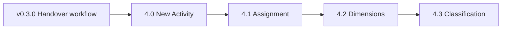

# ABRA Mobile CRM — Product roadmap

**Status:** Living document  
**Last updated:** 2026-06-09  
**Current release:** **v0.3.0** (Sprint 3 complete)

This is the single planning reference for ABRA Mobile CRM development. Detailed sprint notes live under `implementation/sprint-*`; architecture under `architecture/`.

---

## 1. Completed milestones (through v0.3.0)

### v0.1.0 — Foundation (Sprint 0–1)

| Area | Delivered |
|------|-----------|
| **Session** | Login, session token, representative context |
| **My Day** | Today + overdue activity agenda for the logged-in user |
| **Customers** | Firm search, firm detail, contact list and contact detail |
| **Platform** | Thin Gen adapter, React SPA, Slovak UI baseline |

### v0.2.0 — Activity lifecycle (Sprint 2)

| Area | Delivered |
|------|-----------|
| **Activity detail** | Subject, schedule, firm, contact, status, actions |
| **Start activity** | Open → in progress (`Status 1`) |
| **Add note** | Append to `Answer` with timestamp + author, newest first |
| **Complete activity** | Outcome required, `Status 2`, formatted history entry |

### v0.3.0 — Handover & workflow (Sprint 3) ✓

Sprint 3 closes the field-rep loop: finish work, hand over, and schedule the next step without losing context.

| Capability | Summary |
|------------|---------|
| **My Day** | Open / in-progress / today-overdue buckets for assignee |
| **Activity detail** | Full read model, terminal states, action gating |
| **Start activity** | Začať riešiť |
| **Add note** | Pridať poznámku — `AppendAnswer()` with `DD.MM.YYYY HH:mm \| Author` |
| **Complete activity** | Nový výsledok — same history format as notes |
| **Handover activity** | Native Gen `Source_ID` link; source → Odovzdané (`Status 3`) |
| **Follow-up activity** | Create child on complete; subject, schedule, assignee |
| **User assignment** | `SolverUser_ID` + `ResponsibleUser_ID` via user picker |
| **Activity history** | Single `Answer` field, prepend blocks, `---` separators |
| **Context preservation** | Child inherits source `Description` + full `Answer` history |
| **Workflow stabilization** | Default schedule (today + 1 h), Slovak date/time UX, handover form simplification, assignment + inheritance bug fixes |

**Key implementation references:** [3A.4 schedule next](sprint-3a-4-schedule-next-activity.md) · [3A.3 handover](sprint-3a-3-handover-spike.md) · [3B.1 assignment](sprint-3b-1-user-assignment.md) · [3B.3 polish](sprint-3b-3-workflow-polish.md) · [3B.4 handover UX](sprint-3b-4-handover-ux-simplification.md) · [follow-up context](sprint-3b-followup-source-context.md)

---

## 2. Sprint 4 roadmap — Create & classify activities

Sprint 4 extends Mobile CRM from **consuming and handing over** activities to **creating and classifying** them in the field. Backend create infrastructure (`POST /api/v1/activities`, `ActivityCreateService`) already exists from Sprint 3A; Sprint 4 exposes it in the UI and adds dimensions and classification.



### Sprint 4.0 — New Activity

**Goal:** Create a CRM activity from Mobile CRM without an existing source activity.

| Field / behaviour | Notes |
|-------------------|--------|
| **Subject** | Required |
| **Planned date/time** | Required; Slovak-friendly picker (reuse 3B.3 patterns) |
| **Firm** | Required; link to firm search / picker |
| **Contact person** | Optional; from firm contacts |
| **Description** | Optional brief (`Popis`) |

**Out of scope for 4.0:** Dimensions, classification pickers, solver role (see 4.1–4.3).

**Depends on:** Sprint 3A create API, firm/contact modules, Gen validate-then-commit POST.

---

### Sprint 4.1 — Assignment

**Goal:** Explicit assignment model beyond “assign to user” on follow-up.

| Area | Delivered |
|------|-----------|
| **Solver Role** | `SolverRole_ID` picker when configured |
| **Solver User** | `SolverUser_ID` / `ResponsibleUser_ID` rules |
| **Assignment rules** | Align with Gen ownership + My Day visibility ([3B.0 analysis](sprint-3b-0-activity-assignment-analysis.md)) |

Applies to **new activities (4.0)** and **follow-up create**; must remain consistent with handover workflow.

---

### Sprint 4.2 — Business dimensions

**Goal:** Optional Business Case, Work Order, and Project on activity create/edit.

| Gen field | Mobile label |
|-----------|--------------|
| `BusTransaction_ID` | Business Case |
| `BusOrder_ID` | Work Order |
| `BusProject_ID` | Project |

**Configuration** (tenant / `appsettings` + exposed via session capabilities):

```json
{
  "activityDimensions": {
    "businessCase": true,
    "workOrder": true,
    "project": true
  }
}
```

| Flag | When `false` |
|------|----------------|
| Per dimension | Hidden in UI; omitted from Gen POST body |

**Analysis:** [Sprint 3A.2 dimensions](sprint-3a-2-activity-dimensions-analysis.md) — inheritance on follow-up, `*Req` overrides from activity type.

---

### Sprint 4.3 — Activity classification

**Goal:** Configurable Activity Area, Activity Type, and Activity Series on create.

| Gen field | Mobile label |
|-----------|--------------|
| `ActivityArea_ID` | Activity Area |
| `ActivityType_ID` | Activity Type |
| Activity series / process | Activity Series (`ActivityProcess_ID` or equivalent) |

**Configuration:**

```json
{
  "activityClassification": {
    "activityArea": true,
    "activityType": true,
    "activitySeries": true
  }
}
```

| Flag | When `false` |
|------|----------------|
| Per field | Hidden in UI; adapter uses Gen defaults or inherited refs |

**Note:** Follow-up create today inherits type + refs from source; 4.3 adds explicit classification for **new** activities and optional overrides.

---

### Sprint 4 — cross-cutting concerns

| Topic | Approach |
|-------|----------|
| **Config delivery** | Adapter reads flags at startup; `GET /api/v1/session` capabilities drive UI |
| **Gen validation** | Validate-then-commit; respect activity-type `*Req` flags |
| **Follow-up / handover** | Sprint 3 workflow unchanged; new fields additive |
| **i18n** | Slovak labels; `format.ts` date/time helpers |
| **Testing** | E2E: create → My Day → start → complete; dimension/classification matrix per config |

**Target release:** **v0.4.0** after Sprint 4.3.

---

## 3. Future roadmap — ABRA Mobile Projects

After Mobile CRM reaches v0.4.0, a separate product line **ABRA Mobile Projects** reuses the activity infrastructure for project-centric field work.

| Direction | Description |
|-----------|-------------|
| **Project work** | Activities linked to projects and work breakdown |
| **Time reporting** | Duration / effort capture on complete or dedicated time entries |
| **Service activities** | Service orders, SLAs, recurring visits |
| **Technician work logs** | Structured logs, materials, signatures |
| **Field work** | Offline-tolerant patterns, checklist steps, photo attachments |

**Shared platform (reuse from Mobile CRM):**

- Gen adapter (`crmactivities`, firms, contacts, dimensions)
- Session + representative model
- My Day agenda pattern
- Activity detail, notes, complete, handover chain
- Assignment and history (`AppendAnswer`)

**Not in Mobile CRM v0.4.x:** Full project planning UI, Gantt, budget control — those remain ABRA Gen desktop / Projects scope.

---

## 4. Version map (summary)

| Version | Theme | Status |
|---------|--------|--------|
| v0.1.0 | Login, My Day, customers | ✓ Shipped |
| v0.2.0 | Activity start, notes, complete | ✓ Shipped |
| **v0.3.0** | **Handover, follow-up, assignment, stabilization** | **✓ Current** |
| v0.4.0 | New activity, assignment, dimensions, classification | Planned (Sprint 4) |
| v1.0.0+ | Mobile Projects product line | Future |

---

## 5. Document index

| Sprint | Primary docs |
|--------|----------------|
| 0–1 | [sprint-0-plan](sprint-0-plan.md), [sprint-1-plan](sprint-1-plan.md) |
| 2 | [sprint-2b completion](sprint-2b-activity-completion-design.md), [sprint-2c notes](sprint-2c-activity-notes-design.md) |
| 3 | [3A follow-up design](sprint-3a-follow-up-activity-design.md), [3B workflow review](sprint-3b-2-workflow-review.md) |
| 4 (planned) | [3A.2 dimensions](sprint-3a-2-activity-dimensions-analysis.md), [3B.0 assignment](sprint-3b-0-activity-assignment-analysis.md) |

---

*Update this file when a sprint ships or scope changes. Tag releases in git to match the version map above.*
