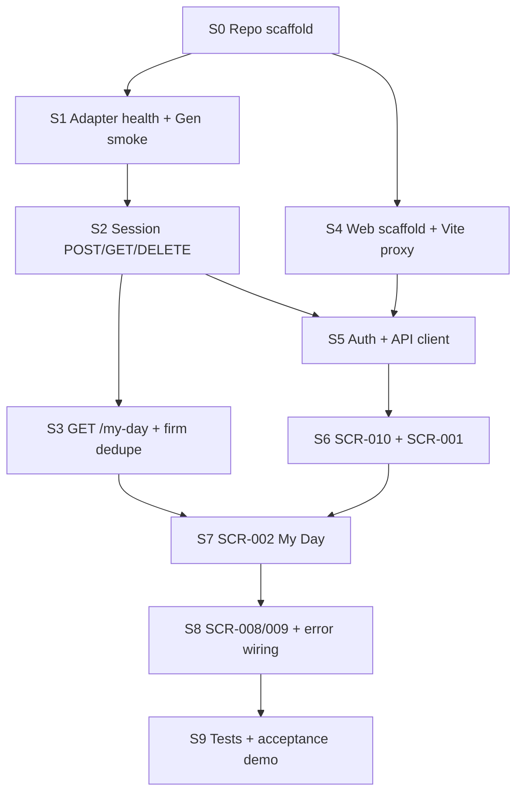

# Sprint 0 — Implementation Plan

**Sprint:** 0 (foundation vertical slice)  
**Version:** 1.0.0  
**Date:** 2026-06-04  
**Status:** Draft

**Goal:** Prove end-to-end flow **Login → Session validation → My Day** against a real Gen sandbox through the thin adapter and browser SPA.

**Inputs:** [Solution Architecture v1.1](../architecture/solution-architecture-v1.md) · [Development Architecture v1](../architecture/development-architecture-v1.md) · [Mobile CRM API v1](../architecture/mobile-crm-api-v1.md) · [Sales rep spike](../analysis/spikes/sales-representative-model.md) · [CRM activities spike](../analysis/spikes/crmactivities-lifecycle.md)

**Deliverables:** [`sprint-0-backlog.md`](sprint-0-backlog.md) · [`sprint-0-acceptance-criteria.md`](sprint-0-acceptance-criteria.md)

---

## 1. Sprint 0 scope

### 1.1 In scope (vertical slice)

| Layer | Deliverable |
|-------|-------------|
| **User journey** | Cold start → bootstrap (SCR-010) → login (SCR-001) → My Day (SCR-002); session re-check on return |
| **API (adapter)** | `POST /session`, `GET /session`, `DELETE /session`, `GET /my-day`, `GET /health` (+ optional `/health/ready`) |
| **API (contract)** | Per [mobile-crm-api-v1](../architecture/mobile-crm-api-v1.md) §7.1–7.2 — no new endpoints |
| **Gen integration** | `currentuser` + `securityusers` (session); `crmactivities` + deduped `firms` (My Day) per [adapter mapping](../architecture/mobile-crm-api-v1-adapter-mapping.md) |
| **Web UI** | Routes: `/app/loading`, `/login`, `/app/my-day`, minimal `/app/session-expired`, `/app/connection-error` |
| **Shell** | Partial `AuthenticatedLayout`: **My Day** tab active; **Customers** tab visible but disabled or “Sprint 1” stub |
| **Testing** | Adapter integration tests (session + my-day against DEMO); Playwright smoke (mobile viewport); manual demo script |

### 1.2 Explicitly out of scope (later sprints)

| Item | Target sprint |
|------|----------------|
| Firm search / detail (SCR-003, SCR-004) | Sprint 1 |
| Contact detail (SCR-005) | Sprint 1 |
| Activity detail / log visit (SCR-006, SCR-007) | Sprint 2 |
| `GET /activity-types`, activity write | Sprint 2 |
| Full two-tab navigation with working Customers | Sprint 1 |
| PWA manifest / service worker | Post–Sprint 0 |
| OpenAPI publish pipeline (automation) | Sprint 0 may use hand-maintained TS types |
| Production customer deploy runbook | Sprint 0 = DEV/TEST sandbox only |
| Offline sync, IndexedDB | Never in MVP (ADR 0002) |
| Corporate IdP / OIDC | Future ADR |

### 1.3 Screens mapped to slice

| SCR | Name | Sprint 0 depth |
|-----|------|----------------|
| SCR-010 | App loading | Full — bootstrap + `GET /session` |
| SCR-001 | Login | Full — `POST /session` |
| SCR-002 | My Day | Full — `GET /my-day`, pull-to-refresh, empty states |
| SCR-008 | Session expired | Minimal — 401 → page → login |
| SCR-009 | Connection error | Minimal — network / 502–503 → page + retry |
| SCR-003–007 | — | Not built |

---

## 2. Spike constraints (must implement)

From validated spikes — adapter **must** follow these in Sprint 0:

| ID | Constraint | Source |
|----|------------|--------|
| SR-01 | `representative.id` = `GET currentuser` → `id` (= `securityusers.ID`) | Sales rep §3 |
| SR-02 | My Day activities: **OR** `ResponsibleUser_ID`, `SolverUser_ID`, `CreatedBy_ID` = `repUserId` | Sales rep §5.2 |
| SR-03 | Do **not** use `employees.ID` as login key; optional `employeeNumber` via `Person_ID` | Sales rep §4.2 |
| LC-01 | Use **`crmactivities`** only — not `tasks` | Lifecycle §2 |
| LC-02 | Activity `select` allowlist — **no** `ResponsibleCustomerPerson_ID` | Lifecycle §5 |
| LC-03 | Map `Status` 0–3 → contract `ActivityStatus` | Lifecycle §3.2 |
| LC-04 | `SheduledStart$DATE` for schedule (typo preserved in Gen API) | Lifecycle §3.3 |

**Sprint 0 spike gap (implement with fallback):**

| OQ | Topic | Sprint 0 approach |
|----|-------|-------------------|
| OQ-SR-04 / OQ-LC-04 | Date `where` on `SheduledStart$DATE` | Implement best-effort predicates from spike §5.2; add integration test on DEMO; document failures in adapter logs |
| OQ-SR-02 | OR vs single ownership field | Ship **OR** per adapter mapping (confirmed on DEMO syntax) |
| — | Firm names on activity rows | Dedupe `GET firms/{id}?select=ID,Name` per distinct `Firm_ID` (study §4.3) |

---

## 3. Logical implementation order

Work proceeds **adapter-first** so the web client integrates against a running API.

| Step | Focus | Blocks |
|------|-------|--------|
| **0** | Monorepo, solution, empty projects, config templates, CI skeleton (optional) | All |
| **1** | Adapter runs; `GET /health`; Gen ping / `currentuser` with configured credentials | Session |
| **2** | Session store, `POST/GET/DELETE /session`, error envelope, correlation id | Web login |
| **3** | `MyDayController`, ownership OR, date filters, mappers, firm name enrichment | My Day UI |
| **4** | Vite + React + TS; dev proxy to adapter | UI features |
| **5** | `api/client`, `AuthContext`, contract types | Pages |
| **6** | SCR-010, SCR-001, route guards | My Day |
| **7** | SCR-002, TanStack Query, pull-to-refresh | Acceptance |
| **8** | Global 401/503 handling, SCR-008/009 routes | Hardening |
| **9** | Integration + E2E tests; run acceptance script | Sprint done |

**Parallel tracks after step 2:** Backend step 3 and frontend steps 4–6 can overlap if API contract types are agreed (hand-written from API doc).

---

## 4. Dependencies

| Dependency | Owner | Required by | Notes |
|------------|-------|-------------|-------|
| Gen DEMO (or customer TEST) reachable | Infra / dev | Step 1 | Same as spike: `config/config.yaml` pattern |
| Gen service credentials (non-secret template) | DevOps | Step 1 | Least-privilege user with `currentuser`, `crmactivities`, `firms` read |
| ADR 0004 / adapter mapping accepted | Architecture | Step 2–3 | Implementation follows mapping doc |
| API v1 DTO shapes frozen for slice | Architecture | Step 5 | `SessionResponse`, `MyDayResponse`, `ActivitySummary` |
| Timezone for “today” (org vs UTC) | Product | Step 3 | Default **Europe/Bratislava** in adapter config until workshop |
| Browser test device or emulator | QA | Step 9 | Mobile viewport 390×844 |

**External / not blocking Sprint 0 start:** App Store, MDM, production TLS cert, commercial health mapping.

---

## 5. Risks

| Risk | Impact | Mitigation |
|------|--------|------------|
| OQ-SR-04 date `where` fails on target Gen | Empty or wrong My Day lists | Spike script reuse; adapter feature flag to relax date filter; log Gen 400 body |
| DEMO has no activities for logged-in user | Empty My Day — looks broken | Document test user with `CreatedBy_ID` / `SolverUser_ID` data (SR §5.2); seed or pick known rep |
| `ResponsibleUser_ID` only filter would show empty | Misleading “no work” | OR filter mandatory in Sprint 0 |
| Session store in-memory only | Lost sessions on adapter restart | Accept for DEV; document Redis for TEST/PROD |
| CORS if dev without proxy | Login fails from Vite | Enforce Vite proxy per dev architecture |
| Hand-maintained TS types drift from API | Compile/runtime mismatch | Contract review checklist in PR; OpenAPI gen in Sprint 1 |
| Shared device token in sessionStorage | Wrong user if no logout | Out of Sprint 0 scope except `DELETE /session` on logout button (optional minimal) |

---

## 6. Definition of done (Sprint 0)

- [ ] All tasks in [`sprint-0-backlog.md`](sprint-0-backlog.md) marked done or explicitly deferred with ticket
- [ ] [`sprint-0-acceptance-criteria.md`](sprint-0-acceptance-criteria.md) executed on DEMO/TEST
- [ ] No Gen calls from browser (network tab audit)
- [ ] README under `src/` with local run instructions (how to start adapter + web)
- [ ] Known OQs documented in adapter `appsettings` comments or `implementation/` notes

---

## 7. Estimation (logical sizing)

| Area | Tasks (backlog) | Relative effort |
|------|-----------------|-----------------|
| Scaffold + health | B-01–B-04, F-01–F-02 | S |
| Session | B-05–B-12, F-05–F-10 | M |
| My Day adapter | B-13–B-22 | L |
| My Day UI | F-11–F-18 | M |
| Errors / shell | F-19–F-22, B-08 | S |
| Testing | T-01–T-12 | M |

**Total:** ~22 backend, ~22 frontend, ~12 test items — one sprint for a small team (2 devs) assuming Gen sandbox stable.

---

## 8. Document history

| Version | Date | Change |
|---------|------|--------|
| 1.0.0 | 2026-06-04 | Initial Sprint 0 plan — Login → Session → My Day slice |
