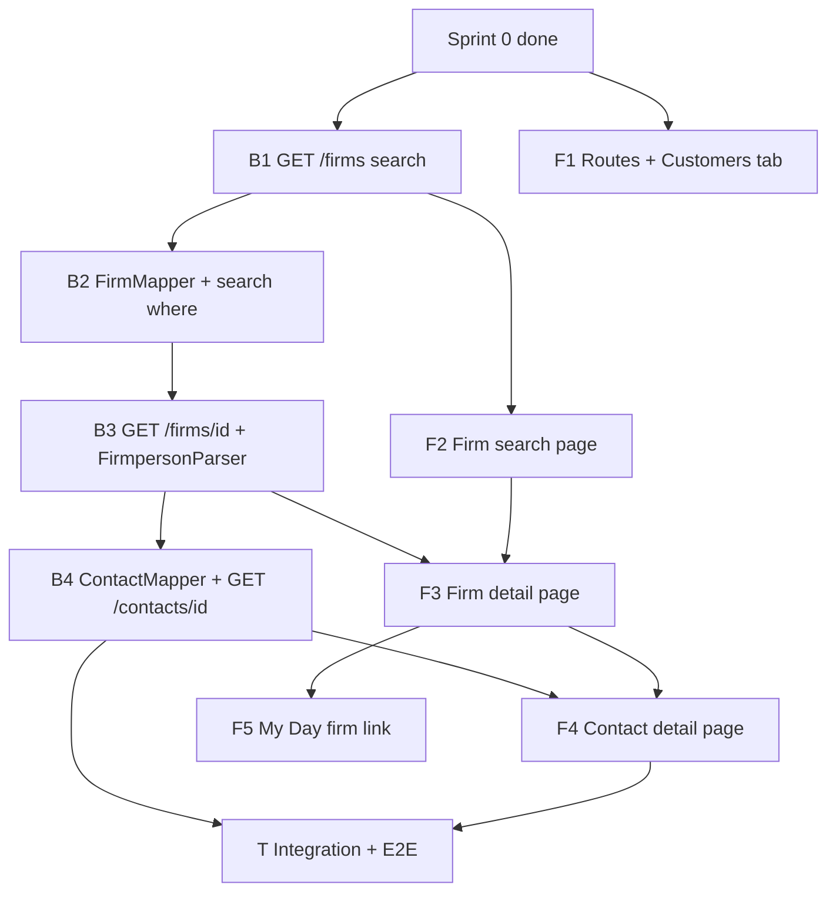

# Sprint 1 — Implementation Plan

**Sprint:** 1 (customer hub vertical slice)  
**Version:** 1.0.0  
**Date:** 2026-06-04  
**Status:** Draft

**Goal:** Deliver the **Firm** customer hub — **search → firm detail → contact detail** — on top of Sprint 0, using validated contact model rules.

**Prerequisite:** [Sprint 0](sprint-0-plan.md) accepted (Login → Session → My Day).

**Inputs:** [Solution Architecture v1.1](../architecture/solution-architecture-v1.md) · [Development Architecture v1](../architecture/development-architecture-v1.md) · [Mobile CRM API v1](../architecture/mobile-crm-api-v1.md) · [Contact model spike](../analysis/spikes/contact-model.md) · [Screen inventory v0.2](../analysis/screens/README.md) (SCR-003–005)

**Deliverables:** [`sprint-1-backlog.md`](sprint-1-backlog.md) · [`sprint-1-acceptance-criteria.md`](sprint-1-acceptance-criteria.md)

---

## 1. Sprint 1 scope

### 1.1 In scope

| Layer | Deliverable |
|-------|-------------|
| **User journey** | Customers tab → firm search → firm 360° → contact detail; firm link from My Day activity row |
| **API (adapter)** | `GET /firms`, `GET /firms/{firmId}`, `GET /contacts/{contactId}` per API v1 §7.3–7.4 |
| **Gen integration** | `firms`, `persons`, `addresses`; `firmpersons[]` parse on full firm GET; no `persons?where=Firm_ID` |
| **Web UI** | Routes `/app/firms`, `/app/firms/:firmId`, `/app/contacts/:contactId`; **Customers** tab enabled |
| **SCR** | SCR-003, SCR-004, SCR-005 full read paths |
| **Navigation** | N-02, N-05; My Day row → firm detail (N-04 prep for Sprint 2) |
| **Testing** | Adapter integration (firms + contacts); Playwright: search → detail → contact |

### 1.2 Explicitly out of scope

| Item | Target |
|------|--------|
| Activity detail (SCR-006) | Sprint 2 |
| Log visit / activity write (SCR-007) | Sprint 2 |
| `GET /firms/{firmId}/contacts` standalone picker API | Sprint 2 (reuse firm detail contacts in UI until then) |
| Contact create/edit | Phase 2 / Gen admin |
| Global contact search (all persons) | Not in MVP |
| Commercial health guaranteed populated | bestEffort — null OK |
| `recentActivities` on firm detail confirmed | bestEffort — empty array OK |
| Pipeline / quote / order sections (placeholders only on SCR-004) | Static “Phase 2” stub, no API |
| `GET /firms?mine=true` (OQ-SR-05) | Future |

### 1.3 Screens

| SCR | Name | Sprint 1 depth |
|-----|------|----------------|
| SCR-003 | Firm search | Full — debounced `q`, pagination, empty states |
| SCR-004 | Firm detail | Full — header, addresses, contacts list, commercial health + recent activities sections (bestEffort) |
| SCR-005 | Contact detail | Full — name, role, phone/email, firm link, tel:/mailto: |
| SCR-002 | My Day | Enhancement — tap **firm name** → SCR-004 |
| SCR-001, 010, 008, 009 | — | Regression only (Sprint 0) |

---

## 2. Spike constraints (contact model + API)

Adapter and UI **must** implement:

| ID | Rule | Source |
|----|------|--------|
| CM-01 | Contacts = Gen **`persons`**; list via **`firmpersons`** on **`GET firms/{id}`** | Contact §1, §3 |
| CM-02 | **Never** `persons?where=Firm_ID` (400 on DEMO) | Contact §3.4 |
| CM-03 | **Never** `select` with nested `FirmPersons(...)` on firms (400) | Contact §8 |
| CM-04 | Exclude **`Hidden`** firms/persons from lists | BR-CM-04 |
| CM-05 | Exclude **`IsEmployee`** persons from customer contact lists | BR-CM-03 |
| CM-06 | **Primary:** `InitialFirmPerson_ID` if not `0000000000`; else min **`PosIndex`** | BR-CM-05, adapter mapping |
| CM-07 | Phone/email: person `address_id` → else `firmperson.address_id` → firm residence/electronic for company line | Contact §5.2 |
| CM-08 | Map `OrgIdentNumber` → `businessRegistrationNumber`; lowercase embed vs PascalCase `select` | API v1 + contact §5.1 |
| CM-09 | Firm search `where` — **not spike-validated**; deployment-specific filter on name/code/registration | Adapter mapping §6.5 |

**Sprint 1 gaps (document + test on DEMO):**

| OQ | Approach |
|----|----------|
| OQ-CM-01 | MVP: full `GET firms/{id}`; log payload size; note follow-up for trim |
| OQ-CM-03 | Prefer **firmperson** embed for list card; **person** GET for SCR-005 detail |
| OQ-CM-06 | Rely on Gen RLS; adapter does not invent extra `where` unless product specifies |
| Firm search `where` | Implement configurable template; integration test on DEMO |

---

## 3. Logical implementation order

| Step | Work | Depends on |
|------|------|------------|
| 1 | `GET /firms` + search policy + `FirmSummary` mapper | Sprint 0 session auth |
| 2 | `GET /firms/{firmId}` + `FirmpersonParser` + `ContactSummary` + addresses | Step 1 patterns |
| 3 | `GET /contacts/{contactId}` + address resolution + `firmId` context | Step 2 |
| 4 | TS types for firm/contact DTOs; `api/firms.ts`, `api/contacts.ts` | Contract §6 |
| 5 | Enable Customers tab; SCR-003 with debounce + infinite scroll or paging | Step 1 API |
| 6 | SCR-004 sections + pull-to-refresh | Step 2 API |
| 7 | SCR-005 + query `?firmId=` for `isPrimary` | Step 3 API |
| 8 | My Day navigation to firm detail | Step 6 |
| 9 | Tests + acceptance demo | All |

**Parallel:** Backend steps 1–3 and frontend steps 4–5 after step 1 contract is stable.

---

## 4. Dependencies

| Dependency | Required by | Notes |
|------------|-------------|-------|
| Sprint 0 complete | All | Session, shell, error handling |
| DEMO firms with searchable names | SCR-003 | Document sample `q` values |
| DEMO firm with `firmpersons` (e.g. EUROCAR `3000000101`) | SCR-004/005 | Contact spike §8 |
| Hand-maintained or generated TS types for firm/contact | Frontend step 4 | Extend Sprint 0 types |
| Product copy SK/CZ for search hint | SCR-003 | i18n stub OK |
| Tax/registration field names on customer Gen | Mapper | May differ from DEMO |

---

## 5. Risks

| Risk | Impact | Mitigation |
|------|--------|------------|
| Full firm GET payload large (OQ-CM-01) | Slow SCR-004 on 4G | Monitor p95; cache in TanStack Query; customer-specific trim later |
| Search `where` wrong on production Gen | Empty or huge result sets | Configurable search template; TEST validation |
| Person address empty, firm address populated | Blank contact cards | Apply CM-07 fallback to residence/electronic on firm for **company** line only; label in UI |
| `commercialHealth` always null | Empty section | Hide section when null (API bestEffort) |
| `recentActivities` filter not validated | Empty section | Same; no false error state |
| Primary badge wrong when `InitialFirmPerson_ID` unset | UX confusion | Use PosIndex rule; document OQ-CM-02 |

---

## 6. Definition of done

- [ ] [sprint-1-backlog.md](sprint-1-backlog.md) tasks done or deferred with ticket
- [ ] [sprint-1-acceptance-criteria.md](sprint-1-acceptance-criteria.md) passed on DEMO/TEST
- [ ] Sprint 0 regression (login, My Day) still passes
- [ ] No `persons?where=Firm_ID` in adapter logs
- [ ] Navigation rules N-02, N-05 verified manually

---

## 7. Estimation

| Area | Backlog IDs | Relative effort |
|------|-------------|-----------------|
| Backend firms search | B-25–B-32 | M |
| Backend firm detail + contacts | B-33–B-45 | L |
| Backend contact detail | B-46–B-52 | M |
| Frontend customer hub | F-27–F-42 | L |
| Testing | T-14–T-24 | M |

One sprint for 2 devs assuming Sprint 0 baseline stable.

---

## 8. Document history

| Version | Date | Change |
|---------|------|--------|
| 1.0.0 | 2026-06-04 | Initial Sprint 1 — Firm search, detail, contacts |
