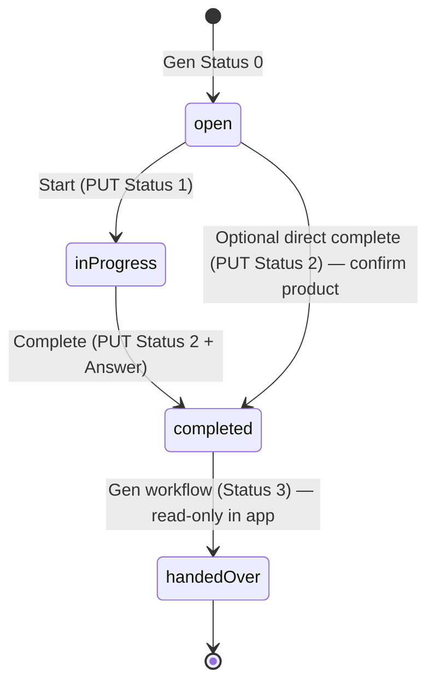

# Sprint 2B — Activity completion (technical design)

**Status:** Planning — no UI implementation in this sprint step  
**Scope:** Gen `crmactivities` inspection + adapter contract for **Open → In Progress → Completed**  
**Sources:** [`analysis/spikes/crmactivities-lifecycle.md`](../analysis/spikes/crmactivities-lifecycle.md), [`analysis/spikes/crmactivities-lifecycle-results.json`](../analysis/spikes/crmactivities-lifecycle-results.json), [`architecture/reference/spike/openapi/crmactivities.json`](../architecture/reference/spike/openapi/crmactivities.json), [`architecture/mobile-crm-api-v1-adapter-mapping.md`](../architecture/mobile-crm-api-v1-adapter-mapping.md)

---

## 1. How activity status is stored

| Layer | Field | Type | Notes |
|-------|--------|------|--------|
| Gen BO `crmactivity` | **`Status`** | **integer enumeration** | Primary lifecycle flag for Mobile CRM MVP |
| Gen BO `crmactivity` | `PMState_ID` | FK → `pmstate` | Separate **process/workflow** state; not the same as `Status` |
| Mobile CRM adapter | `status` | string token | Mapped from Gen integer in `ActivityMapper.MapStatus` |
| Mobile CRM API | `ActivityStatus` | `open` \| `inProgress` \| `completed` \| `handedOver` | Public contract |

Gen stores status as a **persistent integer** on the activity header. It is **writable** (`readOnly: false` in OpenAPI). UI labels come from Gen captions (SK); the adapter normalizes to string tokens for the SPA.

**Independent field:** `PMState_ID` (e.g. `CADEF00000` on DEMO) can change via workflow endpoints without replacing the `Status`-based MVP model. Sprint 2B standardizes on **`Status` only** for start/complete (per adapter mapping ADR).

---

## 2. Status values (Gen ↔ Mobile CRM)

| Gen `Status` | OpenAPI caption (SK) | Mobile CRM `status` | Editable in MVP (`canEdit` / `canComplete`) |
|-------------:|----------------------|---------------------|---------------------------------------------|
| **0** | Neriešené | `open` | Yes |
| **1** | V procese | `inProgress` | Yes |
| **2** | Dokončené | `completed` | No |
| **3** | Odovzdané | `handedOver` | No (treat as terminal / history) |

Adapter mapping (already implemented):

```csharp
// ActivityMapper.MapStatus
0 => "open"
1 => "inProgress"
2 => "completed"
3 => "handedOver"
```

**Product note:** DEMO list samples included rows with `Status` 2 and 3 before the spike. After a “complete” PUT (`Status: 2`), a follow-up GET on the same row returned **`Status: 3`** and cleared `Description` / `Answer` in the response — Gen may apply **post-complete workflow** (hand-over) on that installation. Mobile CRM should **display** `handedOver` as terminal and must not offer edit/complete when `status` is `completed` or `handedOver`.

---

## 3. HTTP methods and workflow endpoints

### 3.1 Supported on `crmactivities` (OpenAPI + DEMO)

| Operation | Supported? | Endpoint | Notes |
|-----------|:------------:|----------|--------|
| **GET** list/detail | Yes | `GET /crmactivities`, `GET /crmactivities/{id}` | Safe `select` list required (no invalid fields) |
| **POST** create | Yes | `POST /crmactivities?validation=true` | Validate-then-commit; see lifecycle spike |
| **PUT** update header | Yes | **`PUT /crmactivities/{id}?validation=true`** | **Primary path for start + complete** |
| **PATCH** | **No** | — | **Not defined** in `crmactivities` OpenAPI |
| **DELETE** | Yes | `DELETE /crmactivities/{id}` | Out of MVP |

### 3.2 Workflow / action endpoints (optional, not MVP v1)

| Endpoint | Method | Purpose |
|----------|--------|---------|
| `/crmactivities/{id}/pmchangestate` | PUT | Change `PMState_ID` (process workflow) |
| `/crmactivities/{id}/pmchangestatebytransition` | PUT | Transition-driven PM state change |

**Sprint 2B decision:** Use **`PUT` + `Status`** only. Do **not** call `pmchangestate` for mobile complete (aligned with [`mobile-crm-api-v1-adapter-mapping.md`](../architecture/mobile-crm-api-v1-adapter-mapping.md) §6.11).

---

## 4. Outcome / result / completion note fields

There is **no** Gen field named `result` or `outcome` on `crmactivity` in the validated schema.

| Business meaning | Gen field | SK label | Read | Write | Mobile CRM API |
|------------------|-----------|----------|:----:|:-----:|----------------|
| Plan / visit notes | **`Description`** | Popis | ✓ | ✓ | `description` |
| **Completion / visit outcome** | **`Answer`** | Odpoveď | ✓ | ✓ | `answer` |
| Contact-related note | `ContactNote` | (contact note) | ✓ | ✓ | Not in MVP contract |
| Audit timestamps | `RealEnd$DATE`, `RealStart$DATE` | Skutočný čas … | ✓ | ✓ (often server-driven) | Optional `lastModifiedAt` later |

**Sprint 2B complete payload:** require user **outcome text** in adapter `PUT` body as **`Answer`**; optionally mirror or append in **`Description`**. Normative Mobile API already requires `answer` when `mode=complete` ([`mobile-crm-api-v1.md`](../architecture/mobile-crm-api-v1.md) §7.5 `PUT /activities/{activityId}`).

---

## 5. Real DEMO request/response example (complete)

From live spike on `http://localhost/demo`, activity id `2000000101` (document number **`PrHo-1/2006`** in full PUT response). Step `complete_status` in [`crmactivities-lifecycle-results.json`](../analysis/spikes/crmactivities-lifecycle-results.json).

### Request

```http
PUT /demo/crmactivities/2000000101?validation=true HTTP/1.1
Authorization: Basic …
Content-Type: application/json
```

```json
{
  "ID": "2000000101",
  "Status": 2,
  "Description": "Completed by Mobile CRM lifecycle spike",
  "Answer": "Visit outcome recorded in spike",
  "Firm_ID": "AAA1000000"
}
```

### Response (HTTP 200, excerpt)

Gen returns **lowercase** keys in JSON body; `status` reflects the submitted completion.

```json
{
  "id": "2000000101",
  "displayname": "PrHo-1/2006",
  "subject": "otázka na pozáručný servis",
  "status": 2,
  "description": "Completed by Mobile CRM lifecycle spike",
  "answer": "Visit outcome recorded in spike",
  "firm_id": "AAA1000000",
  "pmstate_id": "CADEF00000",
  "realend$date": "2025-10-16T08:54:00.000Z",
  "objversion": 205,
  "@meta": {
    "version": 1,
    "validation": {
      "errors": { "count": 1, "values": [ "… x_typ_kotla custom field …" ] },
      "warnings": { "count": 0, "values": [] }
    }
  }
}
```

**Observations for adapter design:**

1. **`Firm_ID` on PUT** — include when the activity has a linked firm (spike pattern); Gen DEMO accepts status-only PUT without `Firm_ID` (validated 2026-06-05).
2. **`?validation=true`** returns `@meta.validation.errors` — DEMO may still return **200** with `errors.count > 0` (custom `X_*` fields). Adapter must treat **non-zero error count as failure** (`422` / `VALIDATION_FAILED`) even on HTTP 200.
3. Follow-up **`GET`** on the same id after complete showed `Status: 3` and empty `Answer`/`Description` on DEMO — plan UI to **refetch after success** and accept terminal `handedOver` as success path.

---

## 6. Target flow: Open → In Progress → Completed

### 6.1 State machine (Mobile CRM)



| User action | From | To | Gen `Status` |
|-------------|------|-----|-------------:|
| **Start work** | `open` | `inProgress` | **1** |
| **Complete visit** | `open` or `inProgress` | `completed` | **2** |
| (Gen auto) | `completed` | `handedOver` | **3** — display only |

**Preconditions (adapter, same as current `ActivityService`):**

- Activity exists and is visible to rep (`ResponsibleUser_ID` / `SolverUser_ID` / `CreatedBy_ID`).
- Current Gen `Status` is **0 or 1** for start/complete.
- On complete: non-empty **`Answer`** (and `Firm_ID` on body).

### 6.2 Gen API sequence (adapter implementation)

All writes: **`PUT /crmactivities/{id}?validation=true`** with **PascalCase** body keys (`ID`, `Firm_ID`, `Status`, …). Use session Basic/Bearer credentials from Mobile CRM login.

**Step 0 — Load context (already in Sprint 2A)**

```http
GET /demo/crmactivities/{id}?select=ID,DisplayName,Code,Subject,Status,Firm_ID,Description,Answer,ObjVersion,…
```

Resolve `firm_id` for every subsequent PUT.

---

#### Transition A — Open → In Progress (“Start work”)

**Not executed in the 2026-06-04 spike**; design follows the same validated **PUT** pattern as update/complete (`Status` is writable integer enum).

**1) Validate (recommended)**

```http
PUT /demo/crmactivities/{id}?validation=true
```

```json
{
  "ID": "{id}",
  "Status": 1,
  "Firm_ID": "{firmId}"
}
```

**2) Commit**

- If Gen returns **200/201** and `@meta.validation.errors.count === 0` → success, map response `status` → `inProgress`.
- If `errors.count > 0` → surface field messages; do not update Mobile session cache.
- **Follow-up spike (P0):** confirm a row in `Status: 0` on target Gen accepts `Status: 1` without extra mandatory fields.

Optional: set `RealStart$DATE` to now if product requires “clock in” (field is writable; spike set it on create).

---

#### Transition B — In Progress → Completed (“Complete visit”)

**Validated on DEMO** (see §5).

**1) Validate**

```http
PUT /demo/crmactivities/{id}?validation=true
```

```json
{
  "ID": "{id}",
  "Status": 2,
  "Answer": "{user outcome — required}",
  "Description": "{optional supplementary note}",
  "Firm_ID": "{firmId}"
}
```

**2) Commit**

- Same success rule: HTTP success **and** `validation.errors.count === 0`.
- Map `status` **2** → `completed`.
- Optionally set `ResolvedBy_ID` = `currentuser.id` if Gen does not default it (spike row had `resolvedby_id` populated).

**3) Refetch**

```http
GET /demo/crmactivities/{id}?select=ID,Status,Description,Answer,RealEnd$DATE,…
```

If Gen moved row to **`Status: 3`**, map to `handedOver` and show outcome from user input in UI until refetch proves otherwise.

---

#### Transition C — Open → Completed (shortcut)

If product allows completing without an explicit “start” step, use **the same PUT as §Transition B** from `Status: 0`. Confirm on Gen that `0 → 2` is allowed (not spike-tested).

---

### 6.3 Mobile CRM adapter surface (no Gen in browser)

Implements existing normative contract — **no new public fields** for Sprint 2B planning:

| Mobile endpoint | `mode` | Gen call |
|-----------------|--------|----------|
| `PUT /api/v1/activities/{activityId}` | `update` | `PUT crmactivities/{id}?validation=true` — optional fields, **do not lower** `Status` |
| `PUT /api/v1/activities/{activityId}` | `complete` | `PUT` with **`Status: 2`**, **`Answer`**, **`Firm_ID`** |
| *(new action)* `PUT …` `mode: start` **or** dedicated `POST …/start` | `start` | `PUT` with **`Status: 1`**, **`Firm_ID`** |

**Recommendation:** extend `ActivitySaveRequest.mode` with **`start`** (minimal contract change) rather than a Gen-specific route in the SPA.

**Suggested C# service sketch:**

```text
StartAsync(id, firmId, repUserId)
  → PUT body { ID, Status=1, Firm_ID }
  → assert validation.errors.count == 0
  → return ActivityDetailResponseDto

CompleteAsync(id, firmId, answer, description?, repUserId)
  → PUT body { ID, Status=2, Answer, Description?, Firm_ID }
  → assert validation.errors.count == 0
  → return ActivityDetailResponseDto
```

**Concurrency:** include `ObjVersion` on PUT when a follow-up spike confirms it is required (OQ-LC-05); otherwise omit for MVP.

**Idempotency:** repeating complete on `Status: 2/3` should return **409** / not editable from adapter.

---

## 7. Validation and error handling

| Condition | Gen behaviour | Adapter → client |
|-----------|---------------|------------------|
| Unknown field in `select` | HTTP **400** | `503` / `SERVICE_UNAVAILABLE` or mapped error |
| Business rule failure | HTTP **200** + `@meta.validation.errors` | **`422` `VALIDATION_FAILED`** with details |
| Missing `Firm_ID` on PUT | Likely validation error | Field detail on `firmId` |
| Custom `X_*` required on DEMO | Validation error on unrelated fields | Strip `X_*` from mobile payloads; fail with clear message if Gen still errors |
| Activity not owned / not found | **404** | `404` `NOT_FOUND` |
| `Status` 2/3 and user completes | — | **409** not editable |

---

## 8. Out of scope / follow-up spikes

| ID | Item |
|----|------|
| P0 | Live DEMO proof: **`Status: 0 → 1`** PUT |
| P0 | Confirm **commit** semantics: one PUT vs validate then second PUT when `errors.count === 0` |
| P1 | **`ObjVersion`** on PUT |
| P1 | Whether **`RealEnd$DATE`** must be sent on complete |
| P2 | When to expose **`pmchangestate`** for customers using PM workflow only |

---

## 9. UI (deferred)

Do **not** implement buttons/screens in this task. When implementing SCR-006/007:

- **Activity detail:** “Start work” when `canEdit && status === open`; “Complete” when `canComplete && status in (open, inProgress)`.
- **Complete form:** single required **outcome** field → API `answer`.
- After success: invalidate `my-day`, firm `recentActivities`, and activity detail queries.

---

## 10. Document history

| Version | Date | Change |
|---------|------|--------|
| 0.1 | 2026-06-04 | Sprint 2B planning — Gen inspection + Open/In Progress/Completed design |
