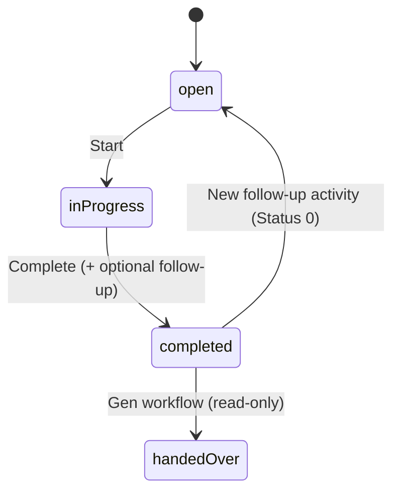

# Sprint 3A — Follow-up activity on completion (technical design)

**Status:** Proposal  
**Scope:** Optional follow-up `crmactivities` create chained after activity complete  
**Sources:** [`analysis/spikes/crmactivities-lifecycle.md`](../analysis/spikes/crmactivities-lifecycle.md), [`implementation/sprint-2b-activity-completion-design.md`](sprint-2b-activity-completion-design.md), [`architecture/mobile-crm-api-v1-adapter-mapping.md`](../architecture/mobile-crm-api-v1-adapter-mapping.md), current adapter (`ActivityService`, `ActivitiesController`, `ActivityDetailPage`)

---

## 1. Business goal

Field reps often need to schedule the **next action** immediately after finishing a call or visit. Today the app supports **Open → In Progress → Completed** only. Sprint 3A adds an **optional follow-up create** in the same completion moment, without blocking completion when follow-up creation fails.

---

## 2. Target workflow



| Step | User action | Adapter / Gen |
|------|-------------|---------------|
| 1 | Enter outcome (+ optional follow-up fields) | — |
| 2 | Submit complete | `PUT` complete current activity (**must succeed first**) |
| 3a | Follow-up not requested | Return completed activity detail |
| 3b | Follow-up requested | `POST` create new `crmactivity` with inherited context |
| 4 | Follow-up fails | Completed activity **unchanged**; return warning to client |

---

## 3. Gen API analysis — `crmactivities` create

### 3.1 Endpoint

| Operation | Endpoint | Notes |
|-----------|----------|--------|
| Validate | `POST /crmactivities?validation=true` | Preview + `@meta.validation.errors`; may return temp `id` |
| Commit | `POST /crmactivities` | Persist when validation clean (mirror Sprint 2B PUT validate-then-commit) |

**Not implemented in adapter today:** `IGenApiClient` has `GetAsync` / `PutAsync` only — Sprint 3A requires **`PostAsync`**.

### 3.2 Required / recommended fields (DEMO evidence)

OpenAPI has **no `required` array** on `crmactivity`. Mandatory rules come from Gen business validation.

| Field | MVP follow-up | Source |
|-------|---------------|--------|
| `Subject` | **Required** (user input) | Form |
| `Firm_ID` | **Required** for customer activities | Inherited from completed activity |
| `ActivityType_ID` | **Required on DEMO** | Inherited from completed activity (fallback: config default, e.g. `Tel` / `2000000101`) |
| `SheduledStart$DATE` | **Required for My Day** | User due date/time |
| `Description` | Optional | User input |
| `Person_ID` | Optional | Inherited contact when present |
| `ResponsibleUser_ID` | Recommended | Inherited owner (see §3.4) |
| `SolverUser_ID` | Optional | Same as owner when `ResponsibleUser_ID` empty on legacy rows |

**Do not send:** `X_*`, `U_SV_*`, `ResponsibleCustomerPerson_ID`, `ID`, `DisplayName`, `Status` (defaults to **0 / open**).

### 3.3 Number series / document number

| Gen field | Read | Write | Mobile CRM handling |
|-----------|:----:|:-----:|---------------------|
| `DisplayName` | ✓ | **RO** | Assigned by Gen (e.g. `NP-1/2026`, `PrHo-1/2006`) |
| `OrdNumber` | ✓ | **RO** | Gen-internal sequence |
| `ID` | ✓ | **RO** | Assigned on persist |

**Mobile CRM never sets document number or ID on create.** After successful `POST`, read `id` + `displayname` from response (or `GET` by id) and map to `documentNumber` via existing `ActivityMapper.ResolveDocumentNumber`.

### 3.4 Ownership assignment

Completed activity context (already loaded in `CompleteAsync`):

| Gen field | Used for |
|-----------|----------|
| `ResponsibleUser_ID` | Primary **owner** candidate |
| `SolverUser_ID` | Fallback when responsible is null (common on DEMO legacy rows) |
| `CreatedBy_ID` | Audit only — not used as follow-up owner |
| Session `repUserId` | Fallback when both above are empty; must match ownership preflight |

**Follow-up create payload:**

```
ResponsibleUser_ID = ResolveOwner(completedActivity, sessionRepUserId)
SolverUser_ID      = same value when DEMO expects solver populated
CreatedBy_ID       = not set (Gen sets from credentials)
```

`ResolveOwner` precedence: `ResponsibleUser_ID` → `SolverUser_ID` → `session.RepUserId`.

Ownership preflight on complete already ensures the rep owns the activity via one of these fields.

### 3.5 Validate-then-commit create pattern

From lifecycle spike + Sprint 2B PUT fix:

1. `POST ?validation=true` with minimal PascalCase body.
2. If `errors.count > 0`, merge Gen-returned defaults from response (`actqueue_id`, `period_id`, `activityarea_id`, `division_id`, `solverrole_id`, `firmoffice_id`, …) into body.
3. Retry validate until `errors.count === 0` or cap retries (e.g. 2).
4. `POST` **without** `?validation=true` to commit.
5. Treat **HTTP 201** or **200 + `errors.count === 0` + GET by id succeeds** as persisted (OQ-LC-01).

DEMO risk: first POST with errors returned preview id but **GET → 404** (not persisted). Adapter must not report success until GET confirms.

### 3.6 Reuse of current activity context

| Mobile CRM (detail) | Gen create field | Rule |
|-------------------|------------------|------|
| `firm.id` | `Firm_ID` | Required; block follow-up if missing |
| `contact.id` | `Person_ID` | Omit when null / placeholder `0000000000` |
| `activityTypeId` | `ActivityType_ID` | Inherit; fallback `GenOptions.DefaultActivityTypeId` |
| `ownerId` | `ResponsibleUser_ID` | `ResolveOwner` (§3.4) |
| — | `Status` | Omit (Gen default **0**) |
| User `subject` | `Subject` | Required |
| User `scheduledStart` | `SheduledStart$DATE` | ISO 8601 instant |
| User `description` | `Description` | Optional |

Optional later: link provenance (`Source_ID` = completed activity id) if product wants traceability — **not in MVP** until spike confirms field behaviour.

---

## 4. API changes (Mobile CRM v1)

### 4.1 Extend complete request

**`PUT /api/v1/activities/{activityId}/complete`** — extend body; **no new route**.

```json
{
  "answer": "Nový výsledok návštevy",
  "description": null,
  "followUp": {
    "enabled": true,
    "subject": "Telefonát – overenie ponuky",
    "scheduledStart": "2026-06-12T09:00:00+02:00",
    "description": "Zavolať po odoslaní cenovej ponuky"
  }
}
```

| Field | Required | Notes |
|-------|----------|-------|
| `answer` | Yes | Unchanged (Sprint 2B append logic) |
| `description` | No | Unchanged |
| `followUp` | No | Absent or `enabled: false` → complete only |
| `followUp.subject` | When enabled | Non-empty trim |
| `followUp.scheduledStart` | When enabled | ISO 8601; must be valid instant |
| `followUp.description` | No | Optional plan note on **new** activity |

### 4.2 Extend complete response

**Success — complete only (unchanged shape + optional nulls):**

```json
{
  "id": "H000000101",
  "status": "completed",
  "answer": "…",
  "followUpActivity": null,
  "warnings": []
}
```

**Success — complete + follow-up created:**

```json
{
  "id": "H000000101",
  "status": "completed",
  "followUpActivity": {
    "id": "J100000101",
    "documentNumber": "NP-14/2026",
    "subject": "Telefonát – overenie ponuky",
    "status": "open",
    "scheduledStart": "2026-06-12T07:00:00Z",
    "firm": { "id": "3000000101", "name": "…" }
  },
  "warnings": []
}
```

**Partial success — complete OK, follow-up failed (requirement §6):**

- **HTTP 200** (activity **is** completed — do not roll back)
- `followUpActivity: null`
- `warnings: [{ "code": "FOLLOW_UP_CREATE_FAILED", "message": "…" }]`

Do **not** use 4xx/5xx for follow-up-only failure after successful complete.

### 4.3 DTO additions (`ApiModels.cs`)

```csharp
public sealed class FollowUpActivityRequestDto
{
    public bool Enabled { get; init; }
    public string? Subject { get; init; }
    public string? ScheduledStart { get; init; }
    public string? Description { get; init; }
}

// Extend CompleteActivityRequestDto
public FollowUpActivityRequestDto? FollowUp { get; init; }

// Extend ActivityDetailResponseDto (or wrapper CompleteActivityResponseDto)
public ActivitySummaryDto? FollowUpActivity { get; init; }
public IReadOnlyList<ApiWarningDto>? Warnings { get; init; }
```

### 4.4 Adapter service changes

| Component | Change |
|-----------|--------|
| `IGenApiClient` | Add `PostAsync` |
| `ActivityCreateService` (new) | `CreateFollowUpAsync(credentials, FollowUpContext, FollowUpInput)` |
| `IActivityService.CompleteAsync` | After successful complete + refetch, optionally call create |
| `ActivityOperationResult<T>` | Add optional `Warnings`, `FollowUpActivity` sidecar **or** wrap in `CompleteActivityResult` |
| `GenOptions` | `DefaultActivityTypeId`, optional `MaxCreateValidationRounds` |
| `ActivitiesController` | Validate `followUp` fields when `enabled`; map partial success |

**Orchestration (pseudocode):**

```
CompleteAsync(..., followUp?, authorDisplayName?)
  1. existing complete preflight + PutStatusAsync(Status=2) + append answer
  2. refetch completed detail
  3. if followUp?.Enabled != true → return Ok(detail)
  4. try CreateFollowUpAsync(context from completed detail + followUp input)
     catch → return Ok(detail, warnings: [FOLLOW_UP_CREATE_FAILED])
  5. return Ok(detail, followUpActivity: summary)
```

**Ordering is strict:** steps 1–2 always run before step 4. No Gen transaction spans both — accept eventual consistency.

### 4.5 Validation (adapter)

| Rule | HTTP |
|------|------|
| `followUp.enabled` + empty `subject` | 422 `VALIDATION_FAILED` field `followUp.subject` |
| `followUp.enabled` + missing/invalid `scheduledStart` | 422 field `followUp.scheduledStart` |
| Complete preflight fails | 409 / 422 as today |
| Completed activity has no `Firm_ID` + follow-up enabled | 422 `followUp.firmId` — cannot create customer activity |

---

## 5. UI proposal (SCR-006 extension)

### 5.1 Placement

Extend the existing **complete form** on `ActivityDetailPage` (when `canComplete`), below **Nový výsledok**.

### 5.2 Layout (Slovak labels)

```
┌─────────────────────────────────────────┐
│ Predchádzajúce poznámky (read-only)      │
├─────────────────────────────────────────┤
│ Nový výsledok *                         │
│ [textarea]                              │
├─────────────────────────────────────────┤
│ ☐ Naplánovať ďalšiu aktivitu            │
│                                         │
│  (expanded when checked)                │
│  Zákazník: ACME s.r.o. (read-only)      │
│  Kontakt:  Ján Novák (read-only / —)    │
│  Typ:      Telefón (read-only, inherited)│
│                                         │
│  Predmet *                              │
│  [input]                                │
│  Termín *                               │
│  [datetime-local]                       │
│  Popis (voliteľný)                      │
│  [textarea]                             │
├─────────────────────────────────────────┤
│ [ Dokončiť aktivitu ]                   │
└─────────────────────────────────────────┘
```

### 5.3 Interaction

| Behaviour | Detail |
|-----------|--------|
| Checkbox default | **Off** — preserves current complete-only flow |
| Inherited fields | Read-only chips; not editable in 3A (per requirements) |
| Submit | Single **Dokončiť aktivitu** button; one API call |
| Loading | Disable form; show *Dokončujem…* |
| Success + follow-up | Toast: *Aktivita dokončená. Naplánovaná ďalšia aktivita NP-14/2026.* Optional link to new activity detail |
| Success, follow-up failed | Toast warning: *Aktivita dokončená, ale ďalšiu aktivitu sa nepodarilo vytvoriť.* Show `warnings[0].message` inline |
| Validation 422 | Field errors on `followUp.*` or `answer` |

### 5.4 i18n keys (proposed)

| Key | SK |
|-----|-----|
| `activity.followUp.enable` | Naplánovať ďalšiu aktivitu |
| `activity.followUp.subject` | Predmet |
| `activity.followUp.scheduledStart` | Termín |
| `activity.followUp.description` | Popis |
| `activity.followUp.inheritedCustomer` | Zákazník |
| `activity.followUp.inheritedContact` | Kontakt |
| `activity.followUp.inheritedType` | Typ aktivity |
| `activity.followUp.createFailed` | Aktivita bola dokončená, ale ďalšiu aktivitu sa nepodarilo vytvoriť. |
| `activity.followUp.createSuccess` | Ďalšia aktivita bola vytvorená. |

### 5.5 Client API (`activities.ts`)

Unchanged endpoint; extend `CompleteActivityRequest` type with optional `followUp`. Handle `warnings` and `followUpActivity` in mutation `onSuccess`.

---

## 6. Risks and edge cases

| ID | Risk | Impact | Mitigation |
|----|------|--------|------------|
| R1 | Gen create validation fails on DEMO (`ActQueue_ID`, `Period_ID`, `Division_ID`, `X_Typ_kotla`) | Follow-up not created | Validate-then-merge-commit; cap retries; surface Gen message in warning |
| R2 | `POST ?validation=true` preview id not persisted | False success | Confirm with GET after commit; require 201 or persisted id |
| R3 | Source activity missing `Firm_ID` | Cannot create customer visit | Block follow-up in UI when no firm; 422 from adapter |
| R4 | Legacy row: `ResponsibleUser_ID` null | Wrong owner on follow-up | `ResolveOwner` fallback chain (§3.4) |
| R5 | Gen auto **handedOver** (`Status 3`) after complete | UI shows terminal state while user reads toast | Accept; follow-up is separate new row |
| R6 | User retries after partial failure | Duplicate follow-up activities | Phase 2: idempotency key; 3A: show clear message, link to My Day |
| R7 | Timezone / `SheduledStart$DATE` | Wrong My Day bucket | Serialize user local → ISO; adapter uses `GenOptions.TimeZoneId` for defaults |
| R8 | `Person_ID` invalid / contact deleted | Create validation error | Omit `Person_ID` on create failure once, retry without contact |
| R9 | Complete succeeds, create slow | User navigates away | Invalidate `myDay` + `firmDetail` queries on any 200 |
| R10 | No `PostAsync` / create service yet | Blocker | Sprint 3A foundation story |
| R11 | Activity type missing on source | Create fails | Config default type + spike per customer |
| R12 | Double submit | Duplicate follow-up | Disable button while pending (existing pattern) |

### 6.1 Out of scope (Sprint 3A)

- Editing inherited firm/contact/type on follow-up form (SCR-007 full create)
- Offline queue for follow-up
- Linking follow-up to source activity in Gen (`Source_ID` / custom field)
- `POST /activities` standalone route (defer to SCR-007)
- PM state / workflow-driven create

---

## 7. Implementation plan (suggested stories)

| # | Story | Estimate |
|---|-------|----------|
| 1 | Spike: persist `POST crmactivities` on DEMO with merge-defaults loop | 0.5–1 d |
| 2 | `PostAsync` + `ActivityCreateService` + unit tests for payload mapping | 1 d |
| 3 | Extend `CompleteAsync` orchestration + partial-success warnings | 1 d |
| 4 | API DTOs + controller validation | 0.5 d |
| 5 | UI complete form extension + i18n + toasts | 1 d |
| 6 | E2E manual test script (complete + follow-up + partial failure) | 0.5 d |

**P0 spike (done):** [`analysis/spikes/follow-up-activity-create.md`](../analysis/spikes/follow-up-activity-create.md) — create succeeds when **reference fields** (`ActQueue_ID`, `Period_ID`, `Division_ID`, `SolverRole_ID`, `ActivityArea_ID`) are inherited from the completed source activity; commit uses `POST` without `?validation=true`.

---

## 8. Open questions

| ID | Question | Priority |
|----|----------|----------|
| OQ-3A-01 | Default `ActivityType_ID` when source has none — config per deployment? | P0 |
| OQ-3A-02 | Set `SolverUser_ID` same as `ResponsibleUser_ID` on all creates? | P0 |
| OQ-3A-03 | Should `SheduledEnd$DATE` default to start + 30 min? | P1 |
| OQ-3A-04 | Navigate to new activity detail on success vs stay on completed detail? | P1 |
| OQ-3A-05 | Idempotency key for retry-safe follow-up create? | P2 |

---

## 9. Verdict

**Feasible for MVP** on `crmactivities`, reusing Sprint 2B complete flow and lifecycle spike create pattern. Main engineering work is **Gen POST create with validate-then-commit** (not yet in adapter) and **partial-success API contract**. UI is a contained extension of the existing complete form.

**Dependency:** Sprint 2B complete (PUT validate + commit, answer append) must remain stable — 3A chains after it.
