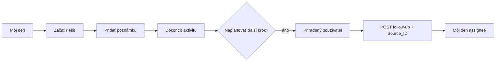

# Sprint 3B.2 — Activity workflow review

**Status:** Review complete  
**Date:** 2026-06-09  
**Scope:** Task 4 — end-to-end workflow stabilization assessment after Sprint 3B.1. **No new features.**

**Context confirmed working (3B.1 E2E):** JANO ↔ JAROJ assignment, My Day for assignee, notes, prepended history, complete + follow-up.

---

## 1. Workflow under review

| Step | Endpoint / action | Status |
|------|-------------------|--------|
| My Day list | `GET /my-day` | ✓ Stable |
| Open detail | `GET /activities/{id}` | ✓ |
| Start | `PUT .../start` | ✓ |
| Add note | `PUT .../note` | ✓ Prepend history |
| Complete | `PUT .../complete` | ✓ |
| Follow-up create | `ActivityCreateService` + `Source_ID` | ✓ Handover status on source |
| User assign | `followUp.assignedUserId` | ✓ Fixed 3B.1 |
| Assignee My Day | Ownership + date bucket | ✓ If scheduled **today/overdue** |

---

## 2. Regression matrix

| Area | Expected | Verified | Notes |
|------|----------|:--------:|-------|
| Start → inProgress | `canComplete` true | ✓ | |
| Note append order | Newest first | ✓ | `AppendAnswer` prepend + unit tests |
| Complete → completed | Terminal UI | ✓ | |
| Follow-up checkbox on | Child created | ✓ | |
| Assign JAROJ | Gen `SolverUser_ID` = JAROJ | ✓ | 3B.1 fix |
| Assignee My Day | JAROJ sees activity | ✓ | When date bucket matches |
| Assigner My Day | May see via `CreatedBy_ID` | ⚠️ | Gen platform rule — see 3B.0 |
| History not duplicated | Single `Answer` field | ✓ | |
| No duplicate outcome fields | One complete textarea | ✓ | Separate note form |

---

## 3. UX / correctness issues (fix before Sprint 4.0)

### 3.1 Critical

| ID | Issue | Doc | Recommended fix |
|----|-------|-----|-----------------|
| **F1** | Follow-up default **tomorrow 10:00** → invisible in My Day until that day | [followup-default-date](sprint-3b-2-followup-default-date-analysis.md) | Default to **today** (rounded time) + hint text |
| **F2** | `datetime-local` shows **US format** on some devices | [datetime-localization](sprint-3b-2-datetime-localization.md) | Split date/time + SK preview |

### 3.2 High

| ID | Issue | Recommended fix |
|----|-------|-----------------|
| **F3** | **Naplánovať ďalší krok** checked by default — unintended follow-ups | Default **unchecked** or confirm step |
| **F4** | No user feedback that follow-up is scheduled **for future date** | Success banner: show `followUpActivity.scheduledStart` formatted |
| **F5** | Future activities have **no My Day home** | Short-term: F1 + F4; medium: **Plánované** section ([myday-visibility](sprint-3b-2-myday-visibility-analysis.md)) |

### 3.3 Medium

| ID | Issue | Recommended fix |
|----|-------|-----------------|
| **F6** | `[AssignDebug]` logs still in production code | Remove after stabilization |
| **F7** | Assigner sees assigned follow-up via `CreatedBy_ID` | Document in UI or accept for MVP |
| **F8** | User picker shows login in parentheses — good; ensure JANO/JAROJ distinguishable | ✓ Already `displayName (loginName)` |
| **F9** | `followUpStart` not reset after complete on same page | Low impact (terminal state); reset if form reused |

### 3.4 Low / accepted

| ID | Issue | Decision |
|----|-------|----------|
| **F10** | Role-only assignment invisible in My Day | Deferred — 3B.0 Option B |
| **F11** | Browser TZ vs server TZ for defaults | Document; use `Europe/Bratislava` in TS if needed |

---

## 4. Hidden defaults audit

| Default | Value | User visible? | Risk |
|---------|-------|:-------------:|------|
| Schedule follow-up | **Checked** | Checkbox visible | **High** — opt-out not opt-in |
| Follow-up subject | Current subject | Visible | Low |
| Follow-up termín | Tomorrow 10:00 | Visible but **easy to miss** | **High** |
| Assigned user | Session rep | Visible select | Low — correct for self-assign |
| Note author | Server-resolved display name | In stored note only | Low |

**No hidden backend defaults** for assignment after 3B.1 (`assignedUserId` required when follow-up enabled).

---

## 5. Text fields audit (no duplication)

| Screen state | Fields | Purpose |
|--------------|--------|---------|
| inProgress | Nový výsledok (textarea) | Complete outcome |
| inProgress | Note form (textarea) | Add note without complete |
| inProgress | Follow-up Predmet, Termín, Popis, User | Schedule next |
| terminal | Read-only Answer | History (newest first) |
| terminal | Description | Separate Gen field |

✓ No duplicate outcome entry paths on same action.

---

## 6. Localization consistency

| Surface | Format | OK? |
|---------|--------|:---:|
| My Day times | `HH:mm` / `DD.MM.YYYY` | ✓ |
| Activity schedule | `DD.MM.YYYY HH:mm` | ✓ |
| Follow-up picker | Native locale | ✗ → F2 |

---

## 7. Recommended fix backlog (pre–Sprint 4.0)

**Sprint 3B.3 (stabilization implementation)** — suggested order:

| # | Fix | Effort | Blocks 4.0? |
|---|-----|--------|:-----------:|
| 1 | Follow-up default date → today + hint | S | **Yes** |
| 2 | Slovak date/time input (split + preview) | M | **Yes** |
| 3 | Success banner with follow-up date + link | S | Recommended |
| 4 | Follow-up checkbox default → unchecked | S | Recommended |
| 5 | Remove `[AssignDebug]` logging | S | Yes (cleanup) |
| 6 | My Day **Plánované** section | M | No — can follow in 4.x |
| 7 | Upcoming API bucket | S | Depends on #6 |

**Do not start Sprint 4.0 until:** F1, F2, F5 (mitigation via F1/F3/F4 at minimum).

---

## 8. Explicitly out of scope (Sprint 4.x)

Per product direction — **not** part of 3B.2 stabilization:

- Business Case / Work Order / Project dimensions UI
- Activity Area / Type / Series pickers
- Native ABRA handover UI beyond `Source_ID` follow-up
- Role-pool My Day expansion

---

## 9. Test scenarios for 3B.3 QA

1. JANO completes → assigns JAROJ → today termín → JAROJ **Dnes** → start → complete.
2. JANO completes → assigns self → tomorrow → **not** in today My Day; success shows date.
3. Note A, note B → detail shows B above A.
4. Complete with follow-up **unchecked** → no child activity.
5. Windows en-US → picker preview shows `DD.MM.YYYY HH:mm`.

---

## 10. References

| Document | Topic |
|----------|-------|
| [sprint-3b-2-followup-default-date-analysis.md](sprint-3b-2-followup-default-date-analysis.md) | Task 1 |
| [sprint-3b-2-datetime-localization.md](sprint-3b-2-datetime-localization.md) | Task 2 |
| [sprint-3b-2-myday-visibility-analysis.md](sprint-3b-2-myday-visibility-analysis.md) | Task 3 |
| [sprint-3b-1-user-assignment.md](sprint-3b-1-user-assignment.md) | Assignment |
| [sprint-3b-0-activity-assignment-analysis.md](sprint-3b-0-activity-assignment-analysis.md) | Ownership rules |
