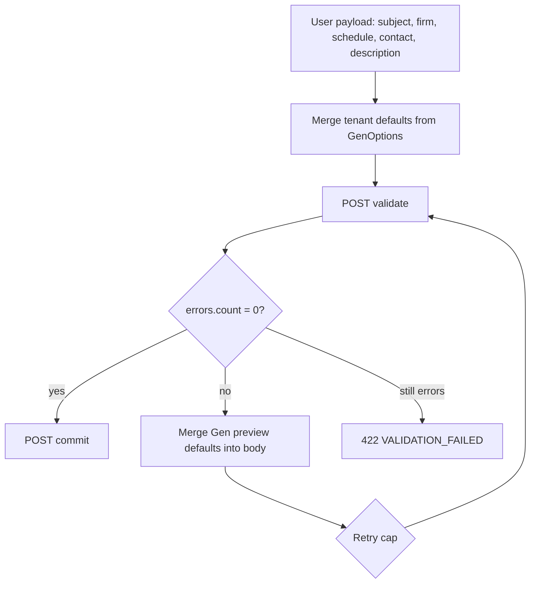
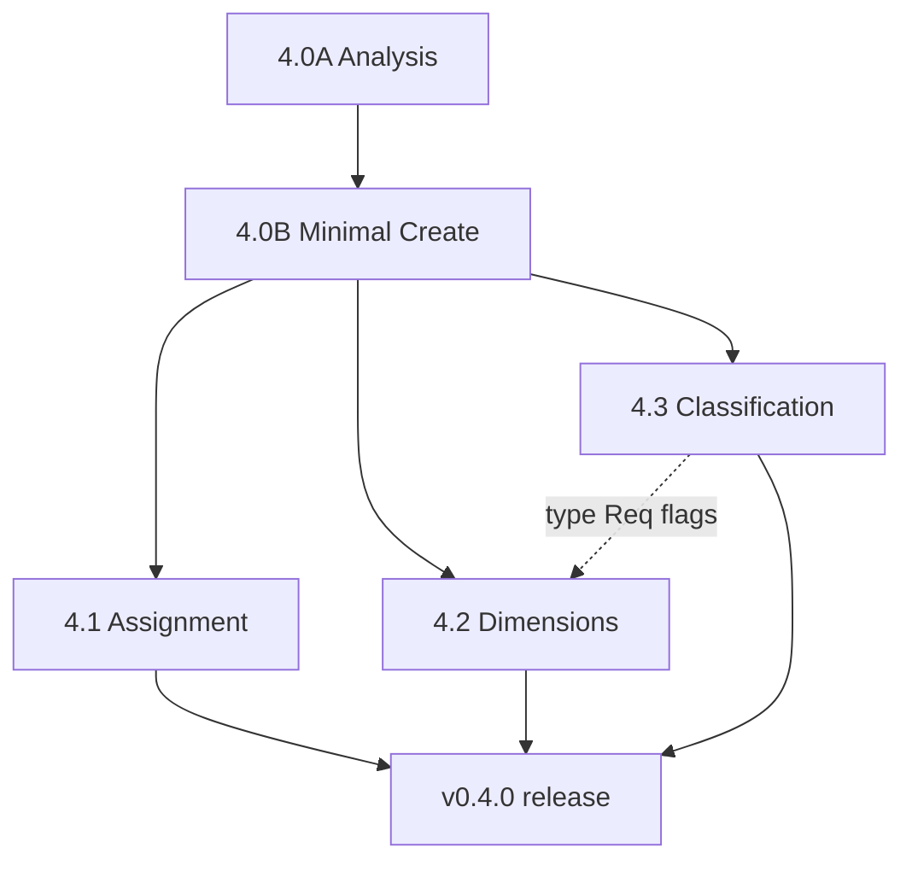

# Sprint 4.0A — Activity creation analysis

**Status:** Analysis complete  
**Date:** 2026-06-09  
**Release baseline:** v0.3.0 (Sprint 3)  
**Goal:** Understand ABRA Gen activity creation requirements and produce an implementation design for **Sprint 4.0B** (minimal Create Activity UI).

**No code changes in this sprint.**

**Sources:** OpenAPI index (`architecture/reference/spike/openapi/`), live DEMO Gen 26, adapter code (`ActivityCreateService`, `FirmService`, `UserLookupService`), spikes ([crmactivities-lifecycle](../analysis/spikes/crmactivities-lifecycle.md), [follow-up create](../analysis/spikes/follow-up-activity-create.md), [contact model](../analysis/spikes/contact-model.md)), prior analyses ([3A.1](sprint-3a-1-activity-create.md), [3A.2 dimensions](sprint-3a-2-activity-dimensions-analysis.md), [3B.0 assignment](sprint-3b-0-activity-assignment-analysis.md)).

**Environment:** `http://localhost/demo`, credentials `api` / `123`

---

## 1. Executive summary

| Topic | Finding |
|-------|---------|
| **Gen primitive** | `POST /crmactivities` with validate-then-commit (`?validation=true` then bare POST) |
| **User-visible MVP fields** | Subject, planned start, firm, contact (optional), description |
| **Hidden but required on DEMO** | `ActQueue_ID`, `Period_ID`, `Division_ID`, `SolverRole_ID`, `ActivityArea_ID` — Gen validation fails without them |
| **Follow-up vs new activity** | Follow-up inherits refs from source; **standalone create needs a reference-resolution strategy** (config defaults + validate merge) |
| **Current adapter gap** | `POST /api/v1/activities` requires `sourceActivityId` — not suitable for standalone create without extension |
| **Firm lookup** | Already implemented (`GET /api/v1/firms?q=`) |
| **Contact lookup** | Contacts via `GET /api/v1/firms/{id}` (embedded list); no firm-scoped contacts search endpoint yet |
| **Assignment default** | Session rep on both `SolverUser_ID` and `ResponsibleUser_ID` (proven in 3B.1) |
| **Dimensions / classification** | Additive optional FK fields — **can ship incrementally in 4.2 / 4.3 without redesign** |
| **Recommended 4.0B** | New `StandaloneActivityCreateService` + extended DTO + minimal create screen |

---

## 2. Task 1 — Activity creation requirements

### 2.1 Field matrix

OpenAPI `crmactivity` has **no `required` array**. Mandatory rules come from Gen `@meta.validation.errors` on `POST ?validation=true`.

| Field | Required? | Category | Source | Default / notes |
|-------|:---------:|----------|--------|-----------------|
| `Subject` | **Yes** | Business + Gen | User input | — |
| `Firm_ID` | **Yes** | Business + Gen | Firm picker | — |
| `ActivityType_ID` | **Yes** (DEMO) | Technical + business | Config default (4.0B) or picker (4.3) | e.g. `2000000101` (Telefón) on DEMO |
| `SheduledStart$DATE` | **Yes** | Business (My Day) | User input | Default: today + 1 h (reuse 3B.3) |
| `Person_ID` | No | Business | Contact picker | Omit when unset; reject `0000000000` |
| `Description` | No | Business | User input | Optional `Popis` |
| `ResponsibleUser_ID` | Recommended | Business (My Day) | Session rep | `currentuser.id` |
| `SolverUser_ID` | Recommended | Business (My Day) | Session rep | Same as responsible in MVP |
| `SolverRole_ID` | **Yes** (DEMO) | Technical | Reference resolution | From queue/type defaults |
| `ActQueue_ID` | **Yes** (DEMO) | Technical | Reference resolution | Activity series / queue |
| `Period_ID` | **Yes** (DEMO) | Technical | Reference resolution | Accounting period |
| `Division_ID` | **Yes** (DEMO) | Technical | Reference resolution | Cost centre |
| `ActivityArea_ID` | **Yes** (DEMO) | Technical | Reference resolution | Often derived from type |
| `Source_ID` | No | Business | — | Only for handover / follow-up |
| `BusTransaction_ID` / `BusOrder_ID` / `BusProject_ID` | No* | Business | Dimension pickers (4.2) | *Required when activity type `*Req = 1` |
| `ID` | — | Auto | Gen | Never send |
| `DisplayName` | — | Auto | Gen | Document number series; never send |
| `Status` | — | Auto | Gen | `0` (Otvorená) on create |
| `CreatedBy_ID` | — | Auto | Gen | API user |
| `CreatedAt$DATE` | — | Auto | Gen | Commit timestamp |
| `PMState_ID` | — | Auto | Gen | Default workflow state |

\* Dimension requirement enforced per `crmactivitytype.BusTransactionReq` / `BusOrderReq` / `BusProjectReq` (0=optional, 1=required, 2=hidden).

### 2.2 Validation behaviour (DEMO evidence)

**Scenario A — user fields only** ([follow-up spike](../analysis/spikes/follow-up-activity-create.md)):

```json
{
  "Subject": "Test",
  "Firm_ID": "3000000101",
  "ActivityType_ID": "2000000101",
  "SheduledStart$DATE": "2026-06-08T10:00:00.000Z"
}
```

→ **4 validation errors:** `actqueue_id`, `period_id`, `solverrole_id`, `division_id`

**Scenario B — with reference fields** (from source or resolved defaults):

```json
{
  "Subject": "Test",
  "Firm_ID": "3000000101",
  "ActivityType_ID": "2000000101",
  "SheduledStart$DATE": "2026-06-08T10:00:00.000Z",
  "ActQueue_ID": "2000000101",
  "Period_ID": "4000000101",
  "Division_ID": "2000000101",
  "SolverRole_ID": "1000000101",
  "ActivityArea_ID": "2000000101"
}
```

→ **`errors.count = 0`**, commit **201**, activity persisted.

**Implementation rule:** Always validate-then-commit. Treat preview id with non-zero errors as **not persisted** (GET → 404 on DEMO).

### 2.3 Standalone create — reference resolution strategy (4.0B design)

Follow-up create copies refs from source GET. **New activity has no source.** Recommended approach:



| Layer | Responsibility |
|-------|----------------|
| **`GenOptions`** | `DefaultActivityTypeId`, `DefaultActQueueId`, `DefaultPeriodId`, `DefaultDivisionId`, `DefaultSolverRoleId`, `DefaultActivityAreaId` (tenant-specific, read from `appsettings.json`) |
| **`ReferenceDefaultsService`** (new) | Build initial POST body; run validate; merge lowercase keys from preview (`actqueue_id` → `ActQueue_ID`, etc.); retry up to 2 rounds |
| **`ActivityCreateService`** (extend) | Branch: `sourceActivityId` set → inherit (current); null → standalone path |

**4.0B MVP:** Single configured activity type + queue set per tenant. **4.3** exposes type/area/queue pickers and passes explicit IDs into the same pipeline.

### 2.4 API example — target Sprint 4.0B contract

```http
POST /api/v1/activities
Authorization: Bearer {token}
Content-Type: application/json
```

```json
{
  "subject": "Návšteva zákazníka",
  "scheduledStart": "2026-06-09T09:00:00+02:00",
  "firmId": "3000000101",
  "contactId": "6000000101",
  "description": "Prvý kontakt po obnovení zmluvy"
}
```

| Field | Required | Notes |
|-------|:--------:|-------|
| `subject` | ✓ | |
| `scheduledStart` | ✓ | ISO-8601 |
| `firmId` | ✓ | |
| `contactId` | ○ | Must belong to firm |
| `description` | ○ | |
| `sourceActivityId` | ○ | Absent for standalone; present for clone/follow-up API path |

**Response:** `ActivityDetailResponse` (same as GET detail) — `status: open`, `documentNumber` from Gen, `canStart: true`.

---

## 3. Task 2 — Firm and contact lookup

### 3.1 Firms

**Gen API:**

```http
GET firms?select=ID,Name,Code,OrgIdentNumber,Hidden&where=(Name like '*EURO*' or Code like '*EURO*')&take=20&skip=0
```

**Mobile CRM API (implemented):**

```http
GET /api/v1/firms?q=EURO&take=20&skip=0
```

| Aspect | Detail |
|--------|--------|
| **Fields returned** | `id`, `name`, `code`, `orgIdentNumber`, `commercialStatus` |
| **Search** | Min **2 characters**; OData `like '*{term}*'` on Name, Code, OrgIdentNumber |
| **Paging** | `take` (1–50), `skip`; `hasMore` when extra row fetched |
| **Filtering** | Hidden firms excluded (`FirmSearchExcludeHidden`) |
| **Performance** | Single Gen list call; suitable for typeahead with debounce |

**Display in create form:** `{name}` primary, `{code}` secondary (matches firm search elsewhere).

### 3.2 Contacts

**Gen model:** `persons` + `firmperson` junction on `GET firms/{id}` — not `persons?where=Firm_ID`.

**Mobile CRM today:**

| Endpoint | Use |
|----------|-----|
| `GET /api/v1/firms/{firmId}` | Returns `contacts[]` with `id`, `displayName`, `fullName`, `isPrimary`, phones/email |
| `GET /api/v1/contacts/{contactId}?firmId=` | Contact detail card |

**Gap for create form:** No lightweight `GET /api/v1/firms/{firmId}/contacts` (optional 4.0B — can reuse firm detail `contacts` slice).

| Question | Answer |
|----------|--------|
| Filter by firm? | **Yes** — only contacts from selected firm's `FirmPersons[]` |
| Search? | Client-side filter on loaded list (typical firm has &lt; 20 contacts) |
| Paging? | Not needed for MVP; firm detail loads all visible links |
| Primary default? | Pre-select `isPrimary` contact when firm chosen |

**Gen POST field:** `Person_ID` (10-char id). Omit when no contact selected.

---

## 4. Task 3 — Assignment model

### 4.1 Gen fields at create time

| Field | Label (SK) | My Day visibility | Create recommendation |
|-------|------------|:-----------------:|----------------------|
| `SolverUser_ID` | Riešiteľ | **Yes** | Set explicitly |
| `ResponsibleUser_ID` | Zodpovedná osoba | **Yes** | Set explicitly |
| `SolverRole_ID` | Rola riešiteľa | **No** | Required ref on DEMO; from defaults |
| `ResponsibleRole_ID` | Zodpovedná rola | **No** | Omit in MVP |
| `CreatedBy_ID` | Vytvoril | **Yes** | Gen sets to API user |

**My Day filter** ([3B.0](sprint-3b-0-activity-assignment-analysis.md)):

```
ResponsibleUser_ID = rep OR SolverUser_ID = rep OR CreatedBy_ID = rep
```

`SolverRole_ID` alone does **not** make activity visible to role members in Mobile CRM.

### 4.2 Recommended Mobile CRM behaviour

| Sprint | Behaviour |
|--------|-----------|
| **4.0B** | Default **assign to self** — `SolverUser_ID` = `ResponsibleUser_ID` = session `repUserId` |
| **4.1** | Optional user picker (reuse follow-up assignee UX); optional `SolverRole_ID` picker |
| **4.1** | Role-only assignment allowed for Gen parity but **document** that only creator sees it in My Day until a user is named |

**Do not** leave both user fields empty on standalone create — explicit self-assignment avoids reliance on `CreatedBy_ID` alone.

**Lookup APIs (4.1):**

```http
GET /api/v1/users?q=&take=30          # existing — securityusers
GET securityroles?select=ID,Name&take=50   # new adapter endpoint
GET securityroles/{id}/securityusers     # role members (optional)
```

---

## 5. Task 4 — Activity classification

Roadmap label **Activity Series** maps to Gen **`ActQueue_ID`** (`crmactivityqueues` — rad aktivít). Related: `ActivityProcess_ID` (process step) — out of 4.0B scope.

### 5.1 Lookup APIs

| Mobile concept | Gen BO | List endpoint | Key fields |
|----------------|--------|---------------|------------|
| Activity Type | `crmactivitytype` | `GET crmactivitytypes` | `ID`, `Code`, `Name` |
| Activity Area | `crmactivityarea` | `GET crmactivityareas` | `ID`, `Code`, `Name` |
| Activity Series | `crmactivityqueue` | `GET crmactivityqueues` | `ID`, `Code`, `Name` |

**Example:**

```http
GET crmactivitytypes?select=ID,Code,Name&take=50
```

```json
[{ "ID": "2000000101", "Code": "Tel", "Name": "Telefón" }]
```

### 5.2 Dependencies and validation

| Relationship | Behaviour |
|--------------|-----------|
| Type → Area | Gen validate preview often sets `activityarea_id` from type |
| Queue → Period, Division, SolverRole | Queue configuration drives accounting refs on DEMO |
| Type `*Req` flags | Control dimension required/optional/hidden (4.2) |
| Process | `ActivityProcess_ID` — desktop chain; not needed for CRM MVP create |

### 5.3 Mobile CRM presentation

| Sprint | UI |
|--------|-----|
| **4.0B** | **Hidden** — tenant defaults in `GenOptions` |
| **4.3** | Configurable pickers when `activityClassification.*` = true |

| Picker | Label (SK) | Required when |
|--------|------------|---------------|
| Activity Type | Typ aktivity | Config on or always (recommend always if classification enabled) |
| Activity Area | Oblasť aktivity | Config on; may auto-fill from type |
| Activity Series | Rad aktivít | Config on; drives hidden refs |

**Proposed adapter endpoints (4.3):**

```http
GET /api/v1/lookups/activity-types
GET /api/v1/lookups/activity-areas
GET /api/v1/lookups/activity-queues
```

Cached per session; `take=100` sufficient for DEMO.

---

## 6. Task 5 — Business dimensions

Confirmed in [3A.2 analysis](sprint-3a-2-activity-dimensions-analysis.md).

| Dimension | Gen field | Lookup |
|-----------|-----------|--------|
| Business Case | `BusTransaction_ID` | `GET bustransactions?select=ID,DisplayName,Code,Name,Firm_ID` |
| Work Order | `BusOrder_ID` | `GET busorders?...` |
| Project | `BusProject_ID` | `GET busprojects?...` |

| Question | Answer |
|----------|--------|
| Search / filter | `where=Firm_ID eq '{firmId}'` on production; empty on DEMO seed |
| Validation | Invalid ID → Gen error; omit when not selected |
| Incremental delivery? | **YES** — optional FK on POST; feature flags hide UI; no change to 4.0B core DTO |

**4.0B payload:** No dimension fields. **4.2:** Add optional `businessCaseId`, `workOrderId`, `projectId` to create DTO.

---

## 7. Task 6 — Configuration model (design only)

### 7.1 Backend location

```json
// appsettings.json (or tenant-specific override)
{
  "Gen": {
    "BaseUrl": "http://localhost/demo",
    "DefaultActivityTypeId": "2000000101",
    "DefaultActQueueId": "2000000101",
    "DefaultPeriodId": "4000000101",
    "DefaultDivisionId": "2000000101",
    "DefaultSolverRoleId": "1000000101",
    "DefaultActivityAreaId": "2000000101"
  },
  "ActivityFeatures": {
    "activityDimensions": {
      "businessCase": false,
      "workOrder": false,
      "project": false
    },
    "activityClassification": {
      "activityArea": false,
      "activityType": false,
      "activitySeries": false
    }
  }
}
```

| Class | Purpose |
|-------|---------|
| `GenOptions` | Extend with reference defaults (existing section) |
| `ActivityFeatureOptions` | New bound section `ActivityFeatures` |

### 7.2 Session capabilities exposure

Extend `GET /api/v1/session` response:

```json
{
  "representative": { "...": "..." },
  "sessionToken": "...",
  "capabilities": [
    "activities.read",
    "activities.write",
    "activities.create",
    "firms.read"
  ],
  "activityFeatures": {
    "dimensions": {
      "businessCase": false,
      "workOrder": false,
      "project": false
    },
    "classification": {
      "activityArea": false,
      "activityType": false,
      "activitySeries": false
    }
  },
  "defaults": {
    "activityTypeId": "2000000101",
    "activityTypeName": "Telefón"
  }
}
```

`defaults` helps UI show read-only type label in 4.0B when classification is disabled.

### 7.3 Frontend visibility logic

```typescript
// Pseudocode — no implementation in 4.0A
const { activityFeatures, defaults } = session;

showBusinessCasePicker = activityFeatures.dimensions.businessCase;
showTypePicker = activityFeatures.classification.activityType;
showTypeLabel = !showTypePicker && defaults.activityTypeName;
```

**Precedence:** Gen activity type `*Req === 2` (hidden) **overrides** config `true` — adapter omits field and logs conflict.

### 7.4 Adapter enforcement matrix

| Config | Gen `*Req` | POST body | UI |
|--------|------------|-----------|-----|
| `false` | any | Omit | Hidden |
| `true` | 0 | Send if user selected | Optional picker |
| `true` | 1 | Must send valid ID | Required picker |
| `true` | 2 | Omit | Hidden (Gen rule wins) |

---

## 8. Task 7 — Sprint 4 implementation roadmap

### 8.1 Sprint 4.0B — Minimal Create Activity

**Goal:** Standalone create screen; user fields only; hidden refs from config + validate merge.

| Work item | Effort | Depends on |
|-----------|--------|------------|
| Extend `CreateActivityRequestDto` — `firmId`, optional `contactId`, optional `sourceActivityId` | S | — |
| `ReferenceDefaultsService` + `GenOptions` defaults | M | Spike validate on DEMO |
| Extend `ActivityCreateService` standalone branch | M | ReferenceDefaultsService |
| Firm picker (reuse search) + contact dropdown from firm detail | M | Existing firm API |
| Schedule picker (reuse 3B.3 date/time + preview) | S | — |
| Create Activity route + form + success → detail / My Day | M | API |
| Session `activityFeatures` + `defaults` (read config) | S | — |
| E2E: create → My Day → start → note → complete | M | All above |

**Estimate:** **2–3 weeks** (1 developer)

**Out of scope:** Dimensions, classification pickers, role assignment UI.

### 8.2 Sprint 4.1 — Assignment

| Work item | Effort |
|-----------|--------|
| `GET /api/v1/roles` lookup | S |
| Assignee picker on create (default self) | S |
| Optional `SolverRole_ID` on create payload | M |
| Document My Day visibility rules in UI hint | S |
| Align follow-up assign path with create assign path | S |

**Estimate:** **1 week**  
**Depends on:** 4.0B create API

### 8.3 Sprint 4.2 — Business dimensions

| Work item | Effort |
|-----------|--------|
| `ActivityFeatureOptions` dimensions flags | S |
| Firm-scoped dimension list endpoints (×3 or generic) | M |
| Optional pickers on create form | M |
| Enforce `*Req` from activity type | M |
| Extend create DTO + Gen payload | S |

**Estimate:** **1.5–2 weeks**  
**Depends on:** 4.0B; benefits from 4.3 type picker for `*Req` resolution

### 8.4 Sprint 4.3 — Activity classification

| Work item | Effort |
|-----------|--------|
| Classification feature flags | S |
| Lookup endpoints (types, areas, queues) | M |
| Pickers on create form | M |
| Queue selection updates Period/Division/SolverRole via validate merge | M |
| Remove hard-coded `GenOptions` defaults where user overrides | S |

**Estimate:** **1.5–2 weeks**  
**Depends on:** 4.0B reference-resolution pipeline

### 8.5 Dependency graph



**Target:** v0.4.0 after 4.3 (or v0.4.1 if 4.2/4.3 ship incrementally).

---

## 9. Proposed UX — Sprint 4.0B

### 9.1 Entry points

| Entry | Route |
|-------|-------|
| My Day toolbar | **+ Nová aktivita** |
| Firm detail | **Vytvoriť aktivitu** (firm pre-filled) |

### 9.2 Form fields

| Field | Control | Required |
|-------|---------|:--------:|
| Predmet | Text | ✓ |
| Termín | Date + time + Slovak preview | ✓ |
| Firma | Search picker (min 2 chars) | ✓ |
| Kontakt | Select from firm contacts | ○ |
| Popis | Textarea | ○ |

**Hidden from user (4.0B):** type, area, queue, assignment (self), dimensions.

### 9.3 Success flow

```
Submit → POST /activities → 200 + detail
  → Toast: „Aktivita {documentNumber} vytvorená“
  → Navigate to activity detail (canStart)
  → Activity appears in My Day when scheduled today/overdue
```

### 9.4 Error handling

| Error | UX |
|-------|-----|
| `VALIDATION_FAILED` | Field-level messages from `details[]` |
| Gen ref resolution failed | Generic + log `[CreateActivity]` with validation errors |
| Firm not found | Inline on firm field |

---

## 10. Implementation recommendations for 4.0B

1. **Split create paths** in `ActivityCreateService`: `CreateFromSourceAsync` (current) vs `CreateStandaloneAsync` (new).
2. **Add `ReferenceDefaultsService`** — do not duplicate validate-merge in controller.
3. **Make `sourceActivityId` optional** on `CreateActivityRequestDto`; validate XOR: either `firmId` (standalone) or `sourceActivityId` (inherit).
4. **Reuse** `UserLookupService`, firm search, schedule defaults, `AppendAnswer` pipeline for post-create workflow.
5. **Add integration test** against DEMO: standalone POST → GET confirms firm, type, schedule, owner.
6. **Do not** send `Status`, `DisplayName`, `X_*` custom fields.
7. **Contact validation:** when `contactId` set, verify person appears in firm's contact list (prevent cross-firm mismatch).

---

## 11. Open questions

| ID | Question | Impact |
|----|----------|--------|
| OQ-4A-01 | Production: are tenant default queue/period IDs stable across upgrades? | Config migration |
| OQ-4A-02 | Should 4.0B expose activity type as read-only label from config? | UX |
| OQ-4A-03 | Create from firm detail — lock firm field? | UX |
| OQ-4A-04 | Does validate merge always populate missing refs on production, making config optional? | Simplify deployment |
| OQ-4A-05 | `FirmOffice_ID` — required on some installs? | Add to merge map if validation demands |

---

## 12. References

| Document | Relevance |
|----------|-----------|
| [roadmap.md](roadmap.md) | Sprint 4 structure |
| [sprint-3a-1-activity-create.md](sprint-3a-1-activity-create.md) | Existing create infrastructure |
| [sprint-3a-followup-spike.md](sprint-3a-followup-spike.md) | Mandatory fields, validate merge |
| [sprint-3a-2-activity-dimensions-analysis.md](sprint-3a-2-activity-dimensions-analysis.md) | Dimensions + config |
| [sprint-3b-0-activity-assignment-analysis.md](sprint-3b-0-activity-assignment-analysis.md) | Assignment + My Day |
| [crmactivities-lifecycle.md](../analysis/spikes/crmactivities-lifecycle.md) | Field inventory |
| [mobile-crm-api-v1-adapter-mapping.md](../architecture/mobile-crm-api-v1-adapter-mapping.md) | API mapping conventions |

---

*Sprint 4.0A complete. Proceed to Sprint 4.0B implementation when approved.*
