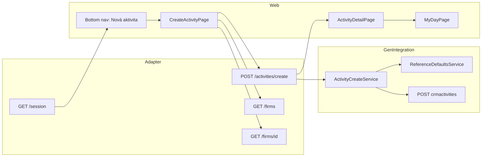

# Sprint 4.0B — Minimal Create Activity

**Status:** Implemented  
**Date:** 2026-06-09  
**Baseline:** Sprint 4.0A analysis, Sprint 3 (v0.3.0)  
**Goal:** First standalone “Create Activity” workflow in Mobile CRM — subject, firm, contact, planned date/time, description; assigned to session user.

---

## 1. Architecture

### 1.1 Overview



### 1.2 Create scenarios in `ActivityCreateService`

| Scenario | Entry | Source activity | Reference fields | Assignment |
|----------|-------|-----------------|------------------|------------|
| **A — Follow-up** | `POST /api/v1/activities` | Required (`sourceActivityId`) | Inherited from source GET | `assignedUserId` or session rep |
| **B — Standalone** | `POST /api/v1/activities/create` | None | `ReferenceDefaultsService` + validate merge | Session rep (`SolverUser_ID`, `ResponsibleUser_ID`) |

Follow-up path is unchanged (including `[FollowUpContext]` logging and source text inheritance).

### 1.3 `ReferenceDefaultsService`

Resolves tenant-configured Gen FK defaults from `Gen:ReferenceDefaults` in `appsettings.json`:

| Config key | Gen field | DEMO value |
|------------|-----------|------------|
| `ActQueueId` | `ActQueue_ID` | `2000000101` |
| `PeriodId` | `Period_ID` | `4000000101` |
| `DivisionId` | `Division_ID` | `2000000101` |
| `SolverRoleId` | `SolverRole_ID` | `1000000101` |
| `ActivityAreaId` | `ActivityArea_ID` | `2000000101` |
| `ActivityTypeId` | `ActivityType_ID` | `2000000101` |

Standalone create flow:

1. Build payload with user fields + configured defaults.
2. `POST crmactivities?validation=true` (up to 3 rounds).
3. On validation errors, merge lowercase keys from validate response into body (same pattern as follow-up spike).
4. `POST crmactivities` commit.
5. Load detail via `IActivityService.GetDetailAsync`.

### 1.4 Session capabilities

`GET /api/v1/session` and `POST /api/v1/session` now include:

```json
{
  "activityFeatures": {
    "createActivity": true
  }
}
```

Controlled by `ActivityFeatures:CreateActivity` in configuration. Frontend shows **Nová aktivita** in bottom navigation when `createActivity` is true.

### 1.5 Deferred (Sprints 4.1–4.3)

Not implemented: solver role picker, user assignment picker, business case / work order / project, activity area / type / series pickers.

---

## 2. API contract

### 2.1 Create standalone activity

```http
POST /api/v1/activities/create
Authorization: Bearer {sessionToken}
Content-Type: application/json
```

**Request body:**

```json
{
  "subject": "Call customer",
  "scheduledStart": "2026-06-15T09:00:00Z",
  "firmId": "1000000101",
  "contactPersonId": "2000000101",
  "description": "Prepare offer"
}
```

| Field | Required | Notes |
|-------|:--------:|-------|
| `subject` | Yes | Trimmed |
| `scheduledStart` | Yes | ISO-8601 → Gen `SheduledStart$DATE` |
| `firmId` | Yes | Must exist in Gen |
| `contactPersonId` | No | Must belong to selected firm when provided |
| `description` | No | Maps to Gen `Description` |

**Success:** `200 OK` — `ActivityDetailResponse` (same shape as `GET /activities/{id}`).

**Validation errors:** `422 Unprocessable Entity`

```json
{
  "error": {
    "code": "VALIDATION_FAILED",
    "message": "Request validation failed.",
    "details": [
      { "field": "subject", "message": "Subject is required." }
    ],
    "traceId": "..."
  }
}
```

**Gen / config failures:** `422` with `VALIDATION_FAILED` or `Gen rejected the activity create.` when reference defaults are missing or Gen rejects the payload.

### 2.2 Follow-up create (unchanged)

```http
POST /api/v1/activities
```

Still requires `sourceActivityId`. Used by complete-with-follow-up and future handover flows.

### 2.3 Session (extended)

```json
{
  "representative": { "id": "...", "displayName": "..." },
  "sessionToken": "...",
  "activityFeatures": { "createActivity": true }
}
```

---

## 3. Frontend

### 3.1 Route and navigation

| Item | Path / location |
|------|-----------------|
| Create page | `/app/activities/new` |
| Nav label | **Nová aktivita** (third bottom-nav item when feature enabled) |
| Save button | **Vytvoriť aktivitu** |

### 3.2 Form fields

| Field | Control | Required |
|-------|---------|:--------:|
| Predmet | Text input | Yes |
| Zákazník | Firm search (`GET /firms?q=`, min 2 chars) | Yes |
| Kontaktná osoba | Select from `GET /firms/{id}` contacts | No (shown after firm selected) |
| Termín | Split `date` + `time` (Sprint 3B.3 UX) | Yes |
| Popis | Textarea | No |

Default schedule: **now + 1 hour** (`defaultFollowUpSchedule()`).

### 3.3 Success flow

1. `POST /activities/create`
2. Invalidate My Day query cache
3. Navigate to activity detail with `activityCreated: true`
4. Green success banner: **Aktivita bola vytvorená**

### 3.4 Screenshots

Capture locally after `npm run dev` (web) and adapter restart:

| Screen | What to show |
|--------|----------------|
| **Nav** | Bottom bar with Môj deň / Zákazníci / **Nová aktivita** |
| **Create form** | Subject, firm search, date/time preview, Vytvoriť aktivitu |
| **Detail after create** | Document number, status Otvorená, success banner |
| **My Day** | New activity in Dnes when scheduled today |

> Automated verification used `scripts/verify_standalone_create.py` against DEMO Gen; UI screenshots are manual follow-up on the same environment.

---

## 4. Configuration

`src/MobileCrm.Adapter/appsettings.json`:

```json
{
  "Gen": {
    "ReferenceDefaults": {
      "ActQueueId": "2000000101",
      "PeriodId": "4000000101",
      "DivisionId": "2000000101",
      "SolverRoleId": "1000000101",
      "ActivityAreaId": "2000000101",
      "ActivityTypeId": "2000000101"
    }
  },
  "ActivityFeatures": {
    "CreateActivity": true
  }
}
```

Per-tenant overrides belong in deployment-specific settings, not in code.

---

## 5. Verification results (DEMO Gen)

**Script:** `scripts/verify_standalone_create.py`  
**Adapter:** `http://localhost:5082` (build output `.adapter-4b-verify-out`, run from that directory so `appsettings.json` loads)  
**Results file:** `analysis/spikes/sprint-4-0b-standalone-create-results.json`

| Step | Result |
|------|--------|
| Login | PASS |
| `session.activityFeatures.createActivity` | PASS (`true`) |
| Firm search | PASS |
| `POST /activities/create` | PASS |
| Created detail: status open, document number, owner = session rep | PASS |
| Visible in My Day (today) | PASS |

**Sample created activity:**

- ID: `6110000101`
- Document number: `PrHo-23/2006`
- Status: `open`
- Owner: `2610000101` (session representative)

### Build / tests

| Check | Result |
|-------|--------|
| `dotnet build` (Gen + Adapter to `.adapter-4b-verify-out`) | OK |
| `npm run build` (Web) | OK |
| `MobileCrm.Adapter.Gen.Tests` (8 tests) | PASS |

**Note:** Full adapter rebuild to `bin/Debug` may fail while `MobileCrm.Adapter.exe` is running (DLL lock). Stop the process or build to an alternate output folder.

---

## 6. Files changed

### Backend

| File | Change |
|------|--------|
| `ReferenceDefaultsService.cs` | New — config + validate merge |
| `ActivityFeatureOptions.cs` | New — feature flags |
| `ActivityCreateService.cs` | `CreateStandaloneAsync`, validate-merge loop |
| `GenOptions.cs` | `ReferenceDefaults` section |
| `ActivitiesController.cs` | `POST create`, firm/contact validation |
| `SessionController.cs` | `activityFeatures` |
| `ApiModels.cs` | DTOs |
| `appsettings.json` | DEMO defaults |
| `Program.cs` | Options binding |

### Frontend

| File | Change |
|------|--------|
| `CreateActivityPage.tsx` | New create form |
| `AuthenticatedLayout.tsx` | Nav link |
| `routes.tsx` | `/app/activities/new` |
| `activities.ts`, `types.ts` | API client |
| `ActivityDetailPage.tsx` | Created success banner |
| `sk-SK.ts` | i18n |
| `global.css` | Create form styles |

---

## 7. Regression scope

Sprint 3 flows preserved by design:

- My Day list/load
- Activity notes, start, complete
- Follow-up on complete (`POST /activities` with `sourceActivityId`)
- Handover / assignment / history (no changes to those endpoints)

Re-run existing Gen unit tests and manual smoke on follow-up complete after deploying this build.
