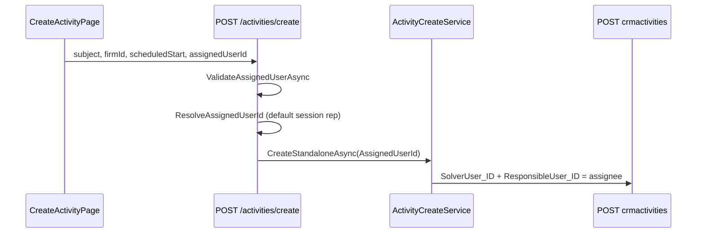

# Sprint 4.1 — Activity Assignment (Create Activity)

**Status:** Implemented  
**Date:** 2026-06-09  
**Depends on:** [3B.0 assignment analysis](sprint-3b-0-activity-assignment-analysis.md), [3B.1 user assignment](sprint-3b-1-user-assignment.md), [4.0B minimal create](sprint-4-0b-minimal-create-activity.md)

---

## 1. Goal

Allow assigning a **standalone** new activity to another user during create, reusing the Sprint 3B.1 assignment model (`SolverUser_ID` + `ResponsibleUser_ID`).

---

## 2. Task 1 — Existing assignment (confirmed)

### 2.1 Gen fields (from 3B.0)

| Field | Purpose | Mobile My Day | Standalone create (4.0B before) |
|-------|---------|:-------------:|----------------------------------|
| `SolverUser_ID` | Concrete solver | ✓ | Session rep only |
| `ResponsibleUser_ID` | Accountable person | ✓ | Session rep only |
| `SolverRole_ID` | Role pool | ✗ | From `ReferenceDefaults` |
| `ResponsibleRole_ID` | Responsible role pool | ✗ | Not set |
| `CreatedBy_ID` | Gen creator | ✓ | Session user on POST |

### 2.2 Sprint 3B.1 handover assignment (unchanged)

Follow-up / handover create (`POST /activities`, complete flow):

```csharp
body["ResponsibleUser_ID"] = assigneeId;
body["SolverUser_ID"] = assigneeId;
```

`assigneeId` = `assignedUserId` from request or session rep. Validated via `ValidateAssignedUserAsync`.

### 2.3 My Day behaviour (no change since 3B.0)

Ownership filter:

```
ResponsibleUser_ID = rep OR SolverUser_ID = rep OR CreatedBy_ID = rep
```

Plus open/in-progress status and schedule date bucket.

**Creator visibility:** User who creates an activity for someone else **still sees it in My Day** via `CreatedBy_ID` (Gen platform rule, documented in 3B.0/3B.1). Assignee sees it via `SolverUser_ID` / `ResponsibleUser_ID`.

### 2.4 Delta since Sprint 3

| Area | Sprint 3 end state | Sprint 4.0B | Sprint 4.1 |
|------|-------------------|-------------|------------|
| Follow-up assignment | ✓ Picker + API | Unchanged | Unchanged |
| Standalone create assignment | N/A | Always session rep | **User picker** |
| Role-only assignment | Not supported | Not supported | Not supported (analysis only) |

---

## 3. Architecture



Reuses **same** controller helpers as follow-up:

- `ResolveAssignedUserId`
- `ValidateAssignedUserAsync`
- Same Gen payload pattern as `BuildFollowUpGenPayload` assignee block

`SolverRole_ID` remains from tenant `ReferenceDefaults` — not user-selectable.

---

## 4. API contract

### `POST /api/v1/activities/create` (extended)

```json
{
  "subject": "Call customer",
  "scheduledStart": "2026-06-15T09:00:00Z",
  "firmId": "3300000101",
  "assignedUserId": "2620000101"
}
```

| Field | Required | Default |
|-------|:--------:|---------|
| `assignedUserId` | No | Session representative |

**Validation:** Explicit `assignedUserId` must reference an active `securityuser`.

**Gen mapping:**

| API field | Gen field |
|-----------|-----------|
| `assignedUserId` | `SolverUser_ID` |
| `assignedUserId` | `ResponsibleUser_ID` |

---

## 5. Frontend (Task 2 & 5)

### Form order

1. Predmet *
2. Zákazník *
3. Kontaktná osoba
4. Termín *
5. **Priradený používateľ** ← new
6. Popis

### Picker

- `GET /api/v1/users` (same as follow-up complete form)
- Default: logged-in user from session / auth context
- Display: `Jaroslav Novák (JANO)` — `displayName (loginName)`

---

## 6. Task 4 — Role-only assignment (analysis only)

### Can activities be assigned by role only?

**On DEMO Gen:** Yes — `SolverRole_ID` without `SolverUser_ID` puts activity in a role pool (desktop agenda).

### Mobile CRM My Day today

**No role-pool visibility.** `BuildOwnershipWhere` ignores `SolverRole_ID` and `ResponsibleRole_ID`. Role-only activities appear in creator's My Day only (`CreatedBy_ID`), not for role members.

### ABRA desktop (inferred)

Desktop agenda likely surfaces role-pool activities to members of `SolverRole_ID`. Mobile does not replicate this.

### Recommended future approach (not implemented)

| Phase | Approach |
|-------|----------|
| **4.x+** | Optional **Rola riešiteľa** picker; keep `SolverRole_ID` from defaults or user override |
| **My Day parity** | Either extend ownership filter with role membership lookup (`securityusers/{id}/securityroles`), or document mobile as “named user only” |
| **Role-only create** | Defer until My Day can show pool activities to the right users |

**Sprint 4.1 scope:** Named user assignment only — matches handover follow-up behaviour.

---

## 7. Verification (Task 6)

**Script:** `scripts/verify_sprint_4_1_assignment.py`  
**Results:** `analysis/spikes/sprint-4-1-assignment-results.json`  
**Environment:** DEMO Gen, adapter `http://localhost:5082` (`.adapter-4-1-verify-out`)

| Scenario | Action | Gen `SolverUser_ID` | Assignee My Day | Creator My Day |
|----------|--------|---------------------|-----------------|----------------|
| **A** | JANO → JANO | `1200000101` | JANO ✓ | JANO ✓ |
| **B** | JANO → JAROJ | `2620000101` | JAROJ ✓ | JANO ✓* |
| **C** | JANO → API | `2610000101` | API ✓ | JANO ✓* |

\*Scenario B/C: JANO still sees created activities via `CreatedBy_ID` — expected per 3B.0; not a regression.

**Sample (Scenario B):** Activity `K110000101` — `SolverUser_ID`/`ResponsibleUser_ID` = JAROJ, `CreatedBy_ID` = JANO.

### Build

| Check | Result |
|-------|--------|
| `dotnet build` → `.adapter-4-1-verify-out` | OK |
| `npm run build` | OK |
| All 3 verification scenarios | PASS |

---

## 8. Screenshots (manual)

| # | Screen |
|---|--------|
| 1 | Create form with **Priradený používateľ** between Termín and Popis |
| 2 | Picker open showing `displayName (loginName)` entries |
| 3 | Activity detail — **Priradený používateľ** shows assignee |
| 4 | JAROJ My Day — activity from JANO create appears under Dnes |

---

## 9. Files changed

| File | Change |
|------|--------|
| `ApiModels.cs` | `StandaloneCreateActivityRequestDto.AssignedUserId` |
| `ActivityCreateService.cs` | `StandaloneCreateActivityCommand.AssignedUserId`, payload mapping |
| `ActivitiesController.cs` | Validate + resolve assignee on `POST create` |
| `CreateActivityPage.tsx` | User picker |
| `types.ts` | `assignedUserId` on request |
| `sk-SK.ts` | Labels |
| `scripts/verify_sprint_4_1_assignment.py` | E2E verification |

---

## 10. Preserved behaviour

- Sprint 3 follow-up / handover assignment unchanged
- Sprint 4.0B standalone create (firm, schedule, references) unchanged except assignee
- No solver/responsible **role** pickers
- No business dimensions or classification
