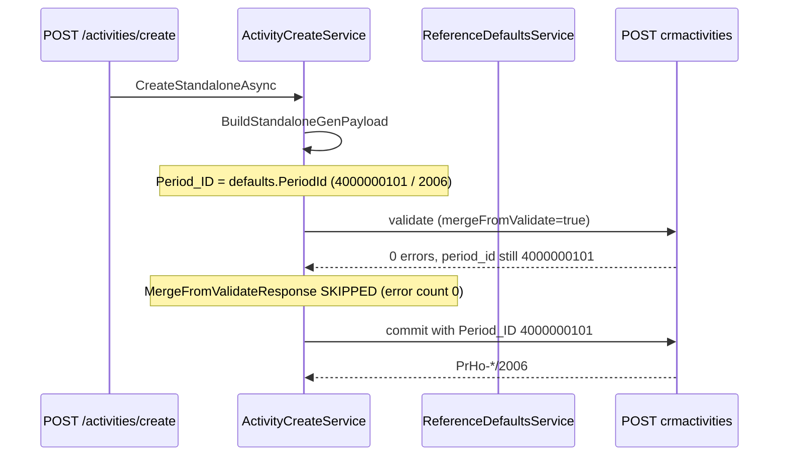

# Sprint 4.2B.2 — Period Resolution Fix

**Status:** Analysis complete (fix proposed, not implemented)  
**Date:** 2026-06-11  
**Issue:** Mobile CRM creates activities in accounting period **2006** (`PrHo-*/2006`) while activity date is in **2026**.

**Evidence spike:** [`scripts/spike_4_2b_2_period_resolution.py`](../scripts/spike_4_2b_2_period_resolution.py) → [`analysis/spikes/sprint-4-2b-2-period-resolution-results.json`](../analysis/spikes/sprint-4-2b-2-period-resolution-results.json)

**Environment:** `http://localhost/demo`, credentials `api` / `123`

---

## 1. Executive summary

| Observation | Finding |
|-------------|---------|
| **Root cause** | Mobile adapter sends **hardcoded** `Period_ID` from `appsettings.json` (`4000000101` = *Účtovné obdobie 2006*). Gen accepts it; document numbering follows period year → `*/2006`. |
| **Why date is ignored** | `Period_ID` is set in `BuildStandaloneGenPayload` **before** validate. Gen does **not** override an explicit (but wrong) period when validate returns 0 errors. |
| **Why merge does not help** | `PostCreateAsync` only calls `MergeFromValidateResponse` when **validation error count > 0**. On success path, corrected `period_id` in validate response is **discarded**. |
| **Desktop behaviour** | ABRA Desktop resolves period from **activity date** (scheduled start falls in 2026 accounting period → `3F80000101` → `NP-25/2026`, `PrHo-23/2026`). |
| **Fix** | Omit hardcoded `Period_ID` on standalone create **or** resolve from `SheduledStart$DATE`; **always merge** `period_id` from validate response before commit. |

---

## 2. Symptom vs expected

| Source | Document no. | Activity date | `period_id` |
|--------|--------------|---------------|-------------|
| Mobile CRM (bug) | `PrHo-62/2006` | 11.06.2026 | `4000000101` (2006) |
| ABRA Desktop (reference) | `PrHo-23/2026` | 11.06.2026 | `3F80000101` (2026) |
| Manual desktop activity `E120000101` | `NP-25/2026` | 11.06.2026 | `3F80000101` |

**Expected:** Activity dated **11.06.2026** → `Period_ID = 3F80000101` (code `2026`) → document number **\*/2026**.

---

## 3. Investigation answers

### Q1 — Is `Period_ID` hardcoded from defaults?

**Yes.**

```201:201:src/MobileCrm.Adapter.Gen/ActivityCreateService.cs
            ["Period_ID"] = defaults.PeriodId,
```

`defaults.PeriodId` comes from `Gen:ReferenceDefaults:PeriodId` in `appsettings.json`:

```json
"PeriodId": "4000000101"
```

Gen master data (`GET periods/4000000101`):

| Field | Value |
|-------|-------|
| `id` | `4000000101` |
| `code` | `2006` |
| `name` | Účtovné obdobie 2006 |
| `datefrom$date` | 2005-12-31T23:00:00Z |
| `dateto$date` | 2006-12-31T23:00:00Z |

This ID was chosen in early spikes as a “known working” DEMO default ([Sprint 3A follow-up spike](../analysis/spikes/follow-up-activity-create.md)) and was never tied to the activity schedule date.

---

### Q2 — Is `Period_ID` resolved from selected activity date?

**Not in Mobile CRM today.**

`ScheduledStart` maps only to `SheduledStart$DATE`. No code queries `periods` or derives period from date.

**Gen can resolve from date** when `Period_ID` is **omitted** from the POST body (see Q3).

2026 period master data (`GET periods/3F80000101`):

| Field | Value |
|-------|-------|
| `id` | `3F80000101` |
| `code` | `2026` |
| `name` | Účtovné obdobie 2026 |
| `datefrom$date` | 2025-12-31T23:00:00Z |
| `dateto$date` | 2026-12-31T23:00:00Z |

---

### Q3 — Does Gen return a corrected `Period_ID` during validate?

**Depends on whether `Period_ID` is sent.**

| Payload | Validate errors | `period_id` in validate response | After commit |
|---------|:---------------:|----------------------------------|--------------|
| **With** `Period_ID: 4000000101` (Mobile today) | 0 | `4000000101` (unchanged) | `PrHo-64/2006` |
| **Without** `Period_ID` | 0 | `3F80000101` (2026) | — |
| **Without** `Period_ID`, then merge + commit | 0 | `3F80000101` | `PrHo-24/2026` |
| **With** `Period_ID: 3F80000101` | 0 | `3F80000101` | `PrHo-25/2026` |

Gen validate **does not correct** a wrong explicit `Period_ID`; it **does infer** the correct period from `SheduledStart$DATE` when `Period_ID` is absent.

---

### Q4 — How does ABRA Desktop determine the correct period?

Inferred from API behaviour and reference activity `E120000101`:

1. User sets activity date (scheduled start).
2. Desktop resolves **accounting period** whose `datefrom$date` ≤ activity date ≤ `dateto$date`.
3. Sets `Period_ID` to that period (2026 → `3F80000101`).
4. Document sequence uses period year → `NP-25/2026`, `PrHo-23/2026`.

Desktop does **not** use the static DEMO config id `4000000101`.

---

## 4. Code path (standalone create)



### `ReferenceDefaultsService`

- `TryGetConfiguredDefaults` — reads static `PeriodId` from config.
- `MergeFromValidateResponse` — can copy `period_id` from validate JSON into body (implementation exists).

### `PostCreateAsync` merge gate

```406:416:src/MobileCrm.Adapter.Gen/ActivityCreateService.cs
            if (validateErrorCount == 0)
            {
                break;
            }

            if (!mergeFromValidate || round >= MaxValidateRounds - 1)
            {
                return (ActivityOperationErrorCode.GenValidationFailed, null);
            }

            _referenceDefaults.MergeFromValidateResponse(body, validateResponse);
```

Merge runs **only** when validation fails. Successful validate with wrong `Period_ID` proceeds straight to commit.

### Follow-up / handover (out of scope for standalone bug, same underlying ID)

`BuildFollowUpGenPayload` sets `Period_ID` from **source activity** (`refs.PeriodId`). If source was created in 2006 period, follow-up stays in 2006 unless separately fixed.

---

## 5. Payload comparison

### Mobile CRM today (bug)

```json
{
  "Subject": "…",
  "Firm_ID": "4000000101",
  "SheduledStart$DATE": "2026-06-11T15:40:00.000Z",
  "ActQueue_ID": "2000000101",
  "Period_ID": "4000000101",
  "Division_ID": "2000000101",
  "SolverRole_ID": "1000000101",
  "ActivityArea_ID": "2000000101",
  "ActivityType_ID": "2000000101",
  "ResponsibleUser_ID": "…",
  "SolverUser_ID": "…"
}
```

**Result:** `PrHo-64/2006`, `period_id: 4000000101`

### ABRA Desktop equivalent (correct)

Same date; period resolved for 2026:

```json
{
  "Period_ID": "3F80000101",
  "SheduledStart$DATE": "2026-06-11T15:40:00.000Z"
}
```

**Result:** `PrHo-25/2026`, `period_id: 3F80000101`

### Recommended Mobile payload (fix)

Omit `Period_ID` in initial body; after validate, merge Gen response:

```json
{
  "SheduledStart$DATE": "2026-06-11T15:40:00.000Z",
  "ActQueue_ID": "2000000101",
  "Division_ID": "2000000101",
  "SolverRole_ID": "1000000101",
  "ActivityArea_ID": "2000000101"
}
```

Validate response includes `"period_id": "3F80000101"` → merge → commit.

---

## 6. Fix proposal

### Recommended — Option A: Gen validate resolution + merge on success

**Scope:** `ActivityCreateService` standalone create only (minimal change).

1. **`BuildStandaloneGenPayload`** — **do not set** `Period_ID` (remove line or make conditional).
2. **`PostCreateAsync`** — after validate round with **0 errors**, call `MergeFromValidateResponse` (or a narrower `MergeResolvedPeriod`) **before** commit when `mergeFromValidate` is true.
3. Keep other reference defaults (`ActQueue_ID`, `Division_ID`, …) as today unless spike shows they should also be merged.

**Pros:** Matches desktop behaviour; no new Gen list dependency; uses Gen’s own period rules.  
**Cons:** Requires validate-then-merge on success path (small behaviour change in `PostCreateAsync`).

### Option B — Explicit period lookup service

1. Add `IPeriodResolutionService`:
   - `GET periods?select=ID,Code,datefrom$date,dateto$date&where=…`
   - Pick period where `scheduledStart` ∈ `[datefrom, dateto]`.
2. Set `Period_ID` in payload before validate.

**Pros:** Explicit, testable without validate side effects.  
**Cons:** Duplicate Gen date logic; OData date filter must be verified per tenant.

### Option C — Config-only change

Set `PeriodId` to `3F80000101` in `appsettings.json`.

**Pros:** Trivial.  
**Cons:** **Wrong** for activities in 2007, 2025, etc.; not a real fix.

### Not recommended

Leaving `Period_ID: 4000000101` and expecting Gen to override — **proven not to happen**.

---

## 7. Suggested implementation checklist

| Step | File | Change |
|------|------|--------|
| 1 | `ActivityCreateService.BuildStandaloneGenPayload` | Omit `Period_ID` |
| 2 | `ActivityCreateService.PostCreateAsync` | Merge validate response on **success** when `mergeFromValidate` |
| 3 | `ReferenceDefaultsService` | Optional: `MergeResolvedFields` limited to `period_id` |
| 4 | Tests | Standalone create with `2026-06-11` → `period_id` = `3F80000101`, display `*/2026` |
| 5 | Script | Extend `verify_sprint_4_2b_*` or new `verify_period_resolution.py` |

**Do not** change unrelated dimensions, UI, or My Day logic.

### Follow-up / handover (separate ticket)

Consider resolving period from **child** `SheduledStart$DATE` instead of copying source `Period_ID` when dates cross accounting years.

---

## 8. Verification against ABRA Desktop

### Automated (DEMO)

```bash
python scripts/spike_4_2b_2_period_resolution.py
```

| Scenario | Expected after fix |
|----------|-------------------|
| Standalone create, date `2026-06-11` | `period_id` = `3F80000101`, display `PrHo-*/2026` |
| Standalone create, date in 2006 | `period_id` = `4000000101`, display `*/2006` |

### Manual ABRA Desktop

1. Create activity in Mobile CRM dated **11.06.2026**.
2. Open same activity in ABRA desktop.
3. Confirm:
   - Document number suffix **/2026** (not `/2006`).
   - Accounting period = **Účtovné obdobie 2026**.
4. Compare with desktop-created reference (`PrHo-23/2026`).

### Regression

| Check | Expected |
|-------|----------|
| Create without date change | Still succeeds |
| Reference defaults (queue, division, role, area) | Unchanged |
| Follow-up create | Unchanged in this sprint |

---

## 9. Period ID reference (DEMO)

| Year | `Period_ID` | `code` | Used by |
|------|-------------|--------|---------|
| 2006 | `4000000101` | `2006` | **Mobile config (bug)** |
| 2026 | `3F80000101` | `2026` | **Desktop / date-resolved** |

List endpoint: `GET periods?take=50` (not `accountingperiods`).

---

## 10. Related artefacts

| Document | Relevance |
|----------|-----------|
| [Sprint 4.0B minimal create](sprint-4-0b-minimal-create-activity.md) | Introduced `ReferenceDefaults.PeriodId` |
| [Sprint 3A follow-up spike](../analysis/spikes/follow-up-activity-create.md) | Early evidence: `4000000101` → `*/2006` even with 2026 schedule |
| [Sprint 4.2A.1 reference activity](sprint-4-2a-1-business-dimensions-validation.md) | `E120000101` uses `period_id: 3F80000101` |
