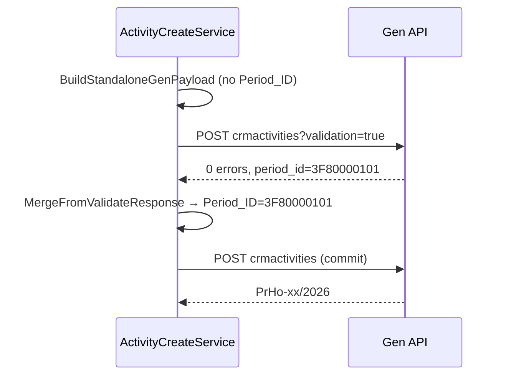

# Sprint 4.2B.3 — Period Resolution Fix

**Status:** Implemented  
**Date:** 2026-06-11  
**Depends on:** [4.2B.2 period analysis](sprint-4-2b-2-period-resolution-fix.md)

---

## 1. Problem

Standalone create with date **11.06.2026** produced document numbers like `PrHo-64/2006` because Mobile CRM sent `Period_ID: 4000000101` (accounting period **2006**) from static config.

ABRA Desktop resolves period from the scheduled date → `3F80000101` (2026) → `PrHo-xx/2026`.

---

## 2. Code changes

### Task 1 — `BuildStandaloneGenPayload`

**File:** `src/MobileCrm.Adapter.Gen/ActivityCreateService.cs`

Removed explicit `Period_ID` from standalone create payload. Gen resolves period from `SheduledStart$DATE`.

**Before:**

```csharp
["ActQueue_ID"] = defaults.ActQueueId,
["Period_ID"] = defaults.PeriodId,
["Division_ID"] = defaults.DivisionId,
```

**After:**

```csharp
["ActQueue_ID"] = defaults.ActQueueId,
["Division_ID"] = defaults.DivisionId,
```

`ReferenceDefaults.PeriodId` remains in config (required by `TryGetConfiguredDefaults`) but is **not** sent on standalone create.

### Task 2 — Validate merge on success

**File:** `src/MobileCrm.Adapter.Gen/ActivityCreateService.cs` — `PostCreateAsync`

When `mergeFromValidate` is true and validate returns **0 errors**, merge Gen response fields (including `period_id`) into the commit body before `POST crmactivities`.

**Before:** merge only when `validateErrorCount > 0`.  
**After:** merge on success path when `mergeFromValidate` is true.

```csharp
if (validateErrorCount == 0)
{
    if (mergeFromValidate)
    {
        _referenceDefaults.MergeFromValidateResponse(body, validateResponse);
    }

    break;
}
```

`MergeFromValidateResponse` copies `period_id` → `Period_ID` (and other reference fields if present). No custom period calculation — same as ABRA Desktop via Gen validate.

### Unchanged

| Area | Behaviour |
|------|-----------|
| Follow-up / handover create | `mergeFromValidate: false`; still copies `Period_ID` from source activity |
| Other reference defaults | `ActQueue_ID`, `Division_ID`, `SolverRole_ID`, `ActivityArea_ID`, `ActivityType_ID` still from config |
| Frontend / API contracts | No changes |

---

## 3. Validation flow (standalone create)



---

## 4. Payload before / after

### Before (4.2B.2 bug)

```json
{
  "SheduledStart$DATE": "2026-06-11T15:40:00.000Z",
  "Period_ID": "4000000101",
  "ActQueue_ID": "2000000101",
  "Division_ID": "2000000101"
}
```

**Result:** `PrHo-64/2006`, `period_id: 4000000101`

### After (4.2B.3 fix)

**Validate request** (no `Period_ID`):

```json
{
  "SheduledStart$DATE": "2026-06-11T15:40:00.000Z",
  "ActQueue_ID": "2000000101",
  "Division_ID": "2000000101"
}
```

**After validate merge → commit:**

```json
{
  "SheduledStart$DATE": "2026-06-11T15:40:00.000Z",
  "Period_ID": "3F80000101",
  "ActQueue_ID": "2000000101",
  "Division_ID": "2000000101"
}
```

**Result:** `PrHo-26/2026`, `period_id: 3F80000101`

---

## 5. Verification results (DEMO)

**Script:** `scripts/verify_sprint_4_2b_3_period_resolution.py`

```bash
ADAPTER_URL=http://localhost:5085/api/v1 python scripts/verify_sprint_4_2b_3_period_resolution.py
```

| Check | Result |
|-------|--------|
| Create activity `2026-06-11T15:40:00Z` | **PASS** |
| `period_id` = `3F80000101` (2026) | **PASS** |
| DisplayName ends with `/2026` (`PrHo-26/2026`) | **PASS** |
| Not using `4000000101` (2006) | **PASS** |
| `GET /business-cases` | **PASS** |
| `GET /my-day` | **PASS** |

### ABRA Desktop

Open created activity `E320000101` (or latest verify run) in ABRA desktop and confirm:

- Accounting period = **Účtovné obdobie 2026**
- Document number suffix **/2026**

---

## 6. Regression checklist

| Feature | Expected | Verified |
|---------|----------|:--------:|
| Standalone create | Works; correct period | ✓ |
| Assignment (`assignedUserId`) | Unchanged | ✓ (same API) |
| Business dimensions | Unchanged | ✓ lookup PASS |
| Handover / follow-up | Unchanged (`mergeFromValidate: false`) | — code path unchanged |
| Notes | Unchanged | — no code touch |
| My Day | Unchanged | ✓ GET PASS |

---

## 7. Files changed

| Path | Change |
|------|--------|
| `src/MobileCrm.Adapter.Gen/ActivityCreateService.cs` | Omit `Period_ID`; merge on validate success |
| `scripts/verify_sprint_4_2b_3_period_resolution.py` | Verification script |
| `implementation/sprint-4-2b-3-period-resolution-fix.md` | This document |

---

## 8. Period reference (DEMO)

| Year | `Period_ID` | `code` |
|------|-------------|--------|
| 2006 | `4000000101` | `2006` (old config default — no longer sent) |
| 2026 | `3F80000101` | `2026` (Gen-resolved for 2026 dates) |
