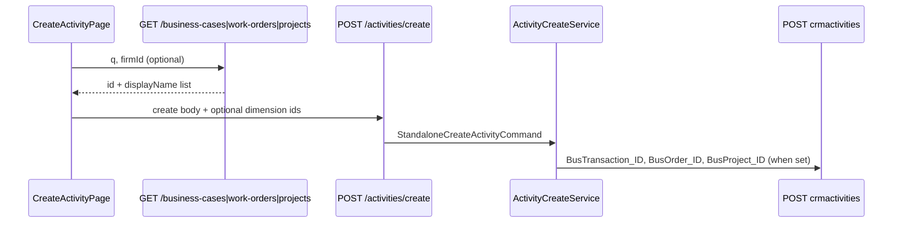

# Sprint 4.2B — Business Dimensions on Create Activity

**Status:** Implemented  
**Date:** 2026-06-11  
**Depends on:** [4.2A business dimensions analysis](sprint-4-2a-business-dimensions-analysis.md), [4.0B minimal create](sprint-4-0b-minimal-create-activity.md), [4.1 assignment](sprint-4-1-assignment.md)

**Scope:** Standalone **Create Activity** only. My Day, activity detail actions, complete, handover, follow-up, and assignment logic are **unchanged**.

---

## 1. Goal

Allow optional links to **Business Case**, **Work Order**, and **Project** when creating a new activity. All three fields are optional and independent.

---

## 2. Architecture



### Components

| Layer | File | Role |
|-------|------|------|
| Gen integration | `DimensionLookupService.cs` | OData list queries on `bustransactions`, `busorders`, `busprojects` |
| Gen integration | `ActivityCreateService.BuildStandaloneGenPayload` | Maps optional IDs to Gen FK fields |
| Adapter API | `BusinessCasesController`, `WorkOrdersController`, `ProjectsController` | Thin lookup endpoints |
| Config | `ActivityDimensionOptions` (`ActivityDimensions` section) | Per-dimension UI flags |
| Session | `SessionController` → `activityFeatures.dimensions` | Frontend feature gating |
| Web | `CreateActivityPage.tsx` section **Obchodné väzby** | Optional selects below firm/contact, above termín |

### Firm-scoped lookup with fallback

When `firmId` is provided, lookup tries `Firm_ID eq '{firmId}'` first. If that returns no rows (common on DEMO seed where `Firm_ID` is null), the service **falls back** to a global list — per 4.2A Option B.

Search uses `Code like '*{q}*' or Name like '*{q}*'` (`DisplayName like` returns 400 on DEMO).

---

## 3. Mapping table

| Mobile API field | Slovak UI label | Gen BO | Gen activity FK (POST) | Gen activity FK (GET) |
|------------------|-----------------|--------|------------------------|------------------------|
| `businessCaseId` | Obchodný prípad | `bustransactions` | `BusTransaction_ID` | `bustransaction_id` |
| `workOrderId` | Zákazka | `busorders` | `BusOrder_ID` | `busorder_id` |
| `projectId` | Projekt | `busprojects` | `BusProject_ID` | `busproject_id` |

All fields are **optional**. Omitted or empty values are not sent to Gen.

---

## 4. API contracts

### 4.1 Lookup endpoints (new)

All return `PagedResultDto<DimensionSummaryDto>`:

```json
{
  "items": [{ "id": "3000000101", "displayName": "Zľavy Zľavové akcie" }],
  "total": 1,
  "hasMore": false
}
```

| Endpoint | Gen collection |
|----------|----------------|
| `GET /api/v1/business-cases?q=&firmId=&take=30&skip=0` | `bustransactions` |
| `GET /api/v1/work-orders?q=&firmId=&take=30&skip=0` | `busorders` |
| `GET /api/v1/projects?q=&firmId=&take=30&skip=0` | `busprojects` |

Query parameters:

| Param | Required | Notes |
|-------|:--------:|-------|
| `q` | No | Filters by `Code` / `Name` (not `DisplayName`) |
| `firmId` | No | Firm-scoped list with global fallback |
| `take` | No | Default 30, max 50 |
| `skip` | No | Default 0 |

Lookup APIs remain available when dimension flags are disabled (flags affect UI only).

### 4.2 Create activity (extended)

`POST /api/v1/activities/create`

```json
{
  "subject": "Nová aktivita",
  "scheduledStart": "2026-06-15T09:00:00+02:00",
  "firmId": "3300000101",
  "contactPersonId": null,
  "description": null,
  "assignedUserId": "1200000101",
  "businessCaseId": "3000000101",
  "workOrderId": "A000000101",
  "projectId": "2000000101"
}
```

| Field | Required | Gen target |
|-------|:--------:|------------|
| `businessCaseId` | No | `BusTransaction_ID` |
| `workOrderId` | No | `BusOrder_ID` |
| `projectId` | No | `BusProject_ID` |

### 4.3 Session feature flags

`appsettings.json`:

```json
"ActivityDimensions": {
  "BusinessCase": true,
  "WorkOrder": true,
  "Project": true
}
```

`GET /api/v1/session` response extension:

```json
"activityFeatures": {
  "createActivity": true,
  "dimensions": {
    "businessCase": true,
    "workOrder": true,
    "project": true
  }
}
```

When a flag is `false`, the corresponding picker is **hidden** in Create Activity. The create API still accepts dimension fields if sent.

---

## 5. UI

**Section:** Obchodné väzby  
**Placement:** Below Zákazník / Kontaktná osoba, above Termín  
**Visibility:** Shown after a firm is selected, when at least one dimension flag is enabled  

Each field is an optional `<select>` populated from the lookup API (firm-scoped with global fallback).

**Files:**

- `src/MobileCrm.Web/src/features/activities/CreateActivityPage.tsx`
- `src/MobileCrm.Web/src/api/dimensions.ts`
- `src/MobileCrm.Web/src/i18n/locales/sk-SK.ts` (`createActivity.dimensionsSection`, …)

---

## 6. Verification

### 6.1 Automated script

```bash
python scripts/verify_sprint_4_2b_business_dimensions.py
# ADAPTER_URL=http://localhost:5084/api/v1  (optional)
```

**DEMO run (2026-06-11):** ALL PASS

| Scenario | Activity ID | BusTransaction_ID | BusOrder_ID | BusProject_ID |
|----------|-------------|---------------------|-------------|---------------|
| No dimensions | H120000101 | *(empty)* | *(empty)* | *(empty)* |
| Business case only | J120000101 | 3000000101 | *(empty)* | *(empty)* |
| Work order only | L120000101 | *(empty)* | A000000101 | *(empty)* |
| Project only | N120000101 | *(empty)* | *(empty)* | 2000000101 |
| All three | P120000101 | 3000000101 | A000000101 | 2000000101 |

Lookup APIs on DEMO:

| Endpoint | Result |
|----------|--------|
| `GET /business-cases` | 2 items; sample `3000000101` found |
| `GET /work-orders` | 3 items; sample `A000000101` found |
| `GET /projects` | 4 items; sample `2000000101` found |

### 6.2 Gen GET evidence (ABRA desktop equivalent)

Activity `P120000101` (all three dimensions):

```json
{
  "ID": "P120000101",
  "Subject": "4.2B verify all-three …",
  "BusTransaction_ID": "3000000101",
  "BusOrder_ID": "A000000101",
  "BusProject_ID": "2000000101"
}
```

These are the same fields visible in ABRA Gen desktop on the activity record. **Manual check:** open the created activity in ABRA desktop and confirm the three business-dimension fields match the table above.

### 6.3 Verification matrix

| # | Test | Expected | DEMO result |
|---|------|----------|-------------|
| 1 | Create without dimensions | Activity created; no Bus* IDs on Gen GET | PASS |
| 2 | Create with business case only | `BusTransaction_ID` set | PASS |
| 3 | Create with work order only | `BusOrder_ID` set | PASS |
| 4 | Create with project only | `BusProject_ID` set | PASS |
| 5 | Create with all three | All three Bus* IDs set | PASS |
| 6 | Lookup APIs return `id` + `displayName` | Paged list | PASS |
| 7 | Session exposes dimension flags | `activityFeatures.dimensions` | PASS |
| 8 | My Day / handover / complete unchanged | No code changes in those flows | PASS (by scope) |

### 6.4 Screenshots

| Screenshot | Status |
|------------|--------|
| Create Activity — Obchodné väzby section with pickers | *Capture from running web app (`/app/activities/new`)* |
| ABRA desktop — activity `P120000101` dimension fields | *Capture manually in ABRA Gen desktop* |

Gen API proof above confirms persisted values pending desktop UI capture.

---

## 7. Out of scope (unchanged)

- My Day ownership filter
- Activity detail display of dimensions
- Handover / follow-up dimension inheritance (already implemented in `BuildFollowUpGenPayload`)
- Complete, note, start workflows
- Assignment validation and picker behaviour (Sprint 4.1)

---

## 8. File index

| Path | Change |
|------|--------|
| `src/MobileCrm.Adapter.Gen/ActivityDimensionOptions.cs` | Config model |
| `src/MobileCrm.Adapter.Gen/DimensionLookupService.cs` | Gen list queries |
| `src/MobileCrm.Adapter.Gen/DimensionSearchQueryBuilder.cs` | OData URL builder |
| `src/MobileCrm.Adapter.Gen/DimensionMapper.cs` | JSON → row |
| `src/MobileCrm.Adapter.Gen/ActivityCreateService.cs` | Standalone payload + command |
| `src/MobileCrm.Adapter/Controllers/DimensionLookupControllers.cs` | Three lookup routes |
| `src/MobileCrm.Adapter/Controllers/ActivitiesController.cs` | Pass dimension IDs |
| `src/MobileCrm.Adapter/Controllers/SessionController.cs` | Dimension flags in session |
| `src/MobileCrm.Adapter/Models/ApiModels.cs` | DTOs |
| `src/MobileCrm.Adapter/appsettings.json` | `ActivityDimensions` |
| `src/MobileCrm.Web/src/features/activities/CreateActivityPage.tsx` | UI section |
| `src/MobileCrm.Web/src/api/dimensions.ts` | API client |
| `scripts/verify_sprint_4_2b_business_dimensions.py` | Verification |
