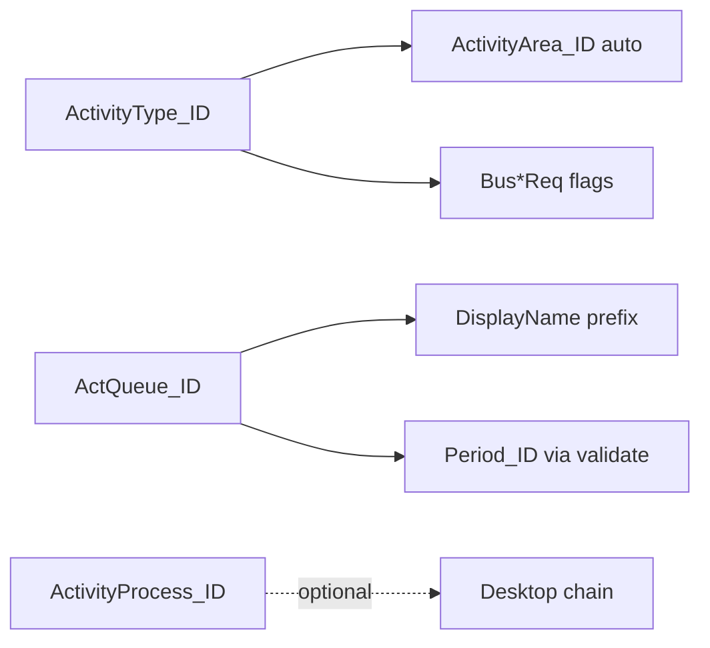

# Sprint 4.3A — Activity Classification Analysis

**Status:** Analysis complete  
**Date:** 2026-06-11  
**Depends on:** [4.0A activity creation analysis](sprint-4-0a-activity-creation-analysis.md), [4.2C configuration review](sprint-4-2c-configuration-review.md), [4.2B dimensions](sprint-4-2b-business-dimensions.md)  
**Goal:** Understand Gen classification BOs, validation, defaulting, and ABRA Desktop UX rules before Sprint 4.3B implementation.

**Evidence:** [`scripts/spike_4_3a_activity_classification.py`](../scripts/spike_4_3a_activity_classification.py) → [`analysis/spikes/sprint-4-3a-activity-classification-results.json`](../analysis/spikes/sprint-4-3a-activity-classification-results.json)

**Environment:** `http://localhost/demo`, credentials `api` / `123`

---

## 1. Executive summary

| Classification | Gen BO | Activity FK | DEMO count | Mandatory on create? | Drives document prefix? |
|----------------|--------|-------------|:----------:|:--------------------:|:-----------------------:|
| **Oblasť aktivity** | `crmactivityareas` | `ActivityArea_ID` | **1** (Sp) | Effectively yes (Gen resolves) | No |
| **Typ aktivity** | `crmactivitytypes` | `ActivityType_ID` | **2** (Tel, Obch) | **Yes** | No (queue does) |
| **Rad aktivít** | `crmactivityqueues` | `ActQueue_ID` | **5** | **Yes** | **Yes** (`NP-`, `PrHo-`, …) |
| **Proces aktivity** | `crmactivityprocesses` | `ActivityProcess_ID` | **10** | **No** on DEMO | No |

**Desktop UX rule (confirmed via Gen validate):**

| Available values | Recommended Mobile behaviour |
|------------------|------------------------------|
| **0** | Cannot create (field blocked / validation error) |
| **1** | **Auto-fill** — hide picker or show read-only |
| **2+** | **User must choose** — empty until selected |

**Area** matches the “1 value → auto-fill” rule on DEMO. **Type** and **Queue** match “multiple → user choice”. **Process** is optional with many values — show picker only when classification enabled and process workflow is in scope.

---

## 2. BO and field mapping

| Slovak UI | Mobile concept | Gen list endpoint | Gen detail | Activity POST field | Activity GET field |
|-----------|----------------|-------------------|------------|---------------------|-------------------|
| Oblasť aktivity | Activity Area | `GET crmactivityareas` | `GET crmactivityareas/{id}` | `ActivityArea_ID` | `activityarea_id` |
| Typ aktivity | Activity Type | `GET crmactivitytypes` | `GET crmactivitytypes/{id}` | `ActivityType_ID` | `activitytype_id` |
| Rad aktivít | Activity Queue / Series | `GET crmactivityqueues` | `GET crmactivityqueues/{id}` | `ActQueue_ID` | `actqueue_id` |
| Proces aktivity | Activity Process | `GET crmactivityprocesses` | `GET crmactivityprocesses/{id}` | `ActivityProcess_ID` | `activityprocess_id` |

**List `$select` (working on DEMO):** `ID,Code,Name,DisplayName`  
**Avoid on list:** `ActivityArea_ID` on types (400 on DEMO list query).

---

## 3. Task 1 — Activity Area (Oblasť aktivity)

### 3.1 DEMO catalog

| ID | Code | Name | DisplayName |
|----|------|------|-------------|
| `2000000101` | `Sp` | Spoločná | Sp Spoločná |

### 3.2 Answers

| # | Question | Answer |
|---|----------|--------|
| 1 | Gen BO? | `crmactivityareas` / `crmactivityarea` |
| 2 | Mandatory? | **Effectively yes** — Gen validate returns `activityarea_id: 2000000101` even when omitted (with type + queue present) |
| 3 | Resolution on create? | **Auto-resolved** by Gen from type/tenant rules; omitting `ActivityArea_ID` still yields `2000000101` in validate preview |
| 4 | Multiple values? | **One** on DEMO — single shared area |
| 5 | Workflow / reporting? | Classifies activity scope; no document prefix; pairs with type dimension rules |
| 6 | Single value behaviour? | **Auto-fill** — Desktop pattern “no user interaction” applies |

### 3.3 Validate evidence (`omit_area` probe)

Request: type + queue, **no** `ActivityArea_ID` → **0 errors**, resolved `activityarea_id: 2000000101`.

---

## 4. Task 2 — Activity Type (Typ aktivity)

### 4.1 DEMO catalog

| ID | Code | Name | Notes |
|----|------|------|-------|
| `2000000101` | `Tel` | Telefón | `processisrequired: false`, `firmreq: 0` |
| `3000000101` | `Obch` | Obchodný prípad | `issheduled: true`, `firmreq: 1` |

### 4.2 Answers

| # | Question | Answer |
|---|----------|--------|
| 1 | Gen BO? | `crmactivitytypes` |
| 2 | Mandatory? | **Yes** — error 803 *Chyba v zadaní položky Typ aktivity* when omitted (`omit_type`, `no_classification_refs`) |
| 3 | Workflow influence? | **Yes** — type flags (`firmreq`, `issheduled`, `Bus*Req`, `processisrequired`) drive required fields |
| 4 | Activity numbering? | **No** — prefix comes from **queue** (`ActQueue_ID`) |
| 5 | Queues / processes? | Type does not set queue; optional `activityprocess_id` on type detail is null on DEMO types |
| 6 | Multiple values — Desktop? | **2 types** → user must select (Desktop: field empty until chosen) |

### 4.3 Type-specific validation (Obch)

When type is missing, validate may also require (type-dependent):

- `nextcontact$date` — *Dátum ďalšieho kontaktu*
- `tradedate$date` — *Plánovaný dátum uzavr. obchodu*

Observed on `no_classification_refs` / `omit_type` probes. **Mobile 4.3B:** when user picks **Obch**, surface or default these dates if Gen still requires them (verify in 4.3B spike).

### 4.4 Dimension requirement flags (type metadata)

`GET crmactivitytypes/{id}` exposes `BusTransactionReq`, `BusOrderReq`, `BusProjectReq` (0/1/2) — already analysed in [4.2A](sprint-4-2a-business-dimensions-analysis.md). Classification type picker must feed dimension UI rules.

---

## 5. Task 3 — Activity Queue / Series (Rad aktivít)

### 5.1 DEMO catalog

| ID | Code | Name | Example document |
|----|------|------|------------------|
| `2000000101` | `PrHo` | Prichádzajúci hovor | `PrHo-28/2026` |
| `3000000101` | `OdHo` | Odchádzajúci hovor | — |
| `4000000101` | `NP` | Nový predaj | `NP-27/2026` |
| `5000000101` | `PS` | Pozáručný servis | — |
| `6000000101` | `RK` | Reklamačné konanie | — |

### 5.2 Answers

| # | Question | Answer |
|---|----------|--------|
| 1 | Gen BO? | `crmactivityqueues` |
| 2 | Stored on activity? | **`ActQueue_ID`** / `actqueue_id` |
| 3 | Document numbering? | **Yes** — queue `Code` is prefix (`NP-25/2026`, `PrHo-62/2006`) |
| 4 | Multiple active? | **Yes** — 5 queues on DEMO; user/tenant selects one |
| 5 | Defaults? | Mobile today: hardcoded `ReferenceDefaults.ActQueueId` = `2000000101` (PrHo); Desktop user picks |
| 6 | Omitted? | **Validation fails** — error 800 *Rad aktivít*; period resolution also fails without queue |

### 5.3 Queue ↔ period linkage

Queue detail `lastnumbers[]` holds per-period counters (`period_id` + `lastnumber`). Explains why **queue + period** must be consistent ([4.2B.3](sprint-4-2b-3-period-resolution-fix.md)).

### 5.4 Commit proof

| Queue | Type | Created display |
|-------|------|-----------------|
| `4000000101` (NP) | `3000000101` (Obch) | `NP-27/2026` |
| `2000000101` (PrHo) | `2000000101` (Tel) | `PrHo-28/2026` |

### 5.5 Reference activities

| Activity | DisplayName | `actqueue_id` | `activitytype_id` |
|----------|-------------|---------------|-------------------|
| `E120000101` (desktop) | `NP-25/2026` | `4000000101` | `3000000101` |
| `5320000101` (mobile) | `PrHo-64/2006` | `2000000101` | `2000000101` |

---

## 6. Task 4 — Activity Process (Proces aktivity)

### 6.1 DEMO catalog

10 process steps (`100` Nový kontakt → `999` Neúspech) — sales pipeline chain.

### 6.2 Answers

| # | Question | Answer |
|---|----------|--------|
| 1 | Gen BO? | `crmactivityprocesses` |
| 2 | Mandatory? | **Optional** on DEMO — `processisrequired: false` on types; reference activities have `activityprocess_id: null` |
| 3 | Workflow? | **Yes** when used — desktop multi-step chains via `Source_ID` + process ([3A.3 handover spike](sprint-3a-3-handover-spike.md)) |
| 4 | Used on DEMO? | **Catalog exists**; sample activities in spike have **no** process set |
| 5 | Without process? | **Yes** — normal create succeeds with `activityprocess_id: null` |

**Mobile CRM MVP recommendation:** Process picker **out of 4.3B MVP** unless customer requires pipeline step on create; align with 3A.3 “out of scope for Mobile CRM MVP”.

---

## 7. Task 5 — ABRA Desktop UX rules

### 7.1 Rule matrix (DEMO-backed)

| Field | DEMO values | 0 values | 1 value | 2+ values |
|-------|:-----------:|----------|---------|-----------|
| **Area** | 1 | N/A on DEMO | **Auto-fill** `Sp` — Gen sets `activityarea_id` without POST | N/A |
| **Type** | 2 | Validate error 803 | N/A | **Picker required** — no default when omitted |
| **Queue** | 5 | Validate error 800 | Unlikely in practice | **Picker required** |
| **Process** | 10 | Optional skip | Could auto-fill if tenant has 1 step | **Picker** if enabled & optional |

### 7.2 Desktop rule consistency

| Rule | Area | Type | Queue | Process |
|------|:----:|:----:|:-----:|:-------:|
| 1 value → auto-fill | **Yes** (DEMO) | No (2 values) | No | Possible |
| Multiple → user selects | N/A | **Yes** | **Yes** | **Yes** (if shown) |
| Hidden when auto-filled | **Recommend** | No | No | Optional |

**Gen validate** is the authoritative mechanism for auto-fill (same as period resolution in 4.2B.3) — not custom client logic.

---

## 8. Validation behaviour summary

### 8.1 Mandatory classification fields (DEMO)

| Field | Omit behaviour | Error code / label |
|-------|----------------|-------------------|
| `ActivityType_ID` | Fail | 803 — Typ aktivity |
| `ActQueue_ID` | Fail | 800 — Rad aktivít |
| `ActivityArea_ID` | **Pass** if type+queue set | Gen auto-fills |
| `ActivityProcess_ID` | **Pass** | — |

### 8.2 Payload examples

**Valid (0 validate errors):**

```json
{
  "Subject": "…",
  "Firm_ID": "4000000101",
  "SheduledStart$DATE": "2026-06-11T10:00:00.000Z",
  "ActQueue_ID": "4000000101",
  "ActivityType_ID": "3000000101",
  "ActivityArea_ID": "2000000101",
  "Division_ID": "2000000101",
  "SolverRole_ID": "1000000101",
  "ResponsibleUser_ID": "…",
  "SolverUser_ID": "…"
}
```

→ After period merge: `NP-xx/2026`, `period_id: 3F80000101`

**Invalid — missing queue:**

```json
{ "ActivityType_ID": "2000000101", "ActivityArea_ID": "2000000101", … }
```

→ Errors: `actqueue_id`, `period_id`

### 8.3 Relationships



| Relationship | Behaviour |
|--------------|-----------|
| Type → Area | Gen auto-sets area on validate (DEMO: always `Sp`) |
| Queue → document number | **Direct** — `Code` as prefix |
| Queue → period | Queue must exist before period resolves |
| Type → dimensions | `*Req` flags on `crmactivitytypes` |
| Process → handover | Desktop chain; not auto on `Source_ID` alone |

---

## 9. Task 6 — Compare with Business Dimensions (4.2B)

| Aspect | Business dimensions | Classification |
|--------|--------------------:|----------------|
| **Gen BOs** | `bustransactions`, `busorders`, `busprojects` | `crmactivityareas/types/queues/processes` |
| **Activity FKs** | `BusTransaction_ID`, `BusOrder_ID`, `BusProject_ID` | `ActivityArea_ID`, `ActivityType_ID`, `ActQueue_ID`, `ActivityProcess_ID` |
| **Mandatory** | Optional (flags per type) | Type + Queue **required**; Area auto; Process optional |
| **Lookup APIs** | `GET /business-cases`, `/work-orders`, `/projects` | **Proposed:** `/activity-areas`, `/activity-types`, `/activity-queues`, `/activity-processes` |
| **Caching** | React Query 60s on create page | **Same pattern** |
| **Feature flags** | `ActivityDimensions.*` → session | **Proposed:** `ActivityClassification.*` |
| **Flag backend enforce** | No (UI only) | Recommend **type+queue always sent**; flags control visibility only |
| **Firm-scoped filter** | Optional `firmId` + fallback | **Not applicable** — global catalogs |
| **Auto-hide single value** | N/A (optional fields) | **Strong fit for Area** |

**Same design pattern:** ✓ Lookup service + thin controllers + session flags + Create Activity section + validate merge.

**Difference:** Classification fields are **required** (except process); dimensions are **optional**. Type selection may **unlock** dimension requirements.

---

## 10. Task 7 — Future configuration model

### 10.1 Proposed `appsettings.json`

```json
{
  "ActivityClassification": {
    "ActivityArea": true,
    "ActivityType": true,
    "ActQueue": true,
    "ActivityProcess": false,
    "AutoHideSingleValue": true
  }
}
```

### 10.2 Session projection

```json
{
  "activityFeatures": {
    "createActivity": true,
    "dimensions": { … },
    "classification": {
      "area": true,
      "type": true,
      "queue": true,
      "process": false,
      "autoHideSingleValue": true
    }
  },
  "defaults": {
    "activityTypeId": "2000000101",
    "activityTypeName": "Telefón",
    "activityAreaId": "2000000101",
    "activityAreaName": "Spoločná"
  }
}
```

### 10.3 `autoHideSingleValue` feasibility

| Value | Implementation |
|-------|----------------|
| `true` | After lookup `take=100`, if `items.length === 1` → set FK silently + read-only label; skip picker |
| `false` | Always show picker when flag enabled |

**Use Gen validate** to confirm auto-filled area matches the single catalog row.

**Feasibility:** **High** — pure frontend + merge from validate; no new Gen APIs.

---

## 11. Task 8 — Recommendation matrix

| Field | DEMO values | Required | Recommended UX | 4.3B priority |
|-------|:-------------:|:--------:|----------------|:-------------:|
| **Area** | 1 (`Sp`) | Auto | **Hidden / read-only** when `autoHideSingleValue` | P1 — trivial auto |
| **Type** | 2 (`Tel`, `Obch`) | **Yes** | **Picker required** (always if classification on) | **P0** |
| **Queue** | 5 | **Yes** | **Picker required** | **P0** |
| **Process** | 10 | No | **Hidden** in 4.3B MVP; picker in 4.3C+ if needed | P2 / defer |

### 11.1 Replace `ReferenceDefaults` usage

| Current default | After 4.3B |
|-----------------|------------|
| `ActivityTypeId` fixed in config | User picker (or session default when 1 type only) |
| `ActQueueId` fixed in config | User picker |
| `ActivityAreaId` fixed in config | Auto from Gen / single-value hide |
| `PeriodId` | **Unchanged** — Gen date resolve ([4.2B.3](sprint-4-2b-3-period-resolution-fix.md)) |

---

## 12. Proposed Sprint 4.3B implementation scope

### In scope

| Item | Description |
|------|-------------|
| **Lookup APIs** | `GET /api/v1/activity-areas`, `/activity-types`, `/activity-queues` |
| **DTOs** | `{ id, code, name, displayName }` (align with dimensions) |
| **Config** | `ActivityClassificationOptions` + session `classification.*` |
| **Create UI** | Section **Klasifikácia aktivity** (below business dimensions or above) |
| **Pickers** | Type + Queue required; Area auto/hidden on DEMO |
| **Backend create** | Send user-selected `ActivityType_ID`, `ActQueue_ID`; omit or merge `ActivityArea_ID` via validate |
| **Validate merge** | Keep 4.2B.3 period merge; merge area if returned |
| **Feature flags** | Per-field hide; `autoHideSingleValue` for area |
| **i18n** | SK labels matching desktop |
| **Verification script** | NP vs PrHo numbering + type/queue required |

### Out of scope (4.3B)

| Item | Rationale |
|------|-----------|
| Activity Process picker | Optional; desktop chain complexity ([3A.3](sprint-3a-3-handover-spike.md)) |
| Obch-specific `nextcontact` / `tradedate` UI | Spike in 4.3B if validate requires on commit |
| Handover classification override | Inherit from source (existing) |
| Activity detail display of classification | Read-only later |
| Backend flag enforcement on APIs | Same as dimensions unless security review |

### Suggested 4.3C (follow-up)

- Process picker + handover chain
- Type-driven conditional fields (Obch dates)
- `crmactivitytypes.*Req` → dimension required/hidden sync

---

## 13. Current Mobile CRM baseline

| Field | Today (post 4.2B.3) |
|-------|---------------------|
| `ActivityType_ID` | `ReferenceDefaults.ActivityTypeId` → always `2000000101` (Tel) |
| `ActQueue_ID` | `ReferenceDefaults.ActQueueId` → always `2000000101` (PrHo) |
| `ActivityArea_ID` | `ReferenceDefaults.ActivityAreaId` → always `2000000101` (Sp) |
| `ActivityProcess_ID` | Never sent |
| User control | **None** — tenant defaults only |

**Gap:** Desktop user picking NP + Obch for Galenit activity; Mobile always creates PrHo + Tel unless defaults change in config.

---

## 14. Artefacts

| File | Purpose |
|------|---------|
| [`scripts/spike_4_3a_activity_classification.py`](../scripts/spike_4_3a_activity_classification.py) | DEMO spike |
| [`analysis/spikes/sprint-4-3a-activity-classification-results.json`](../analysis/spikes/sprint-4-3a-activity-classification-results.json) | Raw results |
| [`implementation/sprint-4-2c-configuration-review.md`](sprint-4-2c-configuration-review.md) | Config patterns |
| [`architecture/reference/spike/crm-controllers-detail.json`](../architecture/reference/spike/crm-controllers-detail.json) | OpenAPI BO index |
