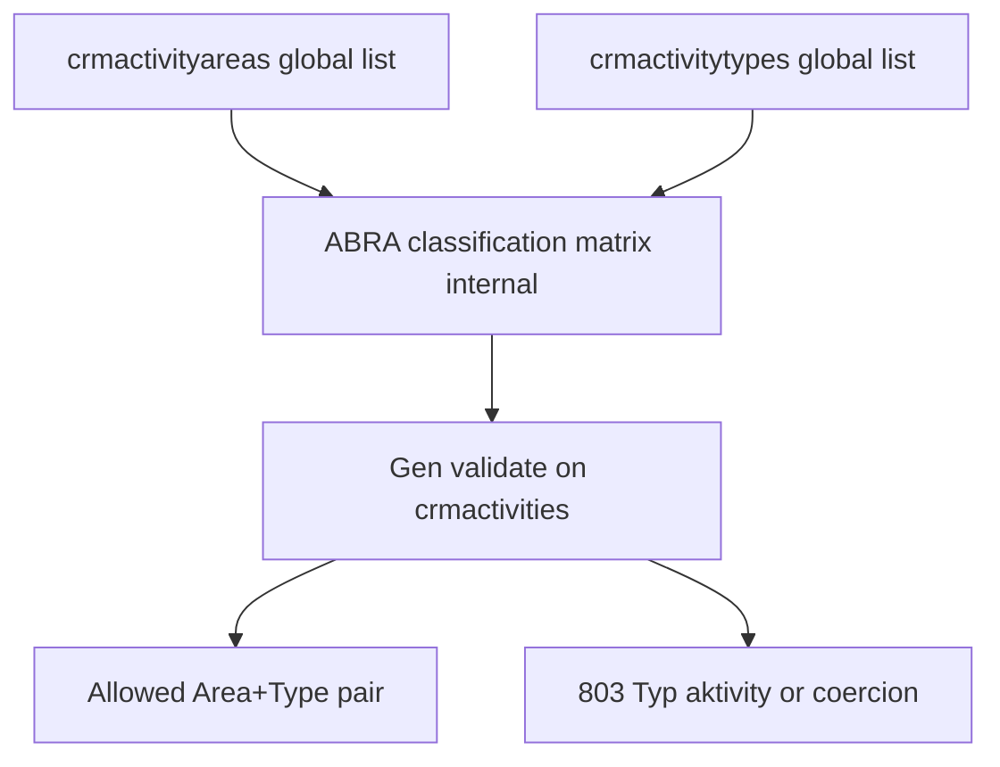
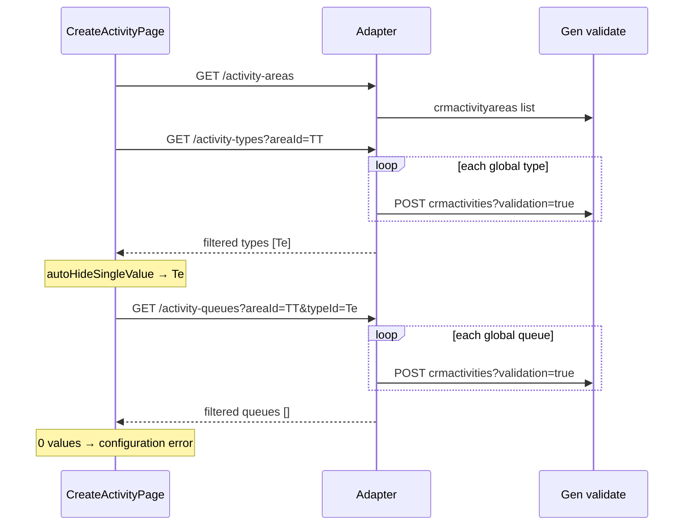

# Sprint 4.3B.2A — Classification Dependency Analysis

**Status:** Analysis complete  
**Date:** 2026-06-12  
**Depends on:** [4.3B classification](sprint-4-3b-activity-classification.md), [4.3B.1 validation UX](sprint-4-3b-1-classification-validation-ux.md)  
**Goal:** Understand ABRA dependency model for Area → Type → Queue before implementing dependent selectors.

**Evidence:** [`analysis/spikes/sprint-4-3b-2a-classification-dependency-results.json`](../analysis/spikes/sprint-4-3b-2a-classification-dependency-results.json)  
**Spike scripts:** [`scripts/spike_4_3b_2a_classification_dependency.py`](../scripts/spike_4_3b_2a_classification_dependency.py), [`scripts/spike_4_3b_2a_extra_probes.py`](../scripts/spike_4_3b_2a_extra_probes.py)

**Environment:** `http://localhost/demo`, credentials `api` / `123`

---

## 1. Executive summary

| Relationship | Exists? | Stored as REST FK? | Queryable via OData filter? |
|--------------|:-------:|:------------------:|:---------------------------:|
| **Area → Type** | **Yes** | **No** | **No** |
| **Type → Queue** (alone) | **No** | **No** | **No** |
| **Area + Type → Queue** | **Yes** | **No** | **No** |

**Real model: Option B**

```text
Area
 ↓
allowed Types

Area + Type
 ↓
allowed Queues
```

Catalog BOs (`crmactivityareas`, `crmactivitytypes`, `crmactivityqueues`) are **global lists**. Allowed combinations live in **ABRA CRM classification configuration**, enforced by Gen **validate** — not as filterable fields on type/queue records.

Mobile CRM must **not** show all global types when an area is selected. Filtering requires a **validate-probe** or equivalent adapter layer (see §6).

---

## 2. DEMO configuration (current)

### Areas

| ID | Code | Name |
|----|------|------|
| `2000000101` | `Sp` | Spoločná |
| `3000000101` | `TT` | Test |

### Types (global catalog)

| ID | Code | Name |
|----|------|------|
| `2000000101` | `Tel` | Telefón |
| `3000000101` | `Obch` | Obchodný prípad |
| `4000000101` | `Te` | Test |

### Queues (global catalog)

`PrHo`, `OdHo`, `NP`, `PS`, `RK` (5 rows)

---

## 3. Task 1 — Activity Area → Activity Type

### 3.1 How ABRA stores the relationship

| Aspect | Finding |
|--------|---------|
| **Parent BO** | `crmactivityarea` / `crmactivityareas` |
| **Child BO** | `crmactivitytype` / `crmactivitytypes` |
| **FK on type?** | **No** — `ActivityArea_ID` is **not** a field on `crmactivitytype` (Gen returns 400: *Neznáma položka … ActivityArea_ID*) |
| **FK on area detail?** | **No** nested `activitytypes[]` collection in REST detail |
| **Junction REST BO** | **Not exposed** — probes for `crmactivityareatypes`, `crmactivitytypeareas`, etc. → 404 |
| **Enforcement** | Gen **validate** on `crmactivities` when `ActivityArea_ID` + `ActivityType_ID` are posted |

The link is maintained in **ABRA Desktop CRM configuration** (area ↔ allowed types matrix). Gen REST exposes master catalogs only; the matrix is internal.

### 3.2 Allowed types per area (validate-probe evidence)

Probe: `POST crmactivities?validation=true` with each type + `ActQueue_ID=PrHo` (queue used only to complete minimal payload).

| Area | Tel | Obch | Te |
|------|:---:|:----:|:--:|
| **Sp** | ✓ allowed | ✓ allowed | ✗ error 803 |
| **TT** | coerced → **Te** | coerced → **Te** | ✓ allowed |

**Area-only validate** (`ActivityArea_ID` only):

| Area | `activitytype_id` resolved | Behaviour |
|------|---------------------------|-----------|
| **Sp** | `null` | User must pick (2+ types) — matches Desktop |
| **TT** | **`4000000101` (Te)** | **Auto-resolved** — matches Desktop single-type list |

### 3.3 Examples

```text
Area: TT (Test)
  └── Types allowed: Te (Test) only

Area: Sp (Spoločná)
  └── Types allowed: Tel, Obch
      (Te rejected with activitytype_id / 803)
```

### 3.4 Diagram



---

## 4. Task 2 — Activity Type → Activity Queue

### 4.1 Does Type alone restrict Queues?

**No.** Queue availability depends on **Area + Type** together.

Evidence:

| Combo | PrHo | OdHo | NP | PS | RK |
|-------|:----:|:----:|:--:|:--:|:--:|
| **Sp + Tel** | ✓ | ✓ | ✗ | ✗ | ✗ |
| **Sp + Obch** | ✗ | ✗ | ✓ | ✓ | ✓ |
| **TT + Te** | ✗ | ✗ | ✗ | ✗ | ✗ |

`ActivityType_ID` is **not** a column on `crmactivityqueues` (OData filter returns 400). Queue BO has no area field either.

### 4.2 Is Queue selection independent?

**No.** Queues are globally listed but **only valid for specific Area+Type pairs** per tenant configuration.

### 4.3 Error when queue invalid

| Field | Code | Message |
|-------|------|---------|
| `actqueue_id` | 800 | Chyba v zadaní položky Rad aktivít |
| `period_id` | 801 | Rad aktivít nemá identitu (follow-on) |

---

## 5. Task 3 — Full dependency model

### 5.1 Option comparison

| Option | Matches DEMO? |
|--------|:-------------:|
| A: Area → Type → Queue (chain) | **Partial** — queue step needs area context |
| B: Area → Type, then Area+Type → Queue | **Yes** |
| Independent catalogs | **No** |

### 5.2 Actual structure

```text
                    ┌─────────────────┐
                    │  Activity Area  │
                    └────────┬────────┘
                             │
              ┌──────────────┴──────────────┐
              ▼                             │
     ┌─────────────────┐                    │
     │ Activity Type   │  (filtered set)   │
     └────────┬────────┘                    │
              │                             │
              └──────────┬──────────────────┘
                         ▼
                ┌─────────────────┐
                │  Area + Type    │
                └────────┬────────┘
                         ▼
                ┌─────────────────┐
                │ Activity Queue  │  (filtered set)
                └─────────────────┘
```

### 5.3 Activity document fields (unchanged)

On `crmactivities`:

| Field | Role |
|-------|------|
| `ActivityArea_ID` | Selected area |
| `ActivityType_ID` | Selected type (must be allowed for area) |
| `ActQueue_ID` | Selected queue (must be allowed for area+type) |

---

## 6. Task 4 — API feasibility

### 6.1 What does NOT work

| Approach | Result |
|----------|--------|
| `GET crmactivitytypes?where=ActivityArea_ID eq '…'` | **400** — field unknown on type BO |
| `GET crmactivityqueues?where=ActivityType_ID eq '…'` | **400** — field unknown on queue BO |
| `GET crmactivityqueues?where=ActivityArea_ID eq '…'` | **400** — column unknown in SQL |
| Junction collection endpoints | **404** on DEMO |

### 6.2 Recommended future API (4.3B.2B+)

**Validate-probe adapter** — use Gen as authority, same as period resolution pattern:

```http
GET /api/v1/activity-types?areaId={areaId}
GET /api/v1/activity-queues?areaId={areaId}&activityTypeId={typeId}
```

**Implementation sketch (not in scope now):**

1. Load global catalog (cached 60s, as today).
2. For each candidate row, `POST crmactivities?validation=true` with minimal firm/date/division payload + proposed classification IDs.
3. Include row if **no** `activitytype_id` / `actqueue_id` error (or if resolved ID matches candidate).
4. Return filtered `PagedResult<ClassificationSummaryDto>`.

**Optional optimisation:** cache matrix per tenant in memory after first probe; invalidate on config change (rare).

### 6.3 Alternative considered

| Approach | Verdict |
|----------|---------|
| `areaId` only on existing endpoints | **Recommended** — minimal API surface |
| Separate `/classification-matrix` bulk endpoint | Possible for fewer round-trips; defer until probe cost measured |
| Client-side validate on every picker open | **Avoid** — exposes Gen credentials pattern, duplicates logic |

### 6.4 Query examples (future)

**Types for TT:**

```http
GET /api/v1/activity-types?areaId=3000000101
```

Expected:

```json
{
  "items": [
    { "id": "4000000101", "code": "Te", "name": "Test", "displayName": "Te Test" }
  ],
  "total": 1,
  "hasMore": false
}
```

**Queues for Sp + Tel:**

```http
GET /api/v1/activity-queues?areaId=2000000101&activityTypeId=2000000101
```

Expected: `PrHo`, `OdHo` only.

---

## 7. Task 5 — Auto-selection behaviour

### 7.1 Framework rules (unchanged)

| Values | Behaviour |
|--------|-----------|
| 0 | Configuration error |
| 1 | Auto-select; hide if `autoHideSingleValue` |
| N | Picker required |

### 7.2 After dependent filtering (recommended)

Rules apply **per level after parent filter**, not on global catalog.

| Step | Area = TT | Area = Sp |
|------|-----------|-----------|
| **Types after filter** | 1 (`Te`) | 2 (`Tel`, `Obch`) |
| **Type UX** | **Auto-select Te, hide picker** | **Show picker** |
| **Queues after filter** | **0** (none configured) | Depends on type |
| **Queue UX** | **Configuration error** — cannot create | Picker or auto per count |

### 7.3 Desktop alignment

| Desktop behaviour | Mobile recommendation |
|-------------------|----------------------|
| TT → only Te in type list | Filter types by area; 1 result → auto/hide |
| TT + Te → no queues | Show configuration error at queue step (0 values) |
| Sp → Tel/Obch picker | Filtered picker |
| Sp + Tel → subset of queues | Filter queues by area+type |

### 7.4 Cascade rules

When **Area changes**:

1. Clear Type and Queue selections.
2. Refetch filtered types.
3. Apply auto-select if 1 type.
4. Refetch queues when type resolved.

When **Type changes**:

1. Clear Queue selection.
2. Refetch filtered queues.

---

## 8. Root cause of Mobile CRM gap

| Today (4.3B) | Problem |
|--------------|---------|
| `GET /activity-types` | Global catalog (3 types) |
| `GET /activity-queues` | Global catalog (5 queues) |
| No `areaId` parameter | User can pick **Tel** under **TT** |

Gen may **coerce** invalid type to area default (TT → Te) or **reject** with 803 depending on payload/state; either way UX is wrong before submit. [4.3B.1](sprint-4-3b-1-classification-validation-ux.md) improves the error message but does not prevent invalid picks.

---

## 9. BO mapping reference

| UI label | Master BO | REST collection | Depends on |
|----------|-----------|-----------------|------------|
| Oblasť aktivity | `crmactivityarea` | `crmactivityareas` | — |
| Typ aktivity | `crmactivitytype` | `crmactivitytypes` | Area (matrix) |
| Rad aktivít | `crmactivityqueue` | `crmactivityqueues` | Area + Type (matrix) |

**Configuration matrix:** not exposed as separate Gen REST BO on DEMO; behaviour inferred from validate probes.

---

## 10. Validate probe reference matrix (DEMO)

### Type compatibility (`typeCompatibility_*`)

See JSON keys `typeCompatibility_Sp`, `typeCompatibility_TT`.

### Queue compatibility (`queueCompatibility`)

| Key | Valid queues |
|-----|--------------|
| `Sp_Tel` | PrHo, OdHo |
| `Sp_Obch` | NP, PS, RK |
| `TT_Te` | **none** |

---

## 11. Screenshots

Capture manually from ABRA Desktop + Mobile CRM:

1. **Desktop:** Area TT → type list shows only **Te**
2. **Desktop:** Area Sp → types Tel, Obch
3. **Desktop:** Sp + Tel → queue subset
4. **Mobile (current):** Area TT still shows Tel, Obch, Te — **incorrect**
5. **Mobile (future):** Area TT → type hidden/auto Te; queue configuration error

---

## 12. Recommended future architecture (4.3B.2B scope sketch)



| Component | Change |
|-----------|--------|
| `ClassificationLookupService` | Add `ResolveTypesForAreaAsync`, `ResolveQueuesForAreaTypeAsync` via validate probe |
| Controllers | Optional `areaId` / `activityTypeId` query params |
| `useAbraCatalogSelector` | Pass parent context; reset on parent change |
| `CreateActivityPage` | Cascade area → type → queue |

**Out of scope for 4.3B.2A:** all implementation above.

---

## 13. Artefacts

| File | Purpose |
|------|---------|
| `implementation/sprint-4-3b-2a-classification-dependency-analysis.md` | This document |
| `analysis/spikes/sprint-4-3b-2a-classification-dependency-results.json` | Raw probe data |
| `scripts/spike_4_3b_2a_classification_dependency.py` | Main spike |
| `scripts/spike_4_3b_2a_extra_probes.py` | Compatibility matrix probes |

---

## 14. Conclusions

1. **Area → Type** is a real, mandatory business rule — not reflected in global type list.
2. **Queue** depends on **Area + Type**, not Type alone — **Option B** is correct.
3. Gen REST **cannot** filter types/queues by parent ID via OData today.
4. Future Mobile CRM should use **validate-probe filtering** + existing **0/1/N selector framework** per filtered level.
5. **TT + Te** with zero valid queues should surface **configuration error** before submit — matching Desktop inability to complete activity creation.
